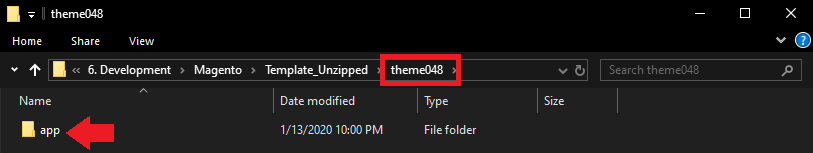
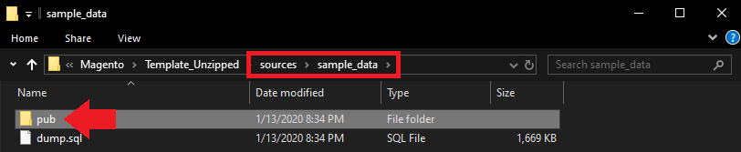
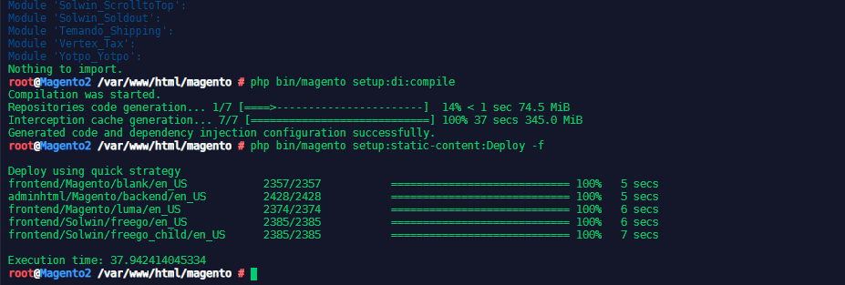
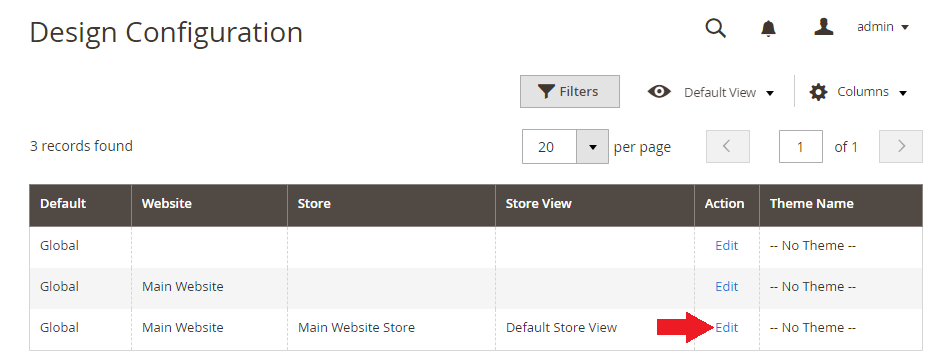
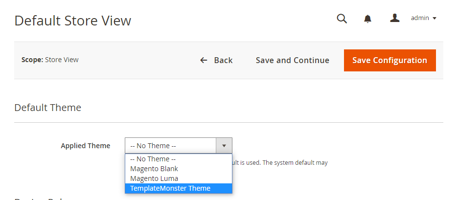
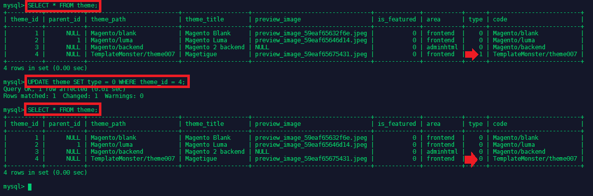
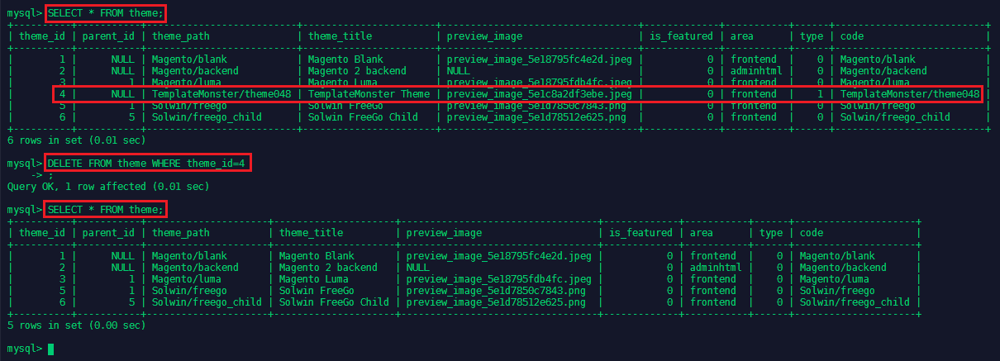
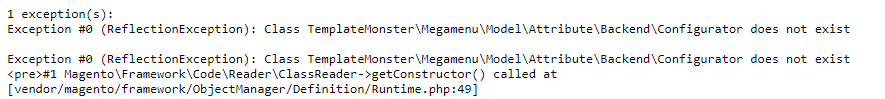
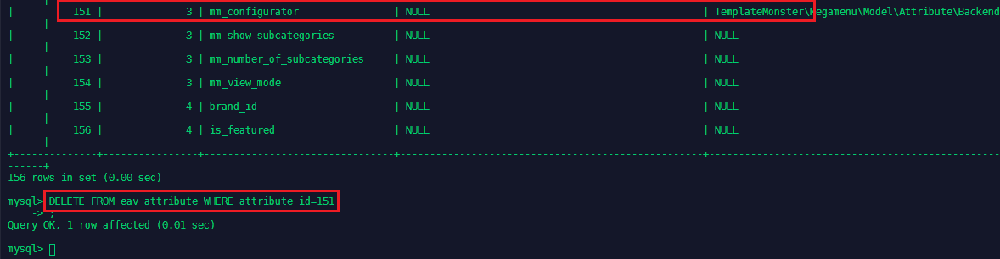
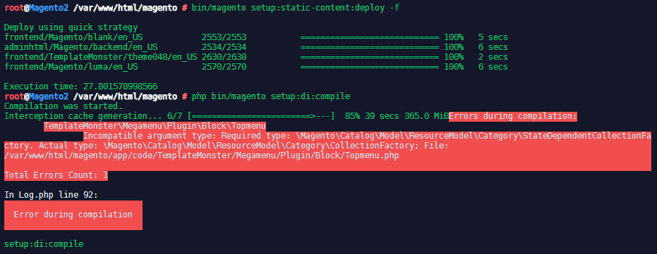

<!-- TOC -->

- [Download and Unzip your Theme](#download-and-unzip-your-theme)
- [Theme Installation](#theme-installation)
- [Importing Demo SQL Data](#importing-demo-sql-data)
- [Lot's of Problems on the way...](#lots-of-problems-on-the-way)
  - [How to clear out a manually installed theme ?](#how-to-clear-out-a-manually-installed-theme)
  - [Error Collection](#error-collection)

<!-- /TOC -->


## Download and Unzip your Theme

After unzipping your theme, you will find a folder named __themeXXXX_. Upload all folders from this directory into your Magento root directory - e.g. `/var/www/html/magento`. In my case the template only had a folder `data`:





Next switch to `sources/sample_data` and copy the folder `pub` to the Magento root directory:





Make sure that all files that you uploaded will be accessible by the default user, e.g. `www-data`:


```bash
chown -R www-data:www-data .
```


## Theme Installation

1. Run Upgrade:


```bash
php bin/magento setup:upgrade
php bin/magento setup:di:compile
php bin/magento setup:static-content:deploy -f
```

> If you are not running the Magento scripts with the `www-data` user, make sure to change the owner of every folder and file inside `var` and `pub` after every recompile:


```
chown -R www-data:www-data ./var
chown -R www-data:www-data ./pub
```





>NOTE: Manual static content deployment is not required in "default" and "developer" modes. In "default" and "developer" modes static contents are being deployed automatically on demand. If you still want to deploy in these modes, use -f option: `bin/magento setup:static-content:deploy -f`.


1. Setup the new Theme:


On the Admin sidebar, __Content__ > Design > __Configuration__ > __Select your current theme__ > :





3. Click on __Edit__ to select your theme:




## Importing Demo SQL Data

To use the sample SQL DATA that comes with your template, you have to start with a blank database. First create a backup of your database to be able to roll it back later:


```bash
mysqldump -u username -p database_name > file.sql
```


Delete all tables from the database - or delete the db and recreate. Then import the sample data from your template.

Bow download a fresh version of Magento and run the init script - make sure that `--db-name` is set to the database you just prepared above:


```bash
bin/magento setup:install \
--base-url=http://mysite.dev \
--db-host=localhost \
--db-name=magento \
--db-user=magento \
--db-password=magento \
--admin-firstname=admin \
--admin-lastname=admin \
--admin-email=admin@admin.com \
--admin-user=admin \
--admin-password=admin123 \
--language=en_US \
--currency=USD \
--timezone=America/Chicago \
--use-rewrites=1
```


Now go through the regular setup through the Magento Admin panel. The Theme should already be selected and ready to be configured.


If your run into the following issue when trying to load the frontend:


```bash
1 exception(s):
Exception #0 (Magento\Framework\Exception\LocalizedException): Unable to find a physical ancestor for a theme 'Magetigue'.
```





Make sure that `type` for the theme is set to `0`:


```sql
SELECT * FROM theme;
UPDATE theme SET type = 0 WHERE theme_id = 4;
```


## Lot's of Problems on the way...

The original theme that I was using did not work... all just went downhill... Error message by error message.

I found that the theme supports PHP up to v7.0.4 __but not__ v7.1. As I am using PHP v7.2 this probably is the issue here.

The free theme I downloaded above was __labeled Magento 2.3 compatible__ and __worked right away__.


### How to clear out a manually installed theme ?

1. File Operations

Delete the content from `app/design/frontend/<Vendor>`. You might also find files in `var/view_preprocessed` & `pub/static/frontend`.


2. DB Operations

Go to your theme table and delete the entry for your created theme.

```sql
mysql -u magento -p
SHOW databases;
USE magento;
SHOW tables;
DESCRIBE theme;
SELECT * FROM theme;
DELETE FROM theme WHERE theme_id=4
EXIT;
```





The template was stored under `theme_id=4` in the theme table inside the Magento database.


3. Flush cache

```bash
php bin/magento cache:flush
```


4. Recompile


```bash
php bin/magento setup:di:compile
php bin/magento setup:static-content:deploy -f
```


5. CleanUP

I am still getting an error message when trying to access the storefront:





If the theme has a configuration in Magento Admin, then it is important to delete all references to the theme in table `eav_attribute`:


```sql
SELECT * FROM eav_attribute;
DELETE FROM eav_attribute WHERE attribute_id=151;
```





A quick re-compile, deploy and flush later everything was up and running...


```bash
php bin/magento setup:di:compile
php bin/magento setup:static-content:deploy -f
php bin/magento cache:flush
```


### Error Collection

_If you see these error messages_:


```
ReflectionException: Class Magento\Framework\App\Http\Interceptor does not exist in /var/www/html/magento/vendor/magento/framework/Code/Reader/ClassReader.php:19 Stack trace: #0 /var/www/html/magento/vendor/magento/framework/Code/Reader/ClassReader.php(19): ReflectionClass->__construct('Magento\\Framewo...') #1 /var/www/html/magento/vendor/magento/framework/ObjectManager/Definition/Runtime.php(49): Magento\Framework\Code\Reader\ClassReader->getConstructor('Magento\\Framewo...') #2 /var/www/html/magento/vendor/magento/framework/ObjectManager/Factory/Dynamic/Developer.php(48): Magento\Framework\ObjectManager\Definition\Runtime->getParameters('Magento\\Framewo...') #3 /var/www/html/magento/vendor/magento/framework/ObjectManager/ObjectManager.php(56): Magento\Framework\ObjectManager\Factory\Dynamic\Developer->create('Magento\\Framewo...', Array) #4 /var/www/html/magento/vendor/magento/framework/App/Bootstrap.php(235): Magento\Framework\ObjectManager\ObjectManager->create('Magento\\Framewo...', Array) #5 /var/www/html/magento/pub/index.php(39): Magento\Framework\App\Bootstrap->createApplication('Magento\\Framewo...') #6 {main}
```





Clear all directories and files under Magento’s var subdirectory and install the Magento software again.

As the Magento file system owner or as a user with root privileges, enter the following commands:


```bash
cd <your Magento install directory>/var
rm -rf cache/* di/* generation/* page_cache/*
```


_And more problems_:


```
1 exception(s):
Exception #0 (Magento\Framework\Config\Dom\ValidationException): Element 'block', attribute 'type': The attribute 'type' is not allowed.
Line: 1001

Element 'block', attribute 'type': The attribute 'type' is not allowed.
Line: 1011

Element 'block', attribute 'type': The attribute 'type' is not allowed.
Line: 1020

Element 'block', attribute 'type': The attribute 'type' is not allowed.
Line: 1027

Element 'block', attribute 'type': The attribute 'type' is not allowed.
Line: 1034

Element 'block', attribute 'type': The attribute 'type' is not allowed.
Line: 1042
```

This is [can be caused](https://magento.stackexchange.com/questions/199151/magento-2-2-0-upgrade-error-attribute-type-is-not-allowed) by themes that use `<block type="..."` instead of `<block class="..."`. I found type declarations in the footer part of the theme and deleted them.


Also check all custom blog layout files in your theme (app/code/design/ThemeVendor/themename/Magefan_Blog/layout), they may have a code e.g.:


```
class="\Magento
```


you need to change it to


```
class="Magento
```


Then flush Magento cache (Magento Admin Panel __System__ > __Cache Management__ > __Flush Magento Cache__).


This solved the problem above but had me ending up with new errors:


```
1 exception(s):
Exception #0 (Exception): Notice: Undefined index: src in /var/www/html/magento/vendor/magento/framework/View/Page/Config/Generator/Head.php on line 126

Exception #0 (Exception): Notice: Undefined index: src in /var/www/html/magento/vendor/magento/framework/View/Page/Config/Generator/Head.php on line 126
```


This error refers to:


```php
protected function processAssets(Structure $pageStructure)
    {
        foreach ($pageStructure->getAssets() as $name => $data) {
            if (isset($data['src_type']) && in_array($data['src_type'], $this->remoteAssetTypes)) {
                if ($data['src_type'] === self::SRC_TYPE_CONTROLLER) {
                    $data['src'] = $this->url->getUrl($data['src']);
                }

                $this->pageConfig->addRemotePageAsset(
                    $data['src'],
                    isset($data['content_type']) ? $data['content_type'] : self::VIRTUAL_CONTENT_TYPE_LINK,
                    $this->getAssetProperties($data),
                    $name
                );
            } else {
                $this->pageConfig->addPageAsset($name, $this->getAssetProperties($data));
            }
        }
        return $this;
    }
```


And a problem with the compilation:


```bash
php bin/magento setup:di:compile
Compilation was started.
Interception cache generation... 6/7 [========================>---]  85% 35 secs 365.0 MiBErrors during compilation:
        TemplateMonster\Megamenu\Plugin\Block\Topmenu
                Incompatible argument type: Required type: \Magento\Catalog\Model\ResourceModel\Category\StateDependentCollectionFactory. Actual type: \Magento\Catalog\Model\ResourceModel\Category\CollectionFactory; File: 
/var/www/html/magento/app/code/TemplateMonster/Megamenu/Plugin/Block/Topmenu.php

Total Errors Count: 1

In Log.php line 92:
                            
  Error during compilation  
                            

setup:di:compile
```
