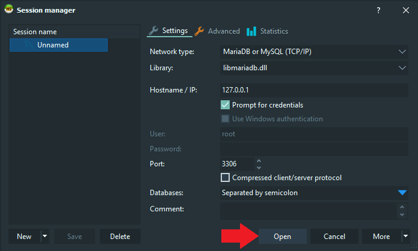
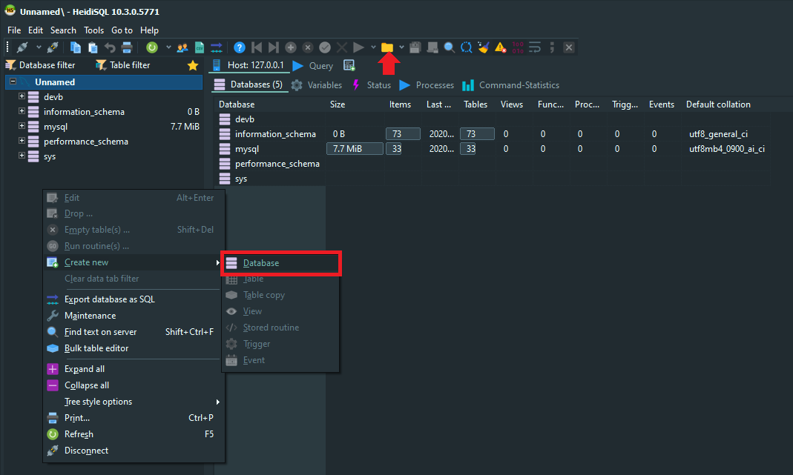
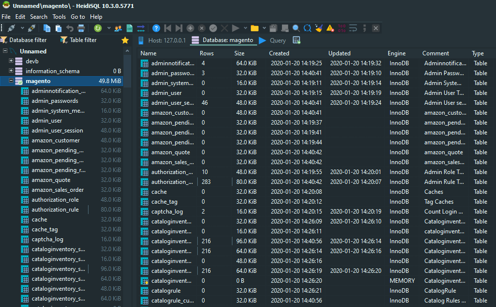

<!-- TOC -->

- [Exporting/Importing SQL files](#exportingimporting-sql-files)
- [MySQL Docker Container](#mysql-docker-container)
- [HeidiSQL](#heidisql)

<!-- /TOC -->

## Exporting/Importing SQL files

```bash
mysqldump -u username -p database_name > file.sql
mysql -u username -p database_name < file.sql
```


## MySQL Docker Container

We can start the MySQL database on our system using Docker. [Download the MySQL Container](https://hub.docker.com/_/mysql) by typing `docker pull mysql` into your Terminal / Powershell. To start the container run the following commands:


```bash
docker volume create crv_mysql

docker run \
    -e MYSQL_ROOT_PASSWORD=my-secret-pw \
    -e MYSQL_DATABASE=devdb \
    -e MYSQL_USER=dbuser \
    -e MYSQL_PASSWORD=dbpassword \
    --mount type=volume,src=crv_mysql,dst=/var/lib/mysql \
    -p 3306:3306 \
    -d \
    mysql:latest
```

This will create a volume to store your data in `/var/lib/mysql` and also create a non-root user and a database that can be accessed with this user. If you just need a quick look at an SQL dump, simplify this command to:


```bash
docker run \
    -e MYSQL_ROOT_PASSWORD=my-secret-pw \
    -e MYSQL_PASSWORD=dbpassword \
    -p 3306:3306 \
    -d \
    mysql:latest
```

You can no connect to the database with `root` and `dbpassword` on `127.0.0.1:3306`.


## HeidiSQL

Under Windows we can use [HeidiSQL](https://www.heidisql.com/download.php) to work with our database. Once you downloaded and installed the software connect the software with the database service:





Now right-click to add a new database. Once created select the database and click on the folder icon to add your SQL file:






