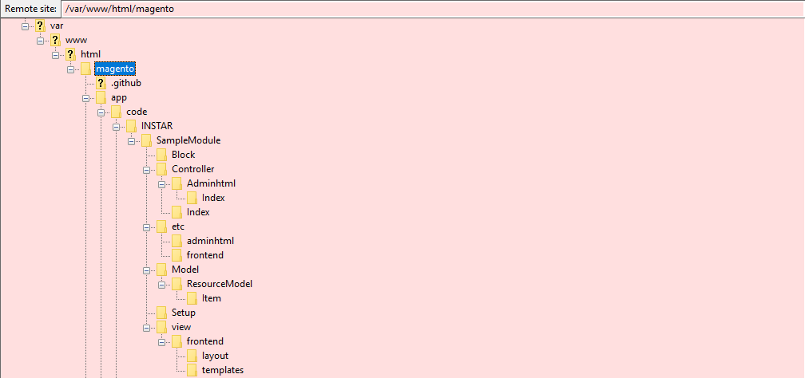
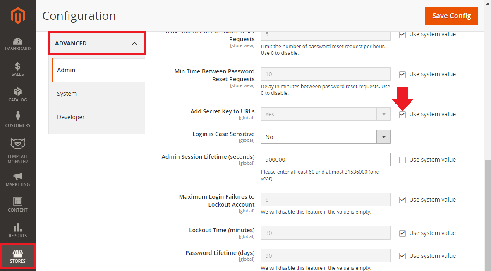
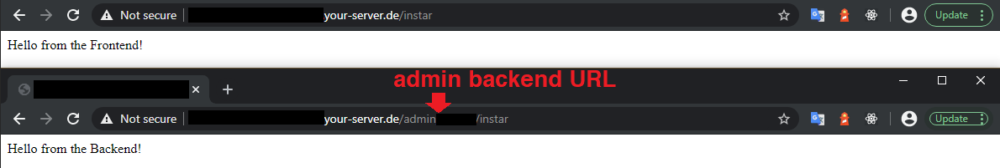
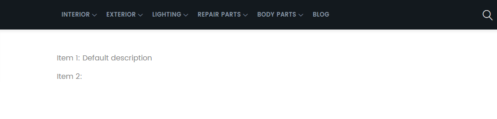

<!-- TOC -->

- [Creating Custom Modules](#creating-custom-modules)
- [Module Install Scripts](#module-install-scripts)
- [Module Updates](#module-updates)
- [Model Layer](#model-layer)
- [Controller Layer](#controller-layer)
- [View Layer](#view-layer)
  - [Blocks](#blocks)

<!-- /TOC -->





## Creating Custom Modules

The default directory for Magento 2 modules is `/var/www/html/magento/app/code`. If the theme you are using already comes with custom module you will be able to find them there. Start by creating a folder there for your personal modules and add another folder inside this one named __SampleModule__.

To create a new module start with a `registration.php` file:


```php
<?php
\Magento\Framework\Component\ComponentRegistrar::register(
    \Magento\Framework\Component\ComponentRegistrar::MODULE,
    'INSTAR_SampleModule',
    __DIR__
);
```

This tells Magento to register your component, that is of type __Module__ and will be called `INSTAR_SampleModule`.


Now continue by creating a directory `etc` inside the __SampleModule__ folder and add a `module.xml` file:


```xml
<?xml version="1.0"?>
<config xmlns:xsi="http://www.w3.org/2001/XMLSchema-instance" xsi:noNamespaceSchemaLocation="urn:magento:framework:Module/etc/module.xsd">
    <module name="INSTAR_SampleModule" setup_version="1.0.0">
        <sequence>
            <module name="Magento_Catalog"/>
        </sequence>
    </module>
</config>
```

This file declares our __INSTAR\_SampleModule__ and it's dependency on the __Magento\_Catalog__ module. This makes sure that it is ensured that the latter is installed and loaded before Magento tries loading our module.


To enable the module go to the Magento root and run the command:


```bash
cd /var/www/html/magento
php bin/magento module:enable INSTAR_SampleModule

The following modules have been enabled:
- INSTAR_SampleModule

To make sure that the enabled modules are properly registered, run 'setup:upgrade'.
Cache cleared successfully.
Generated classes cleared successfully. Please run the 'setup:di:compile' command to generate classes.
Info: Some modules might require static view files to be cleared. To do this, run 'module:enable' with the --clear-static-content option to clear them.
```

You can verify that the module is now enabled by:


```bash
cat /var/www/html/magento/app/etc/config.php

<?php
return [
    'modules' => [
        
        ...
        
        'INSTAR_SampleModule' => 1,

        ...
    ]
];
```


The order in which modules are listed here, is the order in which they are loaded - modules lower in the list can modify configurations set by earlier modules.


We now have to upgrade our database. The following command will go through all loaded modules and check if changes to the database have to be made:


```bash
php bin/magento setup:upgrade
```


We can check our database to see if our module was added to the `setup_module` table:


```sql
mysql> USE magento;
Reading table information for completion of table and column names
You can turn off this feature to get a quicker startup with -A

Database changed
mysql> SELECT * FROM setup_module WHERE module = 'INSTAR_SampleModule';
+---------------------+----------------+--------------+
| module              | schema_version | data_version |
+---------------------+----------------+--------------+
| INSTAR_SampleModule | 1.0.0          | 1.0.0        |
+---------------------+----------------+--------------+
1 row in set (0.00 sec)
```


## Module Install Scripts

For installing a database schema and subsequently data for our module, we need to create installation scripts. For this create a folder called `Setup` next to the `etc` folder in your module root directory and add a file called `InstallSchema.php`:


```php
<?php

namespace INSTAR\SampleModule\Setup;

use Magento\Framework\Setup\InstallSchemaInterface;
use Magento\Framework\Setup\ModuleContextInterface;
use Magento\Framework\Setup\SchemaSetupInterface;
use Magento\Framework\DB\Ddl\Table;

class InstallSchema implements InstallSchemaInterface
{
    /**
     * {@inheritdoc}
     */
    public function install(SchemaSetupInterface $setup, ModuleContextInterface $context)
    {
        $setup->startSetup();

        $table = $setup->getConnection()->newTable(
            $setup->getTable('instar_sample_item')
        )->addColumn(
            'id',
            Table::TYPE_INTEGER,
            null,
            ['identity' => true, 'nullable' => false, 'primary' => true],
            'Item ID'
        )->addColumn(
            'name',
            Table::TYPE_TEXT,
            255,
            ['nullable' => false],
            'Item Name'
        )->addIndex(
            $setup->getIdxName('instar_sample_item', ['name']),
            ['name']
        )->setComment(
            'Sample Items'
        );
        $setup->getConnection()->createTable($table);

        $setup->endSetup();
    }
}
```

This defines the `instar_sample_item` database table for our module - consisting of an integer `id` as primary key and `name` of type text with a max. length of 255 characters.


We can now add a second script to fill our new table with some default data for our module. For this create a second file called `InstallData.php`:


```php
<?php

namespace INSTAR\SampleModule\Setup;

use Magento\Framework\Setup\InstallDataInterface;
use Magento\Framework\Setup\ModuleContextInterface;
use Magento\Framework\Setup\ModuleDataSetupInterface;

class InstallData implements InstallDataInterface
{
    /**
     * {@inheritdoc}
     */
    public function install(ModuleDataSetupInterface $setup, ModuleContextInterface $context)
    {
        $setup->startSetup();

        $setup->getConnection()->insert(
            $setup->getTable('instar_sample_item'),
            [
                'name' => 'Item 1'
            ]
        );

        $setup->getConnection()->insert(
            $setup->getTable('instar_sample_item'),
            [
                'name' => 'Item 2'
            ]
        );

        $setup->endSetup();
    }
}
```


This will add two items with the names `Item 1` and `Item 2` to our table. The `id` field will be created by MySQL automatically.


To try the installation scripts we first have to delete the MySQL table that has already been created in the earlier step:


```sql
DELETE FROM setup_module WHERE module = 'INSTAR_SampleModule';
```


And re-run the Magento database upgrade script to add the module:


```bash
php bin/magento setup:upgrade
```


Once the upgrade is done your scripts should have been executed and the `instar_sample_item` table been created:


```sql
mysql> SELECT * FROM instar_sample_item;
+----+--------+
| id | name   |
+----+--------+
|  1 | Item 1 |
|  2 | Item 2 |
+----+--------+
2 rows in set (0.00 sec)
```


## Module Updates

To update our database table during a module update we need to create two more scripts - `UpgradeSchema.php` and `UpgradeData.php`. Let's start with the first:


```php
<?php

namespace INSTAR\SampleModule\Setup;

use Magento\Framework\DB\Ddl\Table;
use Magento\Framework\Setup\UpgradeSchemaInterface;
use Magento\Framework\Setup\ModuleContextInterface;
use Magento\Framework\Setup\SchemaSetupInterface;

class UpgradeSchema implements UpgradeSchemaInterface
{
    /**
     * {@inheritdoc}
     */
    public function upgrade(SchemaSetupInterface $setup, ModuleContextInterface $context)
    {
        $setup->startSetup();

        if (version_compare($context->getVersion(), '1.0.1', '<')) {
            $setup->getConnection()->addColumn(
                $setup->getTable('instar_sample_item'),
                'description',
                [
                    'type' => Table::TYPE_TEXT,
                    'nullable' => true,
                    'comment' => 'Item Description'
                ]
            );
        }

        $setup->endSetup();
    }
}
```


This script extends the `instar_sample_item` with an optional column `description` of type text. The script will first check if the installed version is smaller `1.0.1` and only add the column if this condition is true.


Now we can add our default data to the new column with the `UpgradeData.php` script:


```php
<?php

namespace INSTAR\SampleModule\Setup;

use Magento\Framework\Setup\ModuleContextInterface;
use Magento\Framework\Setup\ModuleDataSetupInterface;
use Magento\Framework\Setup\UpgradeDataInterface;

class UpgradeData implements UpgradeDataInterface
{
    /**
     * {@inheritdoc}
     */
    public function upgrade(ModuleDataSetupInterface $setup, ModuleContextInterface $context)
    {
        $setup->startSetup();

        if (version_compare($context->getVersion(), '1.0.1', '<')) {
            $setup->getConnection()->update(
                $setup->getTable('instar_sample_item'),
                [
                    'description' => 'Default description'
                ],
                $setup->getConnection()->quoteInto('id = ?', 1)
            );
        }

        $setup->endSetup();
    }
}
```

This will add the string `Default description` into the `description` field of __Item 1__ (`id=?, 1`). The second item is not going to receive a default description, which is ok since we defined this field as optional (`'nullable' => true`). Again, this script only executes if the installed version is older then version `1.0.1`.


To simulate that we just updated the code for our module, we need to edit the `./etc/module.xml` file and change the setup version to `1.0.1`:


```xml
<?xml version="1.0"?>
<config xmlns:xsi="http://www.w3.org/2001/XMLSchema-instance" xsi:noNamespaceSchemaLocation="urn:magento:framework:Module/etc/module.xsd">
    <module name="INSTAR_SampleModule" setup_version="1.0.1">
        <sequence>
            <module name="Magento_Catalog"/>
        </sequence>
    </module>
</config>
```

Now we can re-run the database upgrade script. This time the install scripts won't be executed - only the update scripts should run and add the additional column to our database table `instar_sample_item`:


```bash
php bin/magento setup:upgrade
```

We can verify the update by checking the table:


```sql
mysql> SELECT * FROM instar_sample_item;
+----+--------+---------------------+
| id | name   | description         |
+----+--------+---------------------+
|  1 | Item 1 | Default description |
|  2 | Item 2 | NULL                |
+----+--------+---------------------+
2 rows in set (0.00 sec)
```

Or by reading the installed version of our module:


```sql
mysql> SELECT * FROM setup_module WHERE module = 'INSTAR_SampleModule';
+---------------------+----------------+--------------+
| module              | schema_version | data_version |
+---------------------+----------------+--------------+
| INSTAR_SampleModule | 1.0.1          | 1.0.1        |
+---------------------+----------------+--------------+
1 row in set (0.00 sec)
```


## Model Layer

The most basic model is the `ResourceModel` - a model to communicate directly to your database. To create a resource model for your module create the following file in the module root `Model/ResourceModel/item.php`:


```php
<?php

namespace INSTAR\SampleModule\Model\ResourceModel;

use Magento\Framework\Model\ResourceModel\Db\AbstractDb;

class Item extends AbstractDb
{
    protected function _construct()
    {
        $this->_init('instar_sample_item', 'id');
    }
}
```


To create the model we have to add another file `item.php` one folder up pointing to our resource model:


```php
<?php

namespace INSTAR\SampleModule\Model;

use Magento\Framework\Model\AbstractModel;

class Item extends AbstractModel
{
    protected function _construct()
    {
        $this->_init(\INSTAR\SampleModule\Model\ResourceModel\Item::class);
    }
}
```


Now we can create a collection inside the resource model in an sub-folder __Item__:


```php
<?php

namespace INSTAR\SampleModule\Model\ResourceModel\Item;

use Magento\Framework\Model\ResourceModel\Db\Collection\AbstractCollection;
use INSTAR\SampleModule\Model\Item;
use INSTAR\SampleModule\Model\ResourceModel\Item as ItemResource;

class Collection extends AbstractCollection
{
    protected $_idFieldName = 'id';

    protected function _construct()
    {
        $this->_init(Item::class, ItemResource::class);
    }
}

```


## Controller Layer

Let's start by adding routing both for our backend and frontend. For the frontend create the following file inside your module root `./etc/frontend/routes.xml`:


```xml
<?xml version="1.0"?>
<config xmlns:xsi="http://www.w3.org/2001/XMLSchema-instance" xsi:noNamespaceSchemaLocation="urn:magento:framework:App/etc/routes.xsd">
    <router id="standard">
        <route id="instar" frontName="instar">
            <module name="INSTAR_SampleModule"/>
        </route>
    </router>
</config>
```

The router ID is set to `standard` - this means this route can be accessed on the base URL of your Magento installation __my-magento/:frontName__ e.g. `http://my-server.com/instar`.


And do the same for your backend routing in `./etc/adminhtml/routes.xml`:


```xml
<?xml version="1.0"?>
<config xmlns:xsi="http://www.w3.org/2001/XMLSchema-instance" xsi:noNamespaceSchemaLocation="urn:magento:framework:App/etc/routes.xsd">
    <router id="admin">
        <route id="instar" frontName="instar">
            <module name="INSTAR_SampleModule"/>
        </route>
    </router>
</config>
```

The router ID is set to `admin` - this means this route can be accessed on the admin URL of your Magento installation __my-magento/:adminURL/:frontName__ e.g. `http://my-server.com/admin_khf32984/instar`


The controller itself is now stored in `./Controller` in the module root directory. Inside this folder create another directory called `Index` and add a file `Index.php` to control our frontend:


```php
<?php

namespace INSTAR\SampleModule\Controller\Index;

use Magento\Framework\Controller\ResultFactory;

class Index extends \Magento\Framework\App\Action\Action
{
    public function execute()
    {
        /** @var \Magento\Framework\Controller\Result\Raw $result */
        $result = $this->resultFactory->create(ResultFactory::TYPE_RAW);
        $result->setContents('Hello from the Frontend!');
        return $result;
    }
}
```


For the backend create another folder right next to `Index` and add the following file `./Controller/Adminhtml/Index/Index.php`:


```php
<?php

namespace INSTAR\SampleModule\Controller\Adminhtml\Index;

use Magento\Framework\Controller\ResultFactory;

class Index extends \Magento\Backend\App\Action
{
    public function execute()
    {
        /** @var \Magento\Framework\Controller\Result\Raw $result */
        $result = $this->resultFactory->create(ResultFactory::TYPE_RAW);
        $result->setContents('Hello from the Backend!');
        return $result;
    }
}
```


Now flush the Magento cache (all XML files are cached by Magento - changing them always requires a flush):


```bash
bin/magento cache:flush
```


To test that the routing is working we can open the URLs inside our browser:

* http://my-server/instar
* http://my-server/admin/instar


__Note__: a security feature in Magento will prevent you from accessing the Admin URL - for testing purposes you can deactivate this feature (re-activate afterwards):








## View Layer

### Blocks

The default directory for building blocks is `./Block` inside your module root. Create this folder and add a file called `Hello.php`:


```php
<?php

namespace INSTAR\SampleModule\Block;

use Magento\Framework\View\Element\Template;
use INSTAR\SampleModule\Model\ResourceModel\Item\Collection;
use INSTAR\SampleModule\Model\ResourceModel\Item\CollectionFactory;

class Hello extends Template
{
    private $collectionFactory;

    public function __construct(
        Template\Context $context,
        CollectionFactory $collectionFactory,
        array $data = []
    ) {
        $this->collectionFactory = $collectionFactory;
        parent::__construct($context, $data);
    }

    /**
     * @return \INSTAR\SampleModule\Model\Item[]
     */
    public function getItems()
    {
        return $this->collectionFactory->create()->getItems();
    }
}
```


This block uses a template that has to be created in `./view/frontend/templates`. Create those folders and add `hello.phtml`:


```phtml
<?php
/** @var \INSTAR\SampleModule\Block\Hello $block */
?>
<?php foreach ($block->getItems() as $item): ?>
<p>
<?php echo $item->getName(); ?>: <?php echo $item->getDescription(); ?>
</p>
<?php endforeach; ?>
```


This template uses our Hello building block that provides the collection of our database table. It then loops over the results and prints the description field of each item inside the table.


Now we have to define where we want to render the output. This will be done in `./view/frontend/layout/instar_index_index.xml` (the name has to be set by the frontName you set in `./etc/frontend/routes.xml` "instar",  the controller name `./Controller/Index` "index", and the action name `./Controller/Index/index.php` "index" ):


```xml
<?xml version="1.0"?>
<page xmlns:xsi="http://www.w3.org/2001/XMLSchema-instance" layout="1column" xsi:noNamespaceSchemaLocation="urn:magento:framework:View/Layout/etc/page_configuration.xsd">
    <body>
        <referenceContainer name="content">
            <block name="instar_hello" class="INSTAR\SampleModule\Block\Hello" template="hello.phtml"/>
        </referenceContainer>
    </body>
</page>
```


Now flush the Magento cache (all XML files are cached by Magento - changing them always requires a flush):


```bash
bin/magento cache:flush
```


If you now visit the frontend URL inside your browser `/instar`, you will see that nothing changed. This because our controller `Controller/Index/Index.php` is still set to output RAW data - `ResultFactory::TYPE_RAW`. This means it will ignore the layout we just created. Let's change that:


```php
<?php

namespace INSTAR\SampleModule\Controller\Index;

use Magento\Framework\Controller\ResultFactory;

class Index extends \Magento\Framework\App\Action\Action
{
    public function execute()
    {
        return $this->resultFactory->create(ResultFactory::TYPE_PAGE);
    }
}

```


