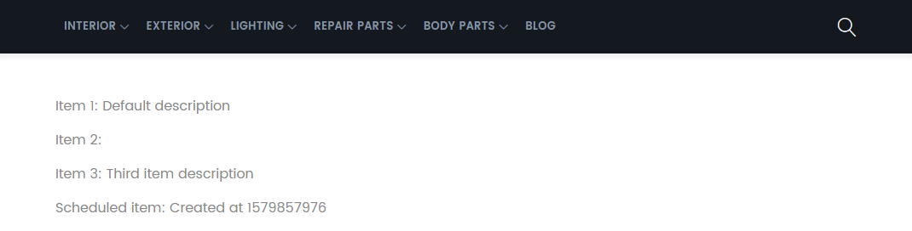

<!-- TOC -->


<!-- /TOC -->

We can automate tasks using cron jobs in Magento. Let's start by adding a file `./Cron/AddItem.php`:


```php
<?php

namespace INSTAR\SampleModule\Cron;

use INSTAR\SampleModule\Model\ItemFactory;
use INSTAR\SampleModule\Model\Config;

class AddItem
{
    private $itemFactory;

    public function __construct(ItemFactory $itemFactory)
    {
        $this->itemFactory = $itemFactory;
    }

    public function execute()
    {
        $this->itemFactory->create()
            ->setName('Scheduled item')
            ->setDescription('Created at ' . time())
            ->save();
    }
}
```


To execute this job on a schedule we now have to add a file `./etc/crontab.xml`:


```xml
<?xml version="1.0"?>
<config xmlns:xsi="http://www.w3.org/2001/XMLSchema-instance" xsi:noNamespaceSchemaLocation="urn:magento:module:Magento_Cron:etc/crontab.xsd">
    <group id="default">
        <job name="instarAddItem" instance="INSTAR\SampleModule\Cron\AddItem" method="execute">
            <!-- Every five minutes -->
            <schedule>*/5 * * * *</schedule>
            <!--<config_path>instar/general/cron_expression</config_path>-->
        </job>
    </group>
</config>
```

This configuration set's our job up to be executed every 5 minutes:


| Field | Description | Allowed Value |
| -- | -- | -- |
| MIN  | Minute field | 0 to 59, * |
| HOUR | Hour field   | 0 to 23, * |
| DOM  | Day of Month | 1-31, * |
| MON  | Month field  | 1-12, * |
| DOW  | Day Of Week  | 0-6, * |
| CMD  | Command      | Any command to be executed. |


You can now execute all crontabs with the following Magento command:


```bash
bin/magento cron:run
Ran jobs by schedule.
```

You can check your Magento database to see if the crontab is now set to execute:

```sql
SELECT * FROM cron_schedule;
```

You should find entries for `instarAddItem` inside the table:


```sql
mysql> SELECT * FROM cron_schedule WHERE job_code = 'instarAddItem';
+-------------+---------------+---------+---------------------+-------------+-------------+
| schedule_id | job_code      | status  | scheduled_at        | executed_at | finished_at |
+-------------+---------------+---------+---------------------+-------------+-------------+
|         536 | instarAddItem | pending | 2020-01-24 10:20:00 | NULL        | NULL        |
|         537 | instarAddItem | pending | 2020-01-24 10:25:00 | NULL        | NULL        |
|         538 | instarAddItem | pending | 2020-01-24 10:30:00 | NULL        | NULL        |
|         539 | instarAddItem | pending | 2020-01-24 10:35:00 | NULL        | NULL        |
+-------------+---------------+---------+---------------------+-------------+-------------+
4 rows in set (0.00 sec)
```

In this case the job has not yet been executed - re-run the crontab and check again:


```bash
bin/magento cron:run
```


The first run was now scheduled to execute and ran successfully:


```sql
mysql> SELECT * FROM cron_schedule WHERE job_code = 'instarAddItem';
+-------------+---------------+---------+---------------------+---------------------+---------------------+
| schedule_id | job_code      | status  | scheduled_at        | executed_at         | finished_at         |
+-------------+---------------+---------+---------------------+---------------------+---------------------+
|         536 | instarAddItem | success | 2020-01-24 10:20:00 | 2020-01-24 10:26:16 | 2020-01-24 10:26:16 |
|         537 | instarAddItem | pending | 2020-01-24 10:25:00 | NULL                | NULL                |
|         538 | instarAddItem | pending | 2020-01-24 10:30:00 | NULL                | NULL                |
|         539 | instarAddItem | pending | 2020-01-24 10:35:00 | NULL                | NULL                |
+-------------+---------------+---------+---------------------+---------------------+---------------------+
4 rows in set (0.01 sec)
```


To automate this process create a cronjob or SystemD script to execute `bin/magento cron:run` in the desired time interval.


