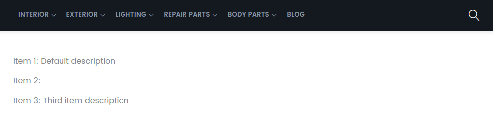

<!-- TOC -->

- [Command Line Interface](#command-line-interface)

<!-- /TOC -->


## Command Line Interface

To create custom commands to the CLI interface add a folder called `./Console/Command` to your [Custom Magento 2 Module](/creating-magento-2-modules). Here we can create our custom command `AddItem.php`:


```php
<?php

namespace INSTAR\SampleModule\Console\Command;

use Symfony\Component\Console\Command\Command;
use Symfony\Component\Console\Input\InputArgument;
use Symfony\Component\Console\Input\InputInterface;
use Symfony\Component\Console\Output\OutputInterface;
use INSTAR\SampleModule\Model\ItemFactory;
use Magento\Framework\Console\Cli;

class AddItem extends Command
{
    const INPUT_KEY_NAME = 'name';
    const INPUT_KEY_DESCRIPTION = 'description';

    private $itemFactory;

    public function __construct(ItemFactory $itemFactory)
    {
        $this->itemFactory = $itemFactory;
        parent::__construct();
    }

    protected function configure()
    {
        $this->setName('instar:item:add')
            ->addArgument(
                self::INPUT_KEY_NAME,
                InputArgument::REQUIRED,
                'Item name'
            )->addArgument(
                self::INPUT_KEY_DESCRIPTION,
                InputArgument::OPTIONAL,
                'Item description'
            );
        parent::configure();
    }

    protected function execute(InputInterface $input, OutputInterface $output)
    {
        $item = $this->itemFactory->create();
        $item->setName($input->getArgument(self::INPUT_KEY_NAME));
        $item->setDescription($input->getArgument(self::INPUT_KEY_DESCRIPTION));
        $item->setIsObjectNew(true);
        $item->save();
        return Cli::RETURN_SUCCESS;
    }
}
```


Magento 2 uses the Symfony framework to create command line commands. This examples imports the necessary modules from Symfony and creates a command that accepts 2 inputs - an item name and description. We now need to implement this command so that those values can be written to [our modules database table](/creating-magento-2-modules#module-install-scripts) - for this we have to add a __Dependency Injection__ configuration to our module with `./etc/di.xml`:


```xml
<?xml version="1.0"?>
<config xmlns:xsi="http://www.w3.org/2001/XMLSchema-instance" xsi:noNamespaceSchemaLocation="urn:magento:framework:ObjectManager/etc/config.xsd">
    <type name="Magento\Framework\Console\CommandList">
        <arguments>
           <argument name="commands" xsi:type="array">
                <item name="instarAddItem" xsi:type="object">INSTAR\SampleModule\Console\Command\AddItem</item>
            </argument>
        </arguments>
    </type>
</config>
```


Now flush the Magento cache (all XML files are cached by Magento - changing them always requires a flush):


```bash
bin/magento cache:flush
```


The list of available Magento commands should now contain the new command we created:


```bash
root@Magento2 /var/www/html/magento # bin/magento
Magento CLI 2.3.3

Usage:
  command [options] [arguments]

Options:
  -h, --help            Display this help message
  -q, --quiet           Do not output any message
  -V, --version         Display this application version
      --ansi            Force ANSI output
      --no-ansi         Disable ANSI output
  -n, --no-interaction  Do not ask any interactive question
  -v|vv|vvv, --verbose  Increase the verbosity of messages: 1 for normal output, 2 for more verbose output and 3 for debug

Available commands:
  help                                        Displays help for a command
  list                                        Lists commands
 instar
  instar:item:add
```


You can now use the command to add Items and append them to your modules database table:


```bash
bin/magento instar:item:add "Item 3" "Third item description"
```


You can now verify that the item was added by connecting to your MySQL database, or by opening the [view we created earlier](/creating-magento-2-modules#view-layer):


