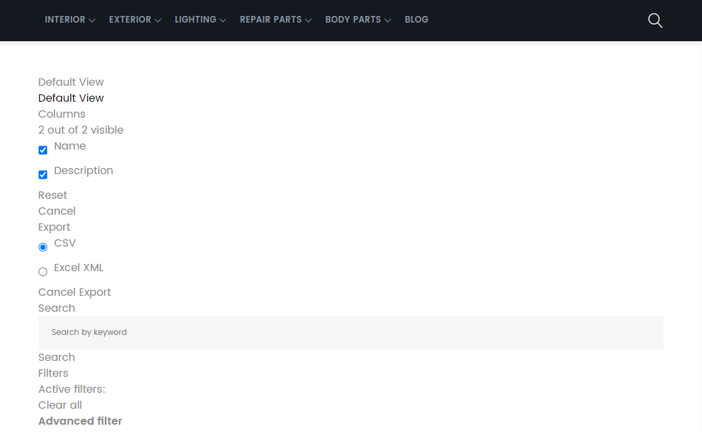

<!-- TOC -->

- [Rendering Grids](#rendering-grids)

<!-- /TOC -->


> Use Magento UI components only for admin routes (see end of the article)


## Rendering Grids

We already [created a custom view](/creating-magento-2-modules#view-layer) that listed all items that were stored in the database by our [custom component](/creating-magento-2-modules#module-install-scripts). Let's now add some design to it by displaying it in a grid. This view was routed by `./Controller/Index/Index.php`:


```php
<?php

namespace INSTAR\SampleModule\Controller\Index;

use Magento\Framework\Controller\ResultFactory;

class Index extends \Magento\Framework\App\Action\Action
{
    public function execute()
    {
        return $this->resultFactory->create(ResultFactory::TYPE_PAGE);
    }
}
```


We now need to create a new collection model to populate the grid with data from our database in `./Model/ResourceModel/Item/Grid/Collection.php`:


```php
<?php

namespace INSTAR\SampleModule\Model\ResourceModel\Item\Grid;

use Magento\Framework\Data\Collection\Db\FetchStrategyInterface as FetchStrategy;
use Magento\Framework\Data\Collection\EntityFactoryInterface as EntityFactory;
use Magento\Framework\Event\ManagerInterface as EventManager;
use Psr\Log\LoggerInterface as Logger;

class Collection extends \Magento\Framework\View\Element\UiComponent\DataProvider\SearchResult
{
    public function __construct(
        EntityFactory $entityFactory,
        Logger $logger,
        FetchStrategy $fetchStrategy,
        EventManager $eventManager,
        $mainTable = 'instar_sample_item',
        $resourceModel = 'INSTAR\SampleModule\Model\ResourceModel\Item'
    ) {
        parent::__construct(
            $entityFactory,
            $logger,
            $fetchStrategy,
            $eventManager,
            $mainTable,
            $resourceModel
        );
    }
}
```


We now have to add some additional configuration to dependency injection `./etc/di.xml`:


```xml
<?xml version="1.0"?>
<config xmlns:xsi="http://www.w3.org/2001/XMLSchema-instance" xsi:noNamespaceSchemaLocation="urn:magento:framework:ObjectManager/etc/config.xsd">
    <type name="Magento\Framework\Console\CommandList">
        <arguments>
           <argument name="commands" xsi:type="array">
                <item name="instarAddItem" xsi:type="object">INSTAR\SampleModule\Console\Command\AddItem</item>
            </argument>
        </arguments>
    </type>
</config>
```


Add the following lines of code to configure the UI grid:


```xml
<?xml version="1.0"?>
<config xmlns:xsi="http://www.w3.org/2001/XMLSchema-instance" xsi:noNamespaceSchemaLocation="urn:magento:framework:ObjectManager/etc/config.xsd">
    <type name="Magento\Framework\Console\CommandList">
        <arguments>
           <argument name="commands" xsi:type="array">
                <item name="instarAddItem" xsi:type="object">INSTAR\SampleModule\Console\Command\AddItem</item>
            </argument>
        </arguments>
    </type>
    <type name="Magento\Framework\View\Element\UiComponent\DataProvider\CollectionFactory">
        <arguments>
            <argument name="collections" xsi:type="array">
                <item name="instar_items_grid_data_source" xsi:type="string">INSTAR\SampleModule\Model\ResourceModel\Item\Grid\Collection</item>
            </argument>
        </arguments>
    </type>
</config>
```


Now we can modify the layout file that we already created `view/frontend/layout/instar_index_index.xml`:


```xml
<?xml version="1.0"?>
<page xmlns:xsi="http://www.w3.org/2001/XMLSchema-instance" layout="1column" xsi:noNamespaceSchemaLocation="urn:magento:framework:View/Layout/etc/page_configuration.xsd">
    <body>
        <referenceContainer name="content">
            <block name="instar_hello" class="INSTAR\SampleModule\Block\Hello" template="hello.phtml"/>
        </referenceContainer>
    </body>
</page>
```


Instead of using a custom __Block__ we now can use the __UI Component__:


```xml
<?xml version="1.0"?>
<page xmlns:xsi="http://www.w3.org/2001/XMLSchema-instance" layout="1column" xsi:noNamespaceSchemaLocation="urn:magento:framework:View/Layout/etc/page_configuration.xsd">
    <body>
        <referenceContainer name="content">
            <uiComponent name="instar_items_grid" />
        </referenceContainer>
    </body>
</page>
```


The configuration for the here referenced `instar_items_grid` can be done in `./view/frontend/ui_component/instar_items_grid.xml`:


```xml
<?xml version="1.0" encoding="UTF-8"?>
<listing xmlns:xsi="http://www.w3.org/2001/XMLSchema-instance" xsi:noNamespaceSchemaLocation="urn:magento:module:Magento_Ui:etc/ui_configuration.xsd">
    <argument name="data" xsi:type="array">
        <item name="js_config" xsi:type="array">
            <item name="provider" xsi:type="string">instar_items_grid.instar_items_grid_data_source</item>
            <item name="deps" xsi:type="string">instar_items_grid.instar_items_grid_data_source</item>
        </item>
        <item name="spinner" xsi:type="string">instar_items_columns</item>
        <item name="buttons" xsi:type="array">
            <item name="add" xsi:type="array">
                <item name="name" xsi:type="string">add</item>
                <item name="label" xsi:type="string" translate="true">Add Item</item>
                <item name="class" xsi:type="string">primary</item>
                <item name="url" xsi:type="string">*/item/new</item>
            </item>
        </item>
    </argument>
    <dataSource name="instar_items_grid_data_source">
        <argument name="dataProvider" xsi:type="configurableObject">
            <argument name="class" xsi:type="string">Magento\Framework\View\Element\UiComponent\DataProvider\DataProvider</argument>
            <argument name="name" xsi:type="string">instar_items_grid_data_source</argument>
            <argument name="primaryFieldName" xsi:type="string">id</argument>
            <argument name="requestFieldName" xsi:type="string">id</argument>
            <argument name="data" xsi:type="array">
                <item name="config" xsi:type="array">
                    <item name="update_url" xsi:type="url" path="mui/index/render"/>
                    <item name="component" xsi:type="string">Magento_Ui/js/grid/provider</item>
                </item>
            </argument>
        </argument>
    </dataSource>
    <listingToolbar name="listing_top">
        <bookmark name="bookmarks"/>
        <columnsControls name="columns_controls"/>
        <exportButton name="export_button"/>
        <filterSearch name="fulltext"/>
        <filters name="listing_filters"/>
        <paging name="listing_paging"/>
    </listingToolbar>
    <columns name="instar_items_columns">
        <argument name="data" xsi:type="array">
            <item name="config" xsi:type="array">
                <item name="childDefaults" xsi:type="array">
                    <item name="fieldAction" xsi:type="array">
                        <item name="provider" xsi:type="string">instar_items_grid.instar_items_grid.instar_items_columns.actions</item>
                        <item name="target" xsi:type="string">applyAction</item>
                        <item name="params" xsi:type="array">
                            <item name="0" xsi:type="string">view</item>
                            <item name="1" xsi:type="string">${ $.$data.rowIndex }</item>
                        </item>
                    </item>
                </item>
            </item>
        </argument>
        <selectionsColumn name="ids">
            <argument name="data" xsi:type="array">
                <item name="config" xsi:type="array">
                    <item name="indexField" xsi:type="string">id</item>
                </item>
            </argument>
        </selectionsColumn>
        <column name="name">
            <argument name="data" xsi:type="array">
                <item name="config" xsi:type="array">
                    <item name="filter" xsi:type="string">text</item>
                    <item name="label" xsi:type="string" translate="true">Name</item>
                </item>
            </argument>
        </column>
        <column name="description">
            <argument name="data" xsi:type="array">
                <item name="config" xsi:type="array">
                    <item name="filter" xsi:type="string">text</item>
                    <item name="label" xsi:type="string" translate="true">Description</item>
                </item>
            </argument>
        </column>
    </columns>
</listing>
```

And we end up with a mess:




Ok, so if we had chosen to use this on our Admin route this would have worked. But there are a couple of things not available for use on the frontend side of Magento - [see this blog for details](https://belvg.com/blog/ui-grid-component-on-the-front-end-in-magento-2.html).

So this can be done - but obviously is not the best way to get started.