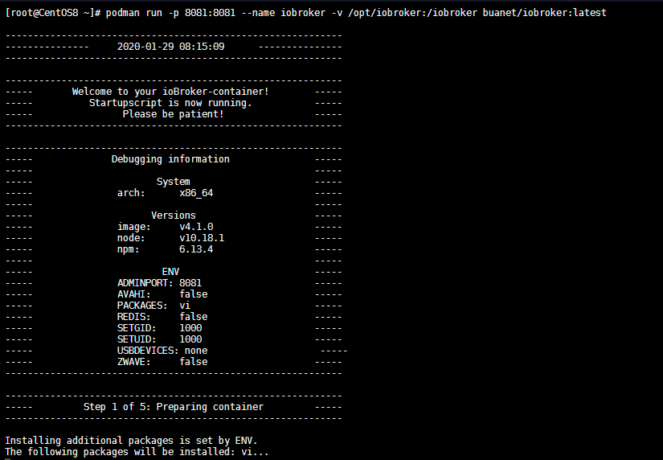

<!-- TOC -->

- [Installation through Podman on CentOS8](#installation-through-podman-on-centos8)

<!-- /TOC -->


## Installation through Podman on CentOS8

IoBroker for Docker is an Dockerimage for [ioBroker IoT platform](http://www.iobroker.net).

The automatically built images are available on [Docker Hub](hhttps://github.com/buanet/docker-iobroker). Download the image with one of the following command:


```bash
podman pull buanet/iobroker:latest
```

And and run it:


```bash
podman run -p 8081:8081 --name iobroker buanet/iobroker:latest
```





### Persist your Configuration


1. Find out your container ID (or just use the name you have assigned when running the image)


```bash
podman ps 
CONTAINER ID  IMAGE                                     COMMAND               CREATED         STATUS             PORTS                             NAMES
5582e69da175  localhost/buanet/iobroker:latest          /opt/scripts/iobr...  13 minutes ago  Up 13 minutes ago  0.0.0.0:8081->8081/tcp            iobroker
```


2. Get into the container and find the ioBroker location


```bash
[root@CentOS8 ~]# podman exec -ti 5582e69da175 /bin/bash
root@5582e69da175:/opt/iobroker# find / -name iobroker
/etc/sudoers.d/iobroker
/home/iobroker
/opt/iobroker
/opt/iobroker/iobroker
/usr/bin/iobroker
/iobroker
```


3. Stop and delete the container and change to runscript to mount the folder onto your host system:


```bash
podman stop iobroker
podman rm iobroker
podman run -p 8081:8081 \
  -p 8082:8082 \
  -p 8087:8087 \
  -p 1883:1883 \
  --name iobroker \
   -v /opt/iobroker:/opt/iobroker \
   -v /opt/iobroker/home:/home/iobroker \
  --detach=true \
  --restart="always" \
  buanet/iobroker:latest
```

> Port `8082` added for ioBroker visualization, port `8087` for the REST API and port `1883` for MQTT.


Make sure that the folders `/opt/iobroker/home` and `/opt/iobroker` exist on your host system (`chmod -R 777 /opt/iobroker` or `755` to give Podman all necessary permissions and `chcon -Rt svirt_sandbox_file_t /opt/motioneye`).


> I noticed a problem that podman changes the owner:group of those folders on my host system to iobroker:iobroker. But it sets the permission wrong and ioBroker no longer loads - you can check it with `podman logs iobroker`. Rerunning `chmod -R 777 /opt/iobroker` solves the issue.