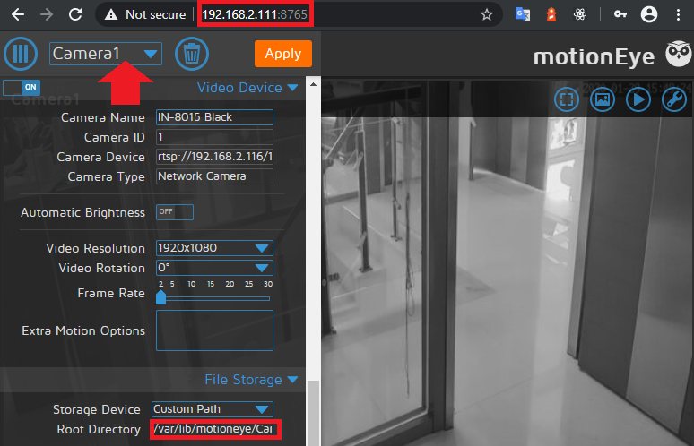

<!-- TOC -->

- [Installation through Podman on CentOS8](#installation-through-podman-on-centos8)
  - [Access MotionEye and Create a Camera](#access-motioneye-and-create-a-camera)
  - [Video Recording Persistence](#video-recording-persistence)

<!-- /TOC -->


## Installation of MotionEye through Podman on CentOS8

The automatically built images are available on [Docker Hub](https://hub.docker.com/r/ccrisan/motioneye/). Download the image with one of the following command:


```bash
podman pull ccrisan/motioneye:master-amd64
```

Or on an non-internet device - run the docker or podman command on your PC with an internet connection, e.g. on a Windows PC:


```bash
docker pull ccrisan/motioneye:master-amd64
docker save -o motioneye.docker ccrisan/motioneye:master-amd64
```

And copy the `motioneye.docker` file to your CentOS system and run:


```bash
podman load -i motioneye.docker
podman run ccrisan/motioneye:master-amd64
```


To run the container use the following command (__see correction below!__):


```bash
podman run --name="motioneye" \
    -p 8765:8765 \
    --hostname="motioneye" \
    -v /etc/localtime:/etc/localtime:ro \
    -v /opt/motioneye:/etc/motioneye \
    --restart="always" \
    --detach=true \
    ccrisan/motioneye:master-amd64
```


But I ran into some security-related issues with SELinux and permissions on `/opt/motioneye/` and `/opt/motioneye/lib`. Make sure to run `chmod` with the necessary rights (`chmod -R 777 /opt/motioneye` to open it up completely - some might prefer `755` instead) and `chcon -Rt svirt_sandbox_file_t /opt/motioneye`. I also added `--security-opt label=disable \` tag and the re-stream port `8081` for my camera.

Additionally I added a [motioneye.conf template](https://raw.githubusercontent.com/ccrisan/motioneye/78a89fbc2e2d2c284408f8eb1037c8598b4e715a/extra/motioneye.conf.sample) to the `/opt/motioneye` directory on my host system.


```bash
podman run --name="motioneye" \
    -p 8765:8765 \
    --hostname="motioneye" \
    -v /etc/localtime:/etc/localtime:ro \
    -v /opt/motioneye:/etc/motioneye \
    --security-opt label=disable \
    --restart="always" \
    --detach=true \
    ccrisan/motioneye:master-amd64
```

> Currently the video recordings from MotionEye are not persisted. To find out where those are stored we first have to run the container, check the location and revisit this run command ([see below](#video-recording-persistence)).


Add additional port mappings with the `-p` parameter if you want to use the streaming feature of motion: `-p 8765:8765 -p 8081:8081`; for cameras added, numbering of ports used for streaming starts from `8081` (second camera will use port `8082`, etc). Ports used for streaming can be later changed in motionEye (Advanced Settings -> Video Streaming -> Streaming Port) but should always match the ones that are being exposed from Docker.

If using additional services that make use of ports in the 808x range, then default mapping can be edited to avoid conflicting by mapping higher range port numbers that are not in use by other services (i.e., `-p 8765:8765 -p 58081:8081 -p 58082:8082`)

Change the bind path `/etc/motioneye`  according to your needs. The first contains the configuration files for motionEye. The bound file `/etc/localtime` is necessary for a proper timezone configuration inside the container using the timezone of the host.

To forward a video device of your host use an additional parameter like the following


```bash
--device=/dev/video0
```


> Check the [Podman Commands](https://github.com/containers/libpod/blob/master/commands.md) for more details.


### Access MotionEye and Create a Camera

Now that MotionEye is running we can access it on your servers IP address + the default port `8765` that we forwarded out of the container to all network interfaces, when ran the container.





Click on the drop down menu marked with the red arrow to add a camera. The RTSP streaming URL for your camera is it's IP address + the stream that you want extract (with falling resolution) `/11`, `/12` or `/13` - e.g.


```bash
rtsp://192.168.2.116/11
```

The directory that will store our video recordings is given by the marked root directory:


```bash
/var/lib/motioneye/{Camera Name}
```


Apply your settings and you should see your cameras live video.


### Video Recording Persistence

At the moment all video recordings that we create will be stored inside the container and thus be deleted once we shut it down. To prevent this from happening we log us into the container, locate the media storage directory and and mount a volume to persists this data.


```bash
podman ps -a
CONTAINER ID  IMAGE                                     COMMAND               STATUS                   PORTS                   NAMES
b2352521ed1a  localhost/ccrisan/motioneye:master-amd64  /bin/sh -c test -...  Up 6 minutes ago         0.0.0.0:8765->8765/tcp  motioneye
```

Now we know the container ID is `b2352521ed1a` (we could also use the container name - since we set it to `motioneye`).


```bash
[root@CentOS8 ~]# podman exec -ti b2352521ed1a /bin/bash
root@motioneye:/# find / -name motioneye
/etc/motioneye
/usr/local/lib/python2.7/dist-packages/motioneye
/usr/local/share/motioneye
/usr/share/motioneye
/var/lib/motioneye
root@motioneye:/# ll /var/lib/motioneye
total 0
drwxrwxrwx. 3 root root 21 Jan 29 15:32 ./
drwxr-xr-x. 1 root root 23 Jan 29 00:56 ../
drwxr-xr-x. 2 root root  6 Jan 29 15:32 Camera1/
```


We can see that the directory `/var/lib/motioneye` was created and holds a folder for our camera's recordings. We can now stop and delete the container and mount this directory as a volume to our host system to persist the data:


```bash
podman stop motioneye
podman rm motioneye
podman run --name="motioneye" \
    -p 8765:8765 \
    -p 8081:8081 \
    -p 8082:8082 \
    --hostname="motioneye" \
    -v /etc/localtime:/etc/localtime:ro \
    -v /opt/motioneye:/etc/motioneye \
    -v /opt/motioneye/lib:/var/lib/motioneye \
    --security-opt label=disable \
    --restart="always" \
    --detach=true \
    ccrisan/motioneye:master-amd64
```


Camera re-stream ports collided with the default ports used by ioBroker =>


```bash
podman run --name="motioneye" \
    -p 8765:8765 \
    -p 7777:7777 \
    -p 7778:7778 \
    --hostname="motioneye" \
    -v /etc/localtime:/etc/localtime:ro \
    -v /opt/motioneye:/etc/motioneye \
    -v /opt/motioneye/lib:/var/lib/motioneye \
    --security-opt label=disable \
    --restart="always" \
    --detach=true \
    ccrisan/motioneye:master-amd64
```