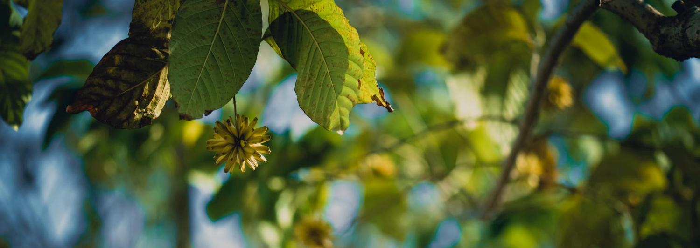

<!-- TOC -->

- [Finding Images](#finding-images)
- [Building Images](#building-images)
- [Running Containers on Images](#running-containers-on-images)
- [Working with Container Processes](#working-with-container-processes)
- [Working with the Container Filesystem](#working-with-the-container-filesystem)
- [Removing Images](#removing-images)
- [Miscellaneous](#miscellaneous)

<!-- /TOC -->

For more information about podman, visit the [Red Hat Developer website](https://developers.redhat.com/). This cheat sheet was written by Doug Tidwell, with huge thanks to Dan Walsh and Scott McCarty.

In the following `container` is either a container name or a container ID. If `tag` is omitted in image:tag , the default value is latest.

## Finding Images

| Command | Description |
|---|---|
| podman images | List all local images |
| podman history image:tag | Display information about how an image was built |
| podman login registryURL -u username [-p password] | Log in to a remote registry |
| podman pull registry/username/image:tag | Pull an image from a remote registry |
| podman search searchString | Search local cache and remote registries for images |
| podman logout | Log out of the current remote registry |

_The list of registries is defined in `/etc/containers/registries.conf`_

## Building Images

| Command | Description |
|---|---|
| podman build -t image:tag . | Build and tag an image using the instructions in Docker?le in the
current directory |
| podman build -t image:tag -f Dockerfile2 | Same as above, but with a di?erent Docker?le |
| podman tag image:tag image:tag2 | Add an additional name to a local image |
| podman tag image:tag registry/username/image:tag | Same as above, but the additional name includes a remote registry |
| podman push registry/username/image:tag | Push an image to a remote registry |

## Running Containers on Images

| Command | Description |
|---|---|
| podman run --rm -it [--name name] image:tag command | Run a container based on a given image. |

* `--rm` Remove the container after it exits
* `-it` Connect the container to the terminal
* `--name` name Give the container a name
* `image:tag` The image used to create the container
* `command` A command to run (/bin/bash for example)
* `-d` Run the container in the background
* `-p 8080:32000` Expose container port 8080 as localhost:32000
* `-v /var/lib/mydb:/var/lib/db` Map the /var/lib/mydb directory on localhost to a volume named /var/lib/db inside the container

| Command | Description |
|---|---|
| podman commit container newImage:tag | Create a new image based on the current state of a running container |
| podman create [--name name] image:tag | Create (but don’t start) a container from an image |
| podman start container | Start an existing container from an image |
| podman restart container | Restart an existing container |
| podman wait container1 [container2… ] | Wait on one or more containers to stop |
| podman stop container | Stop a running container gracefully |
| podman kill container | Send a signal to a running container |
| podman rm [-f] container | Remove a container (use -f if the container is running) |
| podman stats container | Display a live stream of a container’s resource usage |
| podman inspect container | Return metadata (in JSON) about a running container |

## Working with Container Processes

| Command | Description |
|---|---|
| podman ps [--all] | List the running containers on the system (use --all to include non-
running containers) |
| podman attach container | Attach to a running container and view its output or control it
+ + detaches from the container but leaves it running. |
| podman exec container command | Execute a command in a running container |
| podman top container | Display the running processes of a container |
| podman logs [-tail] container | Display the logs of a container |
| podman pause container / podman unpause container | Pause/unpause all the processes in a container |
| podman port container | List the port mappings from a container to localhost |

## Working with the Container Filesystem

| Command | Description |
|---|---|
| podman diff container | Display all the changes to a container’s ?lesystem |
| podman cp source target | Copy ?les and folders between a container and localhost |
| podman mount container / podman umount container | Mount or unmount a container’s root ?lesystem |
| podman import tarball | Import a tarball and save it as a ?lesystem image |
| podman export [-o outputFile] container | Export the container’s ?lesystem to a tar ?le |
| podman save [-o archiveFile] [--format docker-archive | oci-archive | oci-dir | docker-dir] image:tag | Save an image in docker-archive (default) or another format |
| podman load -i archiveFile | Load a saved image from docker-archive or another format |

## Removing Images

| Command | Description |
|---|---|
| podman rmi [-f] image:tag | Remove a local image from local cache (use -f to force removal) |
| podman rmi [-f] registry/username/image:tag | Remove a remote image from local cache (use -f to force removal) |

## Miscellaneous

| Command | Description |
|---|---|
| podman version | Display podman version information |
| podman info | Display information about the podman environment |