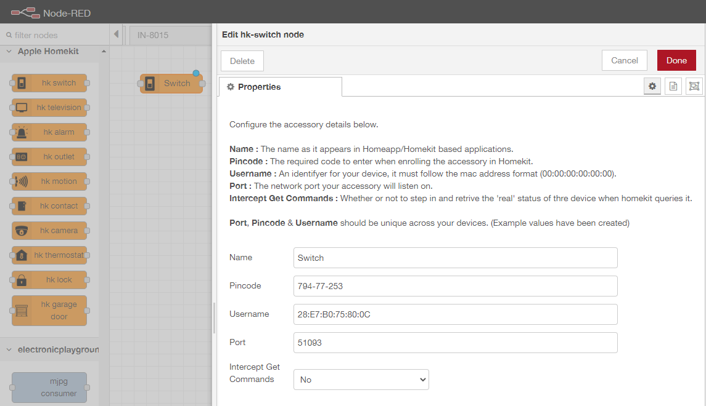
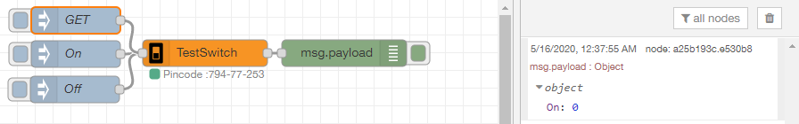
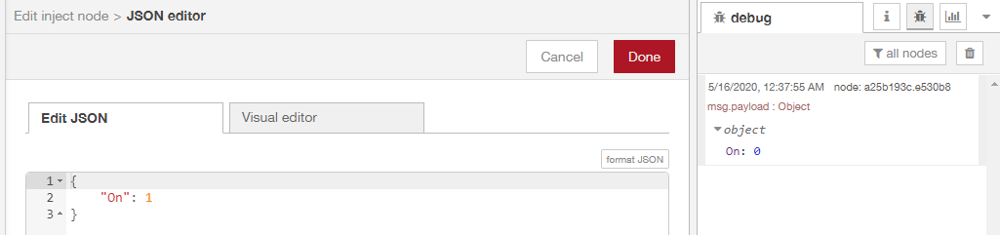
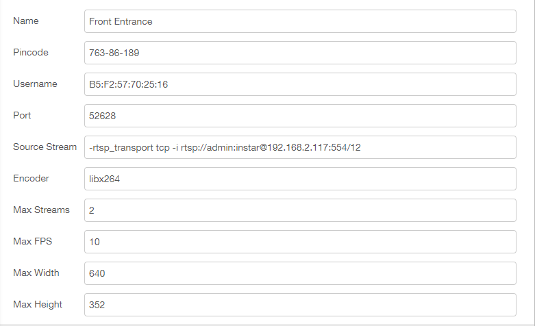
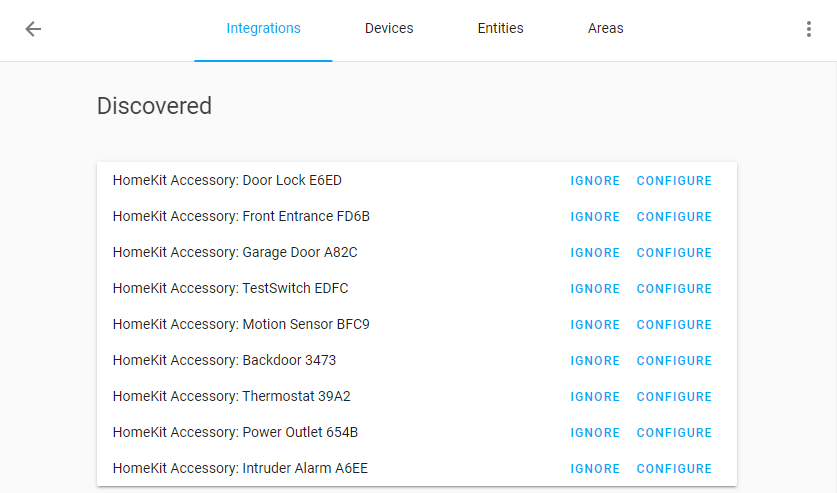

<!-- TOC -->

- [Bonjour](#bonjour)
- [FFMPEG](#ffmpeg)
    - [Commit your Changes to the Container Image](#commit-your-changes-to-the-container-image)
- [Adding Homekit Nodes](#adding-homekit-nodes)
    - [hk switch](#hk-switch)
    - [hk outlet](#hk-outlet)
    - [hk thermostat](#hk-thermostat)
    - [hk alarm](#hk-alarm)
    - [hk motion](#hk-motion)
    - [hk contact](#hk-contact)
    - [hk lock](#hk-lock)
    - [hk garage door](#hk-garage-door)
    - [hk camera](#hk-camera)
- [Adding your Homekit Devices to Home Assistant](#adding-your-homekit-devices-to-home-assistant)

<!-- /TOC -->


## Bonjour

First we need to add libraries for [Apple Bonjour mDNSResponder](https://pkgs.alpinelinux.org/package/edge/main/x86/avahi-compat-libdns_sd) support to our [Node-RED Container](/home-assistant-open-hab-node-red-io-broker-motion-eye-containerized#node-red):


```
podman exec -ti nodered /bin/bash
apk add avahi-compat-libdns_sd
```

_On a Debian based container image use_ `apt-get install libavahi-compat-libdnssd-dev` _instead_


## FFMPEG

The camera node requires FFMPEG to be installed:


```
apk add  --no-cache ffmpeg
ffmpeg -version
```


### Commit your Changes to the Container Image


Find out the ID of your working Node-RED container:

```bash
podman ps -a

CONTAINER ID  IMAGE                              CREATED      STATUS          NAMES
5a800b30d707  localhost/nodered/node-red:latest  2 hours ago  Up 2 hours ago  nodered
```


And commit the changes to your Node-RED image:

```bash
podman commit 5a800b30d707 localhost/nodered/node-red:latest

Getting image source signatures
Copying blob 5216338b40a7 skipped: already exists
Copying blob 71bfbf950c11 skipped: already exists
Copying blob be137f464809 skipped: already exists
Copying blob f67c97fd4436 skipped: already exists
Copying blob 35460e116648 skipped: already exists
Copying blob 3fd3eff2f520 skipped: already exists
Copying blob 9647323e45c3 skipped: already exists
Copying blob 630dbc93193b skipped: already exists
Copying blob d4e3c4f2011c skipped: already exists
Copying blob 15b62db68044 skipped: already exists
Copying blob 70f17cb313f5 skipped: already exists
Copying blob 4004cf0f3090 done
Copying config b98bf74922 done
Writing manifest to image destination
Storing signatures
b98bf74922ffaaeb1a24fba5ec27cc94dc8a82dbdea5e5b530daea0efa0b7136
```


## Adding Homekit Nodes

Install the Homekit nodes into Node-RED from the palette menu - I am choosing [node-red-contrib-homekit-preconfigured](http://flows.nodered.org/node/node-red-contrib-homekit-preconfigured) that comes with a couple of easy to use nodes for smarthome devices.





To GET an overview over all available characteristics contained within a node, simply inject the string `GetCharacteristics` and check the debug panel:





The switch node only offers the characteristic `On` which you can switch from `0` to `1` by injecting the following JSON object:





### hk switch

```json
[{"id":"dab26010.30d35","type":"hk-switch","z":"e6aaa2fa.a9d3a","pincode":"794-77-253","username":"28:E7:B0:75:80:0C","name":"TestSwitch","port":"51093","interceptget":"No","originalId":"dab26010.30d35","x":230,"y":60,"wires":[["a25b193c.e530b8"]]},{"id":"a25b193c.e530b8","type":"debug","z":"e6aaa2fa.a9d3a","name":"","active":true,"tosidebar":true,"console":false,"tostatus":false,"complete":"false","x":386,"y":60,"wires":[]},{"id":"de29bd4d.a3c6b","type":"inject","z":"e6aaa2fa.a9d3a","name":"On","topic":"","payload":"{\"On\":1}","payloadType":"json","repeat":"","crontab":"","once":false,"onceDelay":0.1,"x":85,"y":61,"wires":[["dab26010.30d35"]]},{"id":"879ccff8.550e4","type":"inject","z":"e6aaa2fa.a9d3a","name":"Off","topic":"","payload":"{\"On\":0}","payloadType":"json","repeat":"","crontab":"","once":false,"onceDelay":0.1,"x":84,"y":101,"wires":[["dab26010.30d35"]]},{"id":"5a0ba7f0.b25be8","type":"inject","z":"e6aaa2fa.a9d3a","name":"GET","topic":"","payload":"GetCharacteristics","payloadType":"str","repeat":"","crontab":"","once":false,"onceDelay":0.1,"x":85,"y":23,"wires":[["dab26010.30d35"]]}]
```


### hk outlet


```json
[{"id":"5bfbcc57.ae0584","type":"inject","z":"e6aaa2fa.a9d3a","name":"GET","topic":"","payload":"GetCharacteristics","payloadType":"str","repeat":"","crontab":"","once":false,"onceDelay":0.1,"x":84,"y":160,"wires":[["53cd054d.71517c"]]},{"id":"ae543ca6.70421","type":"debug","z":"e6aaa2fa.a9d3a","name":"","active":true,"tosidebar":true,"console":false,"tostatus":false,"complete":"false","x":407,"y":240,"wires":[]},{"id":"53cd054d.71517c","type":"hk-outlet","z":"e6aaa2fa.a9d3a","pincode":"559-11-933","username":"3E:37:41:D5:BF:22","name":"Power Outlet","port":"56821","interceptget":"Yes","originalId":"53cd054d.71517c","x":239,"y":240,"wires":[["ae543ca6.70421"]]},{"id":"54092f53.ccc79","type":"inject","z":"e6aaa2fa.a9d3a","name":"Off","topic":"","payload":"{\"On\":0}","payloadType":"json","repeat":"","crontab":"","once":false,"onceDelay":0.1,"x":84,"y":239,"wires":[["53cd054d.71517c"]]},{"id":"88f4911e.d87d5","type":"inject","z":"e6aaa2fa.a9d3a","name":"On","topic":"","payload":"{\"On\":1}","payloadType":"json","repeat":"","crontab":"","once":false,"onceDelay":0.1,"x":85,"y":199,"wires":[["53cd054d.71517c"]]},{"id":"c308fa64.b349e8","type":"inject","z":"e6aaa2fa.a9d3a","name":"Not In Use","topic":"","payload":"{\"OutletInUse\":0}","payloadType":"json","repeat":"","crontab":"","once":false,"onceDelay":0.1,"x":91,"y":320,"wires":[["53cd054d.71517c"]]},{"id":"aae5ea4e.139478","type":"inject","z":"e6aaa2fa.a9d3a","name":"In Use","topic":"","payload":"{\"OutletInUse\":1}","payloadType":"json","repeat":"","crontab":"","once":false,"onceDelay":0.1,"x":82,"y":280,"wires":[["53cd054d.71517c"]]}]
```


### hk thermostat


```json
[{"id":"7e793a50.1a4ed4","type":"inject","z":"e6aaa2fa.a9d3a","name":"Current/Target Temp","topic":"","payload":"{\"CurrentTemperature\":21,\"TargetTemperature\":24,\"TemperatureDisplayUnits\":\"°C\"}","payloadType":"json","repeat":"","crontab":"","once":false,"onceDelay":0.1,"x":124,"y":413,"wires":[["970b8ade.44fb88"]]},{"id":"970b8ade.44fb88","type":"hk-thermostat","z":"e6aaa2fa.a9d3a","pincode":"577-50-506","username":"90:D1:75:A3:59:89","name":"Thermostat","port":"52378","interceptget":"Yes","supportsCooling":"No","originalId":"970b8ade.44fb88","x":327,"y":375,"wires":[["5c7fd16a.bdaaf"]]},{"id":"5c7fd16a.bdaaf","type":"debug","z":"e6aaa2fa.a9d3a","name":"","active":true,"tosidebar":true,"console":false,"tostatus":false,"complete":"false","x":487,"y":375,"wires":[]},{"id":"fe72146a.0de2c8","type":"inject","z":"e6aaa2fa.a9d3a","name":"GET","topic":"","payload":"GetCharacteristics","payloadType":"str","repeat":"","crontab":"","once":false,"onceDelay":0.1,"x":84,"y":375,"wires":[["970b8ade.44fb88"]]},{"id":"e97830e2.6813a","type":"inject","z":"e6aaa2fa.a9d3a","name":"Current/TargetState","topic":"","payload":"{\"CurrentHeatingCoolingState\":0,\"TargetHeatingCoolingState\":1}","payloadType":"json","repeat":"","crontab":"","once":false,"onceDelay":0.1,"x":124,"y":451,"wires":[["970b8ade.44fb88"]]}]
```


### hk alarm


```json
[{"id":"d1c360eb.a33f5","type":"hk-alarm","z":"e6aaa2fa.a9d3a","pincode":"771-22-989","username":"B4:B1:DB:16:E6:88","name":"Intruder Alarm","port":"49288","interceptget":"Yes","originalId":"d1c360eb.a33f5","x":324,"y":512,"wires":[["d6de3190.19907"]]},{"id":"c0e56e96.9af34","type":"inject","z":"e6aaa2fa.a9d3a","name":"GET","topic":"","payload":"GetCharacteristics","payloadType":"str","repeat":"","crontab":"","once":false,"onceDelay":0.1,"x":87,"y":512,"wires":[["d1c360eb.a33f5"]]},{"id":"d6de3190.19907","type":"debug","z":"e6aaa2fa.a9d3a","name":"","active":true,"tosidebar":true,"console":false,"tostatus":false,"complete":"false","x":492,"y":512,"wires":[]},{"id":"a6a0c561.9081d8","type":"inject","z":"e6aaa2fa.a9d3a","name":"Current/Target State","topic":"","payload":"{\"SecuritySystemTargetState\":1,\"SecuritySystemCurrentState\":1}","payloadType":"json","repeat":"","crontab":"","once":false,"onceDelay":0.1,"x":126,"y":551,"wires":[["d1c360eb.a33f5"]]},{"id":"3f1d4147.2185ee","type":"inject","z":"e6aaa2fa.a9d3a","name":"Tampered/Fault State","topic":"","payload":"{\"StatusFault\":1,\"StatusTampered\":1}","payloadType":"json","repeat":"","crontab":"","once":false,"onceDelay":0.1,"x":135,"y":590,"wires":[["d1c360eb.a33f5"]]}]
```


### hk motion


```json
[{"id":"bcdcd6c0.8530c8","type":"inject","z":"e6aaa2fa.a9d3a","name":"GET","topic":"","payload":"GetCharacteristics","payloadType":"str","repeat":"","crontab":"","once":false,"onceDelay":0.1,"x":85,"y":647,"wires":[["11606b68.e07905"]]},{"id":"1e440055.ba776","type":"debug","z":"e6aaa2fa.a9d3a","name":"","active":true,"tosidebar":true,"console":false,"tostatus":false,"complete":"false","x":487,"y":647,"wires":[]},{"id":"11606b68.e07905","type":"hk-motion","z":"e6aaa2fa.a9d3a","pincode":"199-28-428","username":"C7:DA:E5:C2:49:71","name":"Motion Sensor","port":"57989","interceptget":"Yes","originalId":"11606b68.e07905","x":321,"y":647,"wires":[["1e440055.ba776"]]},{"id":"c7b07991.6079e8","type":"inject","z":"e6aaa2fa.a9d3a","name":"MotionDetected","topic":"","payload":"{\"MotionDetected\":true}","payloadType":"json","repeat":"","crontab":"","once":false,"onceDelay":0.1,"x":115,"y":684,"wires":[["11606b68.e07905"]]},{"id":"c7c10f08.c9f6d","type":"inject","z":"e6aaa2fa.a9d3a","name":"Active/Charging","topic":"","payload":"{\"StatusActive\":0, \"ChargingState\": 1}","payloadType":"json","repeat":"","crontab":"","once":false,"onceDelay":0.1,"x":116,"y":723,"wires":[["11606b68.e07905"]]},{"id":"d6204201.c36fe","type":"inject","z":"e6aaa2fa.a9d3a","name":"Level/LowBatt","topic":"","payload":"{\"BatteryLevel\":99, \"StatusLowBattery\": 0}","payloadType":"json","repeat":"","crontab":"","once":false,"onceDelay":0.1,"x":107,"y":762,"wires":[["11606b68.e07905"]]}]
```


### hk contact


```json
[{"id":"bf0a64d3.f53088","type":"inject","z":"e6aaa2fa.a9d3a","name":"GET","topic":"","payload":"GetCharacteristics","payloadType":"str","repeat":"","crontab":"","once":false,"onceDelay":0.1,"x":91,"y":828,"wires":[["61ceb5eb.e3ea3c"]]},{"id":"800d69f1.ee8418","type":"debug","z":"e6aaa2fa.a9d3a","name":"","active":true,"tosidebar":true,"console":false,"tostatus":false,"complete":"false","x":505,"y":828,"wires":[]},{"id":"14614a57.b85056","type":"inject","z":"e6aaa2fa.a9d3a","name":"ContactSensorState","topic":"","payload":"{\"ContactSensorState\":1}","payloadType":"json","repeat":"","crontab":"","once":false,"onceDelay":0.1,"x":131,"y":870,"wires":[["61ceb5eb.e3ea3c"]]},{"id":"61ceb5eb.e3ea3c","type":"hk-contact","z":"e6aaa2fa.a9d3a","pincode":"174-31-966","username":"1B:2B:CD:87:2B:85","name":"Backdoor","port":"47675","interceptget":"Yes","originalId":"61ceb5eb.e3ea3c","x":332,"y":828,"wires":[["800d69f1.ee8418"]]},{"id":"6a853bbd.3c79e4","type":"inject","z":"e6aaa2fa.a9d3a","name":"Tampered/Fault State","topic":"","payload":"{\"StatusFault\":1, \"StatusTampered\":1}","payloadType":"json","repeat":"","crontab":"","once":false,"onceDelay":0.1,"x":140,"y":909,"wires":[["61ceb5eb.e3ea3c"]]},{"id":"ef12f77f.7f8ee8","type":"inject","z":"e6aaa2fa.a9d3a","name":"Tampered/Fault State","topic":"","payload":"{\"BatteryLevel\":99, \"ChargingState\":0, \"StatusLowBattery\":1}","payloadType":"json","repeat":"","crontab":"","once":false,"onceDelay":0.1,"x":140,"y":948,"wires":[["61ceb5eb.e3ea3c"]]}]
```


### hk lock


```json
[{"id":"853f8be1.9b5d98","type":"inject","z":"e6aaa2fa.a9d3a","name":"GET","topic":"","payload":"GetCharacteristics","payloadType":"str","repeat":"","crontab":"","once":false,"onceDelay":0.1,"x":90,"y":1018,"wires":[["f2c56a8d.3f6638"]]},{"id":"74c13b20.ec2da4","type":"debug","z":"e6aaa2fa.a9d3a","name":"","active":true,"tosidebar":true,"console":false,"tostatus":false,"complete":"false","x":419,"y":1018,"wires":[]},{"id":"c09d1e63.070f6","type":"inject","z":"e6aaa2fa.a9d3a","name":"Target/CurrentState","topic":"","payload":"{\"LockTargetState\":0, \"LockCurrentState\":1}","payloadType":"json","repeat":"","crontab":"","once":false,"onceDelay":0.1,"x":130,"y":1060,"wires":[["f2c56a8d.3f6638"]]},{"id":"f2c56a8d.3f6638","type":"hk-lock","z":"e6aaa2fa.a9d3a","pincode":"277-44-193","username":"33:66:1F:D4:67:3D","name":"Door Lock","port":"52873","interceptget":"Yes","originalId":"f2c56a8d.3f6638","x":250,"y":1018,"wires":[["74c13b20.ec2da4"]]}]
```


### hk garage door


```json
[{"id":"43593ce2.bf48f4","type":"inject","z":"e6aaa2fa.a9d3a","name":"GET","topic":"","payload":"GetCharacteristics","payloadType":"str","repeat":"","crontab":"","once":false,"onceDelay":0.1,"x":90,"y":1140,"wires":[["a543a389.09561"]]},{"id":"7d018199.be1cd","type":"debug","z":"e6aaa2fa.a9d3a","name":"","active":true,"tosidebar":true,"console":false,"tostatus":false,"complete":"false","x":492,"y":1140,"wires":[]},{"id":"1c155e45.7fe2b2","type":"inject","z":"e6aaa2fa.a9d3a","name":"Current/TargetState","topic":"","payload":"{\"CurrentDoorState\":1, \"TargetDoorState\":0}","payloadType":"json","repeat":"","crontab":"","once":false,"onceDelay":0.1,"x":130,"y":1220,"wires":[["a543a389.09561"]]},{"id":"a543a389.09561","type":"hk-garage-door","z":"e6aaa2fa.a9d3a","pincode":"287-67-232","username":"47:4D:3C:E5:92:9D","name":"Garage Door","port":"44037","interceptget":"Yes","originalId":"a543a389.09561","x":331,"y":1140,"wires":[["7d018199.be1cd"]]},{"id":"8a04f667.1aa958","type":"inject","z":"e6aaa2fa.a9d3a","name":"LockCurrent/TargetState","topic":"","payload":"{\"LockCurrentState\":1, \"LockTargetState\":1}","payloadType":"json","repeat":"","crontab":"","once":false,"onceDelay":0.1,"x":150,"y":1260,"wires":[["a543a389.09561"]]},{"id":"34bb2003.96a8b","type":"inject","z":"e6aaa2fa.a9d3a","name":"Obstruction","topic":"","payload":"{\"ObstructionDetected\": true}","payloadType":"json","repeat":"","crontab":"","once":false,"onceDelay":0.1,"x":110,"y":1180,"wires":[["a543a389.09561"]]}]
```


### hk camera


The use of the camera node will require FFMPEG to be installed in its default location. (for *nix that is the bin directory. For windows users, ensure the FFMPEG directory is setup in the 'PATH' environment variable)


Configure the accessory details below.

* __Name__ : The name as it appears in Homeapp/Homekit based applications.
* __Pincode__ : The required code to enter when enrolling the accessory in Homekit.
* __Username__ : An identifier for your device, it must follow the mac address format (00:00:00:00:00:00).
* __Port__ : The network port your accessory will listen on.
* __Max Streams__ : The max number of live streams that can occur.
* __Max Width/Heigh__ : The maximum size of the video stream (refer to your IP camera settings).
* __Max FPS__ : Max framerate of the live stream (refer to your IP camera settings).
* __Source Stream__ : The network stream used to capture live and still footage, still footage is derived from a 1 second frame.
* __Encoder__ : The ffmpeg video encoder to use, when streaming footage.

Port, Pincode & Username should be unique across your devices.





## Adding your Homekit Devices to Home Assistant

In Home Assistant head over to the __Configuration__ / __Integrations__ tab. All your devices should already be listed there:





Click on configure and add the corresponding Pin Code (as assigned in Node-RED).
