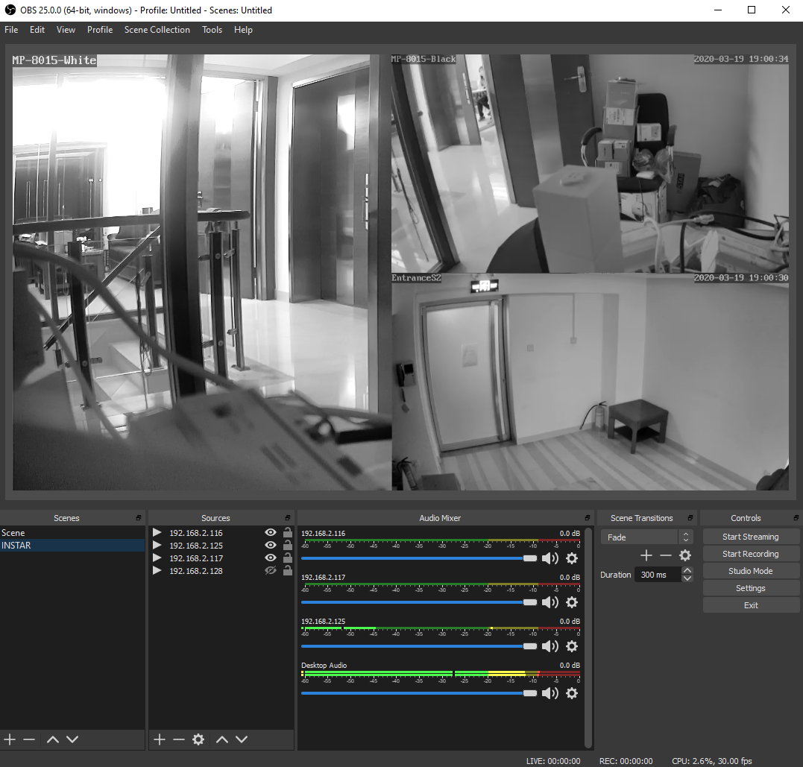
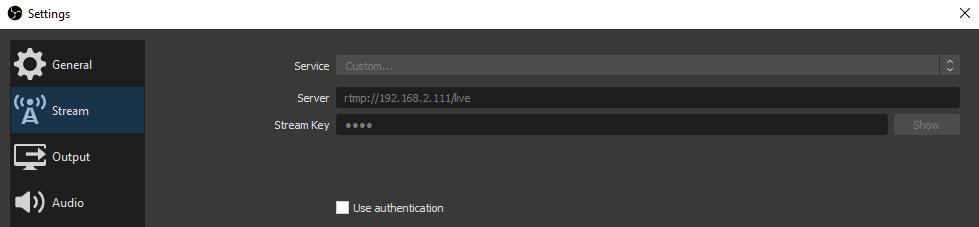
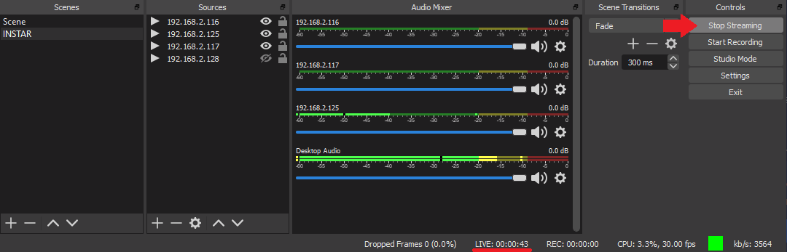
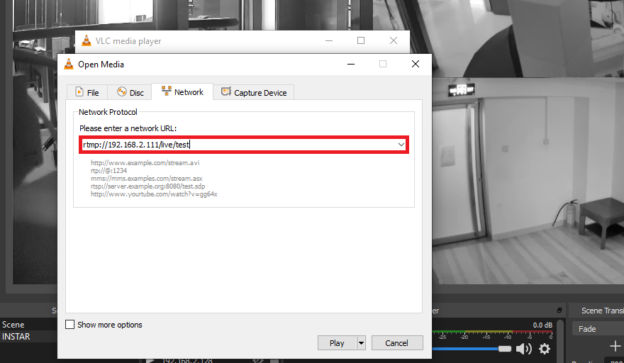
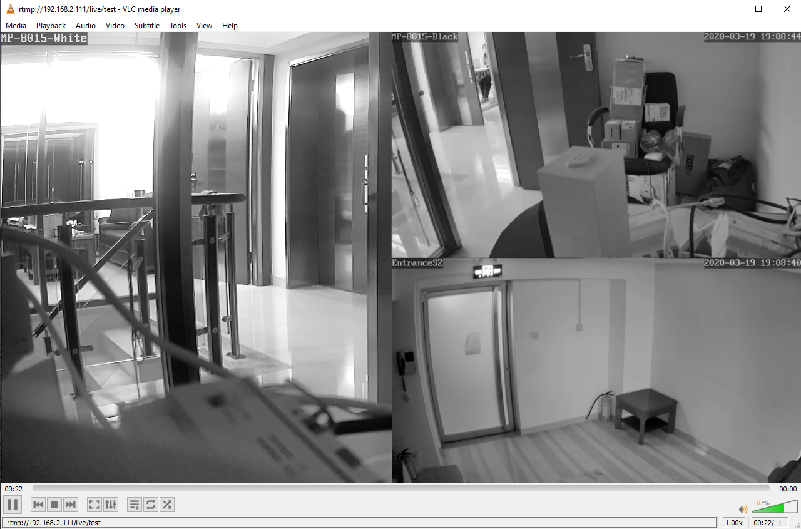
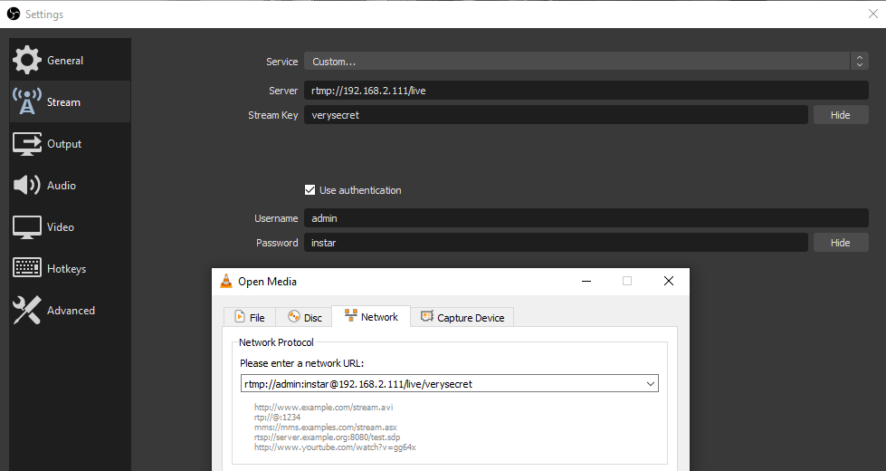

<!-- TOC -->

- [Building the Docker Image](#building-the-docker-image)
    - [Preparing Ubuntu](#preparing-ubuntu)
    - [Installing NGINX](#installing-nginx)
    - [Configuring NGINX to use RTMP](#configuring-nginx-to-use-rtmp)
    - [Open Broadcaster Software](#open-broadcaster-software)
    - [Installing ffmpeg](#installing-ffmpeg)
    - [Create Directories](#create-directories)
    - [Configuring NGINX](#configuring-nginx)
- [Backup Default NGINX Config](#backup-default-nginx-config)

<!-- /TOC -->


> [This is an update / modified version of this tutorial on obsproject.com](https://obsproject.com/forum/resources/how-to-set-up-your-own-private-rtmp-server-using-nginx.50/)


## Building the Docker Image

### Preparing Ubuntu

Start by pulling the latest [Ubuntu Image from DockerHub](https://hub.docker.com/_/ubuntu) and recommit it with a descriptive name:


```bash
docker pull ubuntu
podman run ubuntu:latest
```

```bash
podman ps -a
CONTAINER ID  IMAGE                     COMMAND      CREATED
cd3d48f2ca99  localhost/ubuntu:latest   /bin/bash    7 seconds ago
```


```bash
podman commit --author "Mike Polinowski" cd3d48f2ca99 nginx-rtmp-streamer
```


```bash
podman images                                                                                          

REPOSITORY                       TAG            IMAGE ID       CREATED          SIZE
localhost/nginx-rtmp-streamer    latest         603c26d12092   30 seconds ago   66.6 MB
```


```bash
podman run \
    --name rtmp \
    --net=host \
    --privileged \
    --rm \
    -ti -u root localhost/nginx-rtmp-streamer /bin/bash
```


### Installing NGINX

Make sure you have the necessary tools to build `nginx` using the following command::


```bash
apt update && apt upgrade
apt install build-essential libpcre3 libpcre3-dev libssl-dev wget unzip zlibc zlib1g zlib1g-dev nano
```

From your home directory, download and unpack the [latest version of the nginx source code](http://nginx.org/en/download.html):


```bash
cd ~
wget http://nginx.org/download/nginx-1.16.1.tar.gz
tar -zxvf nginx-1.16.1.tar.gz
```


Next, get and unpack the RTMP module source code from git:


```bash
wget https://github.com/sergey-dryabzhinsky/nginx-rtmp-module/archive/dev.zip
unzip dev.zip
```


Now to building `nginx`:


```bash
cd nginx-1.16.1
./configure --with-http_ssl_module --add-module=../nginx-rtmp-module-dev
make
make install
```

By default it installs to `/usr/local/nginx`. You can start it with:


```bash
/usr/local/nginx/sbin/nginx
```


And to test to make sure `nginx` is running, point your browser to `http://<your server ip>/`:


```bash
Welcome to nginx!
If you see this page, the nginx web server is successfully installed and working. Further configuration is required.

For online documentation and support please refer to nginx.org.
Commercial support is available at nginx.com.

Thank you for using nginx.
```


### Configuring NGINX to use RTMP

Open your config file, located by default at `/usr/local/nginx/conf/nginx.conf` and add the following at the very end of the file:


```conf
rtmp {
        server {
                listen 1935;
                chunk_size 4096;

                application live {
                        live on;
                        record off;
                }
        }
}
```


This is an extremely basic configuration with a "live" application that simply forwards the RTMP stream on to whoever requests it. [Here's the whole configuration guide](https://github.com/arut/nginx-rtmp-module/wiki/Directives), which shows you how to forward streams to other places (such as Twitch), save recordings of uploads, output stats, etc.


Restart nginx with:


```bash
/usr/local/nginx/sbin/nginx -s stop
/usr/local/nginx/sbin/nginx
```


### Open Broadcaster Software





We can now configure the [OBS Studio software](https://github.com/obsproject/obs-studio/wiki/Install-Instructions) to push camera streams to our RTMP server. Create a new profile in OBS, and change your Broadcast Settings:


```bash
Streaming Service: Custom
Server: rtmp://<your server ip>/live
Play Path/Stream Key: test
```





Save your settings and click on __Start Streaming__:





You can access the RTMP stream with a software like the [VLC Player](https://www.videolan.org/vlc/index.html) via the following URL:


```bash
rtmp://<your server ip>/live/test
```





You should be able to see the broadcasted video stream:





Adding user authentication:





## Backup Default NGINX Config


```conf
#user  nobody;
worker_processes  1;

#error_log  logs/error.log;
#error_log  logs/error.log  notice;
#error_log  logs/error.log  info;

#pid        logs/nginx.pid;


events {
    worker_connections  1024;
}


http {
    include       mime.types;
    default_type  application/octet-stream;

    #log_format  main  '$remote_addr - $remote_user [$time_local] "$request" '
    #                  '$status $body_bytes_sent "$http_referer" '
    #                  '"$http_user_agent" "$http_x_forwarded_for"';

    #access_log  logs/access.log  main;

    sendfile        on;
    #tcp_nopush     on;

    #keepalive_timeout  0;
    keepalive_timeout  65;

    #gzip  on;

    server {
        listen       80;
        server_name  localhost;

        #charset koi8-r;

        #access_log  logs/host.access.log  main;

        location / {
            root   html;
            index  index.html index.htm;
        }

        #error_page  404              /404.html;

        # redirect server error pages to the static page /50x.html
        #
        error_page   500 502 503 504  /50x.html;
        location = /50x.html {
            root   html;
        }

        # proxy the PHP scripts to Apache listening on 127.0.0.1:80
        #
        #location ~ \.php$ {
        #    proxy_pass   http://127.0.0.1;
        #}

        # pass the PHP scripts to FastCGI server listening on 127.0.0.1:9000
        #
        #location ~ \.php$ {
        #    root           html;
        #    fastcgi_pass   127.0.0.1:9000;
        #    fastcgi_index  index.php;
        #    fastcgi_param  SCRIPT_FILENAME  /scripts$fastcgi_script_name;
        #    include        fastcgi_params;
        #}

        # deny access to .htaccess files, if Apache's document root
        # concurs with nginx's one
        #
        #location ~ /\.ht {
        #    deny  all;
        #}
    }


    # another virtual host using mix of IP-, name-, and port-based configuration
    #
    #server {
    #    listen       8000;
    #    listen       somename:8080;
    #    server_name  somename  alias  another.alias;

    #    location / {
    #        root   html;
    #        index  index.html index.htm;
    #    }
    #}


    # HTTPS server
    #
    #server {
    #    listen       443 ssl;
    #    server_name  localhost;

    #    ssl_certificate      cert.pem;
    #    ssl_certificate_key  cert.key;

    #    ssl_session_cache    shared:SSL:1m;
    #    ssl_session_timeout  5m;

    #    ssl_ciphers  HIGH:!aNULL:!MD5;
    #    ssl_prefer_server_ciphers  on;

    #    location / {
    #        root   html;
    #        index  index.html index.htm;
    #    }
    #}

}
# rtmp {
#         server {
#                 listen 1935;
#                 chunk_size 4096;
# 
#                 application live {
#                         live on;
#                         record off;
#                 }
#         }
# }
```