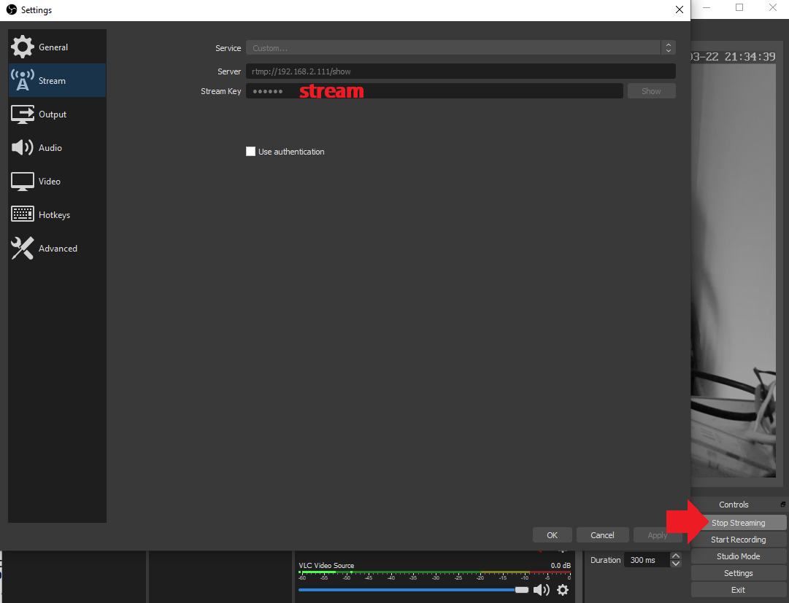
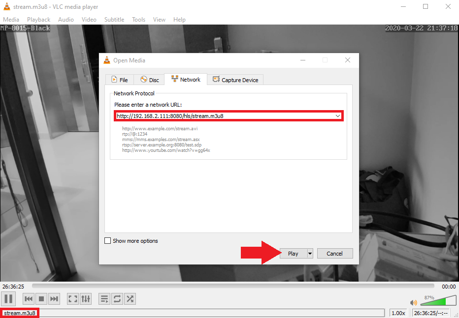

<!-- TOC -->

- [Update the NGINX Configuration File](#update-the-nginx-configuration-file)
    - [RTMP Module Config](#rtmp-module-config)
    - [HTTP Server Config](#http-server-config)
    - [Complete nginx.conf](#complete-nginxconf)
- [Test your Stream](#test-your-stream)
- [From existing rtmp stream already in h264](#from-existing-rtmp-stream-already-in-h264)
- [From local webcam](#from-local-webcam)
- [Embed within website](#embed-within-website)

<!-- /TOC -->


> This tutorial starts where the last ended. I setup OBS to re-stream my INSTAR IP cameras RTSP stream to the NGINX RTMP module and tested that I was able to access this RTMP stream with a VLC player. I now want to embed this video stream into a website ([Reference](https://docs.peer5.com/guides/setting-up-hls-live-streaming-server-using-nginx/)).


## Update the NGINX Configuration File

### RTMP Module Config

Our current RTMP setup looks like this:


```conf
 rtmp {
         server {
                 listen 1935;
                 chunk_size 4096;
 
                 application live {
                         live on;
                         record off;
                 }
         }
 }
```


We will be using stream as our stream name so our endpoint will be: `rtmp://localhost/show/stream` . Which will later be available as `http://localhost:8080/hls/stream.m3u8`. For good HLS experience we recommend using 3 seconds fragments with 60 seconds playlist:


```conf
rtmp {
    server {
        listen 1935; # Listen on standard RTMP port
        chunk_size 4096;

        application show {
            live on;
            # Turn on HLS
            hls on;
            hls_path /mnt/hls/;
            hls_fragment 3;
            hls_playlist_length 60;
            # disable consuming the stream from nginx as rtmp
            deny play all;
        }
    }
}
```


Note that the example points `/mnt/hls/` as the target path for the hls playlist and video files. You can change this to a different directory but make sure that nginx have write permissions:


```bash
mkdir /mnt/hls/
chown -R <nginx user>:<nginx user> /mnt/hls/
chmod 777 /mnt/hls
```


### HTTP Server Config

Since HLS consists of static files, a simple http server can be set up with two additions, correct MIME types and CORS headers.


```conf
server {
    listen 8080;

    location /hls {
        # Disable cache
        add_header Cache-Control no-cache;

        # CORS setup
        add_header 'Access-Control-Allow-Origin' '*' always;
        add_header 'Access-Control-Expose-Headers' 'Content-Length';

        # allow CORS preflight requests
        if ($request_method = 'OPTIONS') {
            add_header 'Access-Control-Allow-Origin' '*';
            add_header 'Access-Control-Max-Age' 1728000;
            add_header 'Content-Type' 'text/plain charset=UTF-8';
            add_header 'Content-Length' 0;
            return 204;
        }

        types {
            application/vnd.apple.mpegurl m3u8;
            video/mp2t ts;
        }

        root /mnt/;
    }
}
```


### Complete nginx.conf

The default location for nginx conf is `/usr/local/nginx/conf/nginx.conf` or `/etc/nginx/nginx.conf`:


```conf
worker_processes  auto;
events {
    worker_connections  1024;
}

# RTMP configuration
rtmp {
    server {
        listen 1935; # Listen on standard RTMP port
        chunk_size 4096;

        application show {
            live on;
            # Turn on HLS
            hls on;
            hls_path /mnt/hls/;
            hls_fragment 3;
            hls_playlist_length 60;
            # disable consuming the stream from nginx as rtmp
            deny play all;
        }
    }
}

http {
    sendfile off;
    tcp_nopush on;
    directio 512;
    default_type application/octet-stream;

    server {
        listen 8080;

        location / {
            # Disable cache
            add_header 'Cache-Control' 'no-cache';

            # CORS setup
            add_header 'Access-Control-Allow-Origin' '*' always;
            add_header 'Access-Control-Expose-Headers' 'Content-Length';

            # allow CORS preflight requests
            if ($request_method = 'OPTIONS') {
                add_header 'Access-Control-Allow-Origin' '*';
                add_header 'Access-Control-Max-Age' 1728000;
                add_header 'Content-Type' 'text/plain charset=UTF-8';
                add_header 'Content-Length' 0;
                return 204;
            }

            types {
                application/dash+xml mpd;
                application/vnd.apple.mpegurl m3u8;
                video/mp2t ts;
            }

            root /mnt/;
        }
    }
}
```


Restart nginx with:

```bash
/usr/local/nginx/sbin/nginx -s stop
/usr/local/nginx/sbin/nginx -t
/usr/local/nginx/sbin/nginx
```


## Test your Stream








## From existing rtmp stream already in h264

if you have an existing rtmp stream in the correct codec, you can skip ffmpeg and tell nginx to pull the stream directly. In order to do so add a [pull directive](https://github.com/arut/nginx-rtmp-module/wiki/Directives#pull) under application section in nginx.conf like so:


```conf
application show {
    live on;
    pull rtmp://example.com:4567/sports/channel3 live=1;
    # to change the local stream name use this syntax: ... live=1 name=ch3; 

    # other directives...
    # hls_...
}
```


## From local webcam

To achieve the stream encoding and muxing we will use the almighty ffmpeg.

To install ffmpeg using [PPA](https://launchpad.net/~mc3man/+archive/ubuntu/bionic-prop) run these commands


```bash
add-apt-repository ppa:mc3man/bionic-prop
apt-get update
apt-get install ffmpeg
```

```bash
ffmpeg -i rtsp://192.168.2.117/12 -vcodec libx264 -vprofile baseline -acodec aac -strict -2 -f flv rtmp://localhost:1935/show/stream
```


* `-re` - consume stream on media's native bitrate (and not as fast as possible)
* `-f` - use video4linux2 plugin
* `-i` - select physical device to capture from
* `-vcodec` - specify video codec to output
* `-vprofile` - use x264 baseline profile
* `-acodec` - use aac audio codec
* `-strict` - allow using the experimental aac codec
* `-f` - specify format to output
* `rtmp://localhost/show/stream` - rtmp endpoint to stream to. if the target port is not 1935 is should be included in the uri.

The last path component is the stream name - that means that multiple channels can be pushed using different names


```conf
rtmp {
    server {
        listen 1935; # Listen on standard RTMP port
        chunk_size 4096;

        application show {

            # Once receive stream, transcode for adaptive streaming
            # This single ffmpeg command takes the input and transforms
            # the source into 4 different streams with different bitrate
            # and quality. P.S. The scaling done here respects the aspect
            # ratio of the input.

            exec ffmpeg -i rtmp://192.168.2.111/appname/streamname -vcodec libx264 -vprofile baseline -acodec aac -strict -2 -f flv rtmp://localhost/show/stream
            
            live on;
            # Turn on HLS
            hls on;
            hls_path /mnt/hls/;
            hls_fragment 3;
            hls_playlist_length 60;
            # disable consuming the stream from nginx as rtmp
            deny play all;
        }
    }
}
```


Restart nginx with:

```bash
/usr/local/nginx/sbin/nginx -s stop
/usr/local/nginx/sbin/nginx -t
/usr/local/nginx/sbin/nginx
```


## Embed within website

Now that we are pushing our stream into nginx, a manifest file in the format stream-name.m3u8 is created in the target folder along with the video fragments.

For our example, the manifest is available at: http://localhost:8080/hls/stream.m3u8.

For testing our new HLS live stream we will use [videojs5](http://videojs.com/).


```html
<video id=autoplay width="720" height="360" class="video-js vjs-default-skin vjs-big-play-centered" controls>
  <source src="http://192.168.2.111:8080/hls/stream.m3u8" type="application/x-mpegURL">
</video>


<link href="//vjs.zencdn.net/5.7.1/video-js.css" rel="stylesheet">
<script src="//vjs.zencdn.net/5.7.1/video.js"></script>
<script src="//videojs.github.io/videojs-contrib-hls/node_modules/videojs-contrib-hls/dist/videojs.hls.min.js"></script>

<script>
var player = videojs('autoplay');
player.play();
</script>
```


[HTML5 Boilerplate](https://html5boilerplate.com)


