<!-- TOC -->

- [Installing Cockpit Web Console](#installing-cockpit-web-console)
- [System Performance Logging](#system-performance-logging)
- [Changing the Hostname](#changing-the-hostname)
- [Changing the Timezone](#changing-the-timezone)
- [User Management](#user-management)
- [Networking](#networking)
- [Podman Containers](#podman-containers)

<!-- /TOC -->


## Installing Cockpit Web Console

Install it on your system by using the command below, which will install the [cockpit](https://cockpit-project.org) with its required dependencies.


```bash
yum install cockpit cockpit-storaged cockpit-podman cockpit-dashboard
```


Enable and start the cockpit.socket service to connect to the system through the web console


```bash
systemctl start cockpit.socket
systemctl enable --now cockpit.socket
systemctl status cockpit.socket
```


If you are running a firewalld on the system, you need to open the cockpit port 9090 in the firewall.


```bash
firewall-cmd --permanent --zone=public --add-service=cockpit
firewall-cmd --reload
```


Open the Cockpit web console in your web browser on port 9090, proceed past the `NET::ERR_CERT_AUTHORITY_INVALID` warning (or install a CA certificate on your CentOS server) and login with your LINUX user:

> The console uses a _.cert_ file certificate from `/etc/cockpit/ws-certs.d` directory. To avoid having to prompt security warnings, install a signed certificate - e.g. LetsEncrypt. Check [documentation](https://cockpit-project.org/guide/latest/https.html#https-certificates) for details.


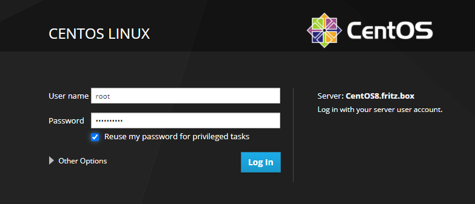


## System Performance Logging

You can activate System Logging from the Interface:


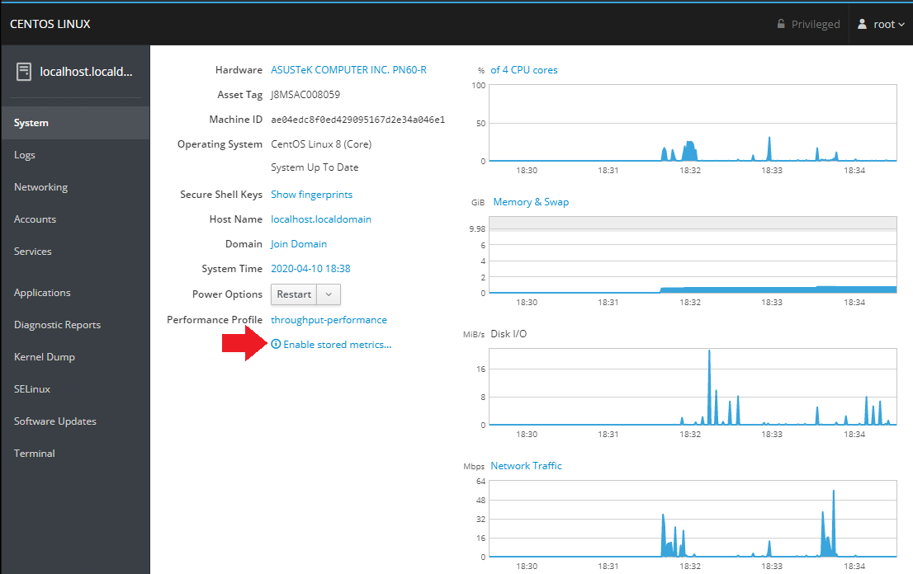


## Changing the Hostname

You can change your system hostname by selecting the option inside the __System__ tab and typing in a name:


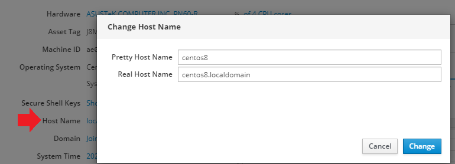


To verify that the hostname was changed switch to the __Terminal__ tab and type `hostnamectl`:


```bash
hostnamectl                                                             
   Static hostname: centos8.localdomain
   Pretty hostname: centos8
Transient hostname: CentOS8.fritz.box
         Icon name: computer-desktop
           Chassis: desktop
        Machine ID: ae04edc8f0ed429095167d2e34a046e1
           Boot ID: e58f2916a4b94f6ea365ae1296e7493c
  Operating System: CentOS Linux 8 (Core)
       CPE OS Name: cpe:/o:centos:centos:8
            Kernel: Linux 4.18.0-147.5.1.el8_1.x86_64
      Architecture: x86-64
```


You can also use the __Services__ tab to see that `systemd-hostnamed.service` did it's job:
  


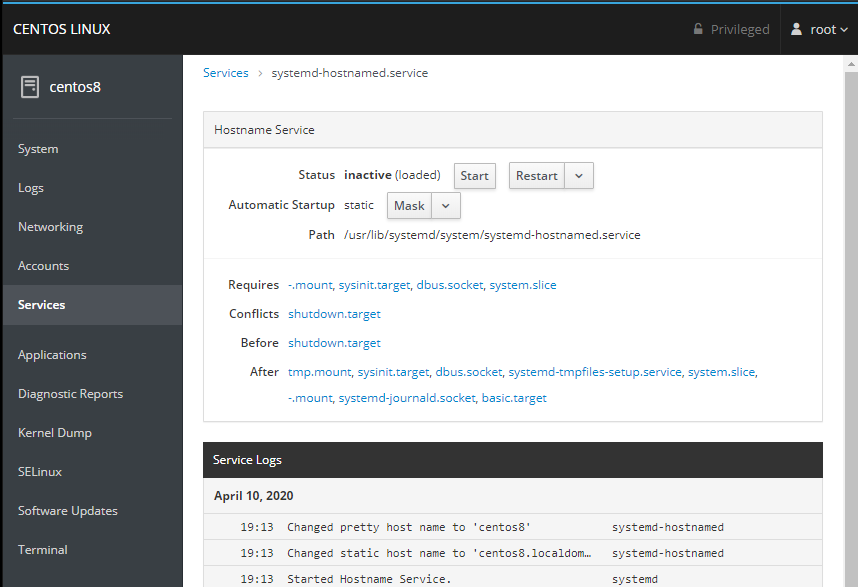


## Changing the Timezone

You can change your system time settings by selecting the option inside the __System__ tab and typing in your time zone:


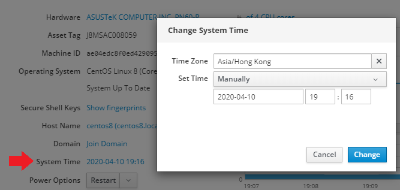


Again, you can verify your settings inside the __Terminal__:


```bash
timedatectl    
               Local time: Fri 2020-04-10 19:18:43 HKT
           Universal time: Fri 2020-04-10 11:18:43 UTC
                 RTC time: Fri 2020-04-10 11:18:43
                Time zone: Asia/Hong_Kong (HKT, +0800)
System clock synchronized: no
              NTP service: n/a
          RTC in local TZ: no
```


## User Management

Create and manage user accounts from the __Account__ tab:


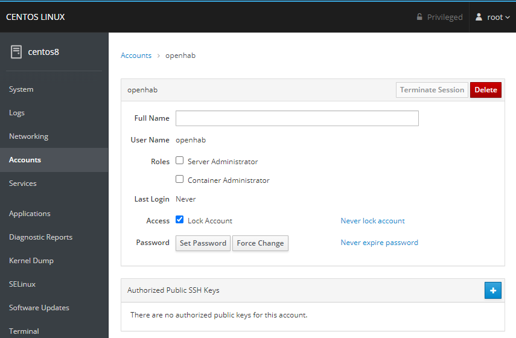


## Networking

Set your servers IPv4 configuration - DHCP, static IP, DNS Server and Gateway:


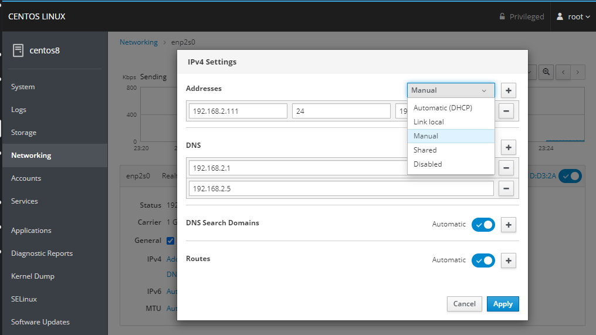


## Podman Containers

We already installed `cockpit-podman` on our machine - if you are using Docker install `cockpit-docker` instead!


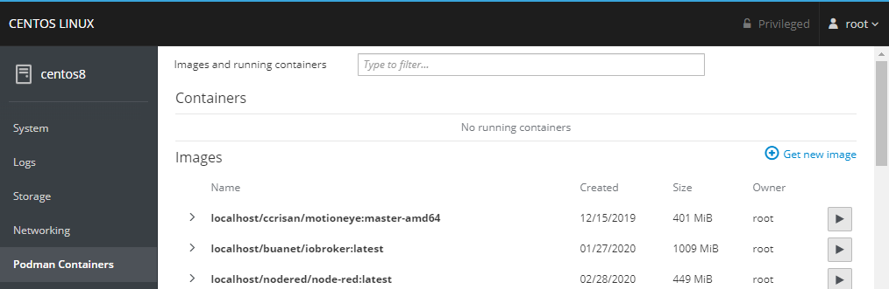


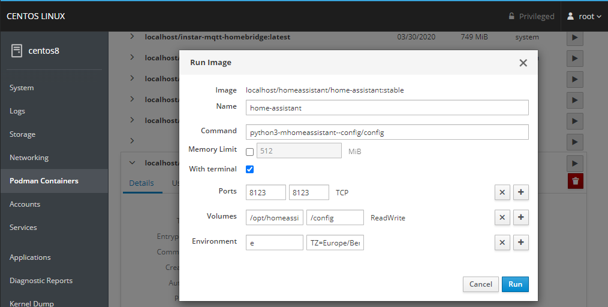


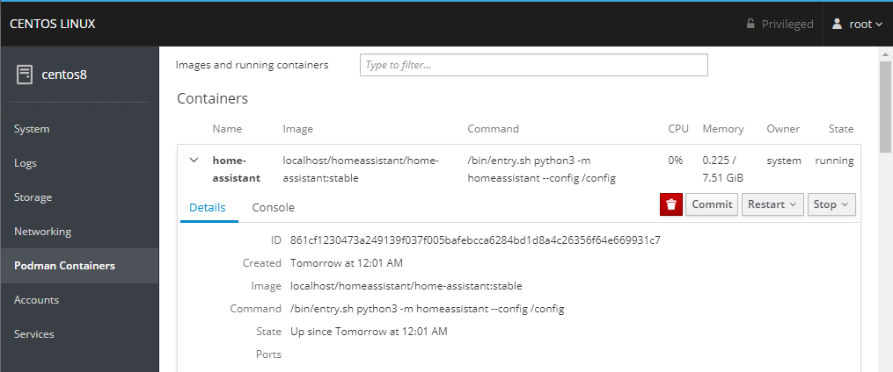


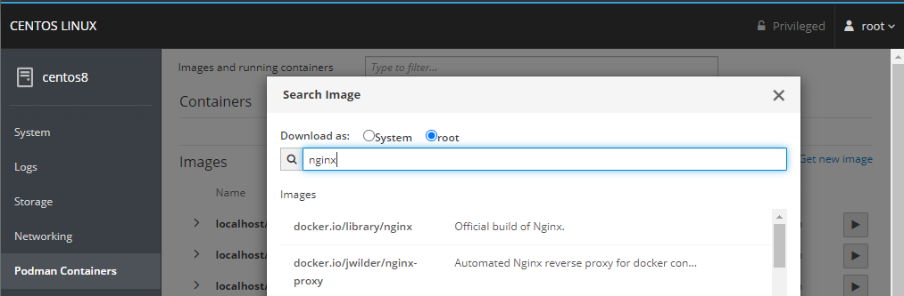


## Remote Server Management

Make sure that you have `cockpit-dashboard` installed and click on the __Dashboard__ button:


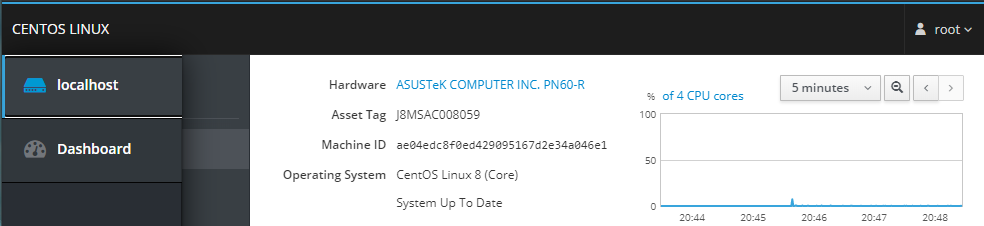


Click on the __Add Server__ button and tyoe in your remote server's IP address (if you don't use the default SSH port, add it behind the IP e.g. `123.123.123.45:6969`):


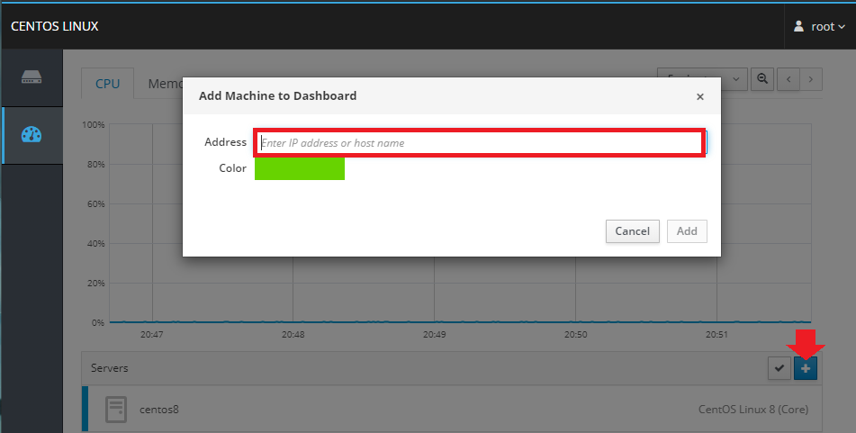


And type in your user login:


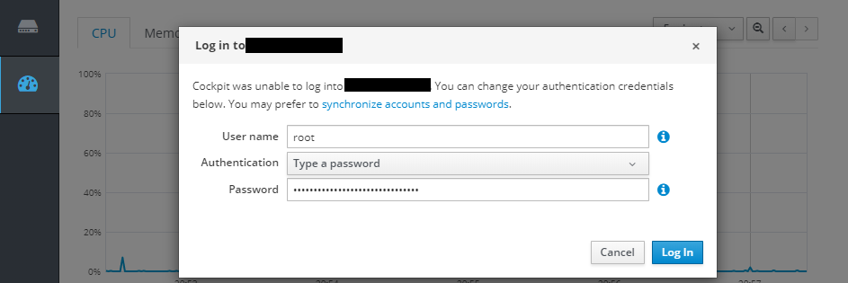