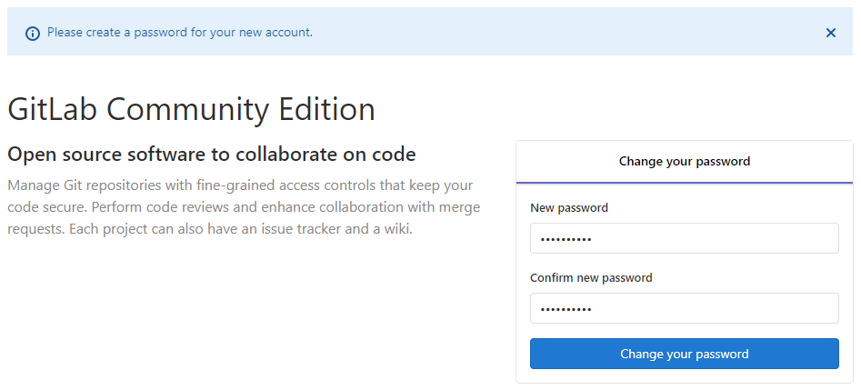
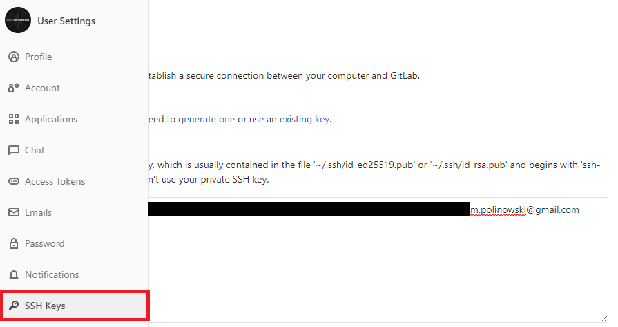
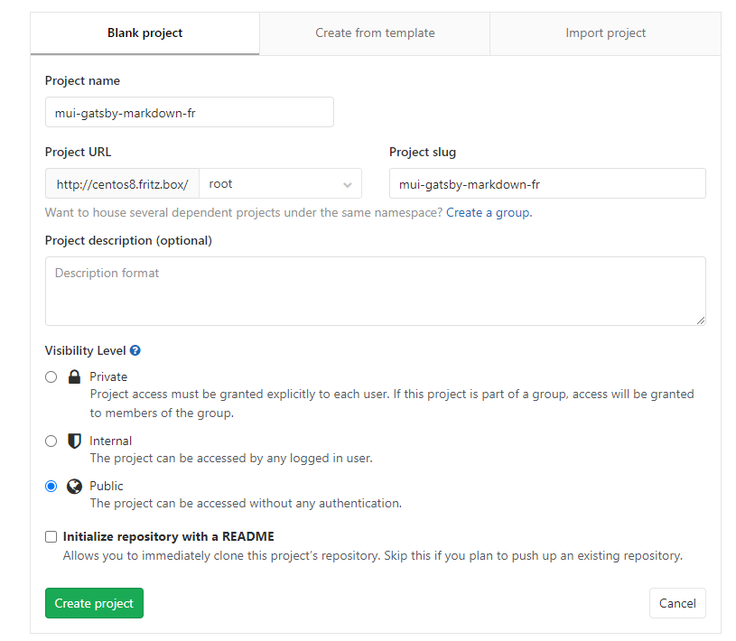
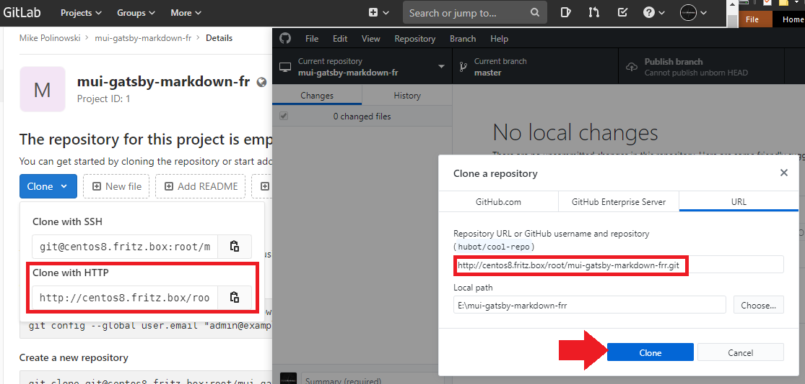

<!-- TOC -->

- [Installation through Podman on CentOS8](#installation-through-podman-on-centos8)
- [Setting Up Gitlab](#setting-up-gitlab)
    - [Adding your SSH Key](#adding-your-ssh-key)
    - [Testing that everything is set up correctly](#testing-that-everything-is-set-up-correctly)
    - [Uploading your Project](#uploading-your-project)

<!-- /TOC -->


## Installation through Podman on CentOS8

Before setting everything else, configure a new enviroment variable $GITLAB_HOME pointing to the folder where the configuration, logs, and data files will reside. Ensure that the folder exists and appropriate permission have been granted:


```bash
export GITLAB_HOME=/srv
```


The GitLab container uses host mounted volumes to store persistent data:


| Local location | Container location | Usage |
| -- | -- | -- |
| `$GITLAB_HOME/gitlab/data` | `/var/opt/gitlab` | For storing application data |
| `$GITLAB_HOME/gitlab/logs` | `/var/log/gitlab` | For storing logs |
| `$GITLAB_HOME/gitlab/config` | `/etc/gitlab` | For storing the GitLab configuration files |


```bash
mkdir /srv/gitlab
mkdir /srv/gitlab/data
mkdir /srv/gitlab/logs
mkdir /srv/gitlab/config
```


You can fine tune these directories to meet your requirements. Once you’ve set up the GITLAB_HOME variable, you can run the image:


```bash
podman run --detach \
  --privileged \
  --hostname centos8.fritz.box \
  --publish 443:443 --publish 80:80 --publish 55466:22 \
  --name gitlab \
  --restart always \
  --volume $GITLAB_HOME/gitlab/config:/etc/gitlab \
  --volume $GITLAB_HOME/gitlab/logs:/var/log/gitlab \
  --volume $GITLAB_HOME/gitlab/data:/var/opt/gitlab \
  gitlab/gitlab-ce:latest
  ```


If you are on SELinux, then run this instead:


```bash
podman run --detach \
  --hostname centos8.fritz.box \
  --publish 443:443 --publish 80:80 --publish 55466:22 \
  --name gitlab \
  --restart always \
  --volume $GITLAB_HOME/gitlab/config:/etc/gitlab:Z \
  --volume $GITLAB_HOME/gitlab/logs:/var/log/gitlab:Z \
  --volume $GITLAB_HOME/gitlab/data:/var/opt/gitlab:Z \
  gitlab/gitlab-ce:latest
```


This will ensure that the Docker process has enough permissions to create the config files in the mounted volumes. For my test environment `centos8.fritz.box` is a local domain that I use for this server - replace it with your own domain. The __SSH Port__ for the Gitlab container is - in the original documentation - exposed on port `22`. I replaced this by a random port `55466` since I am already using `22` to get into my server.


The initialization process may take a long time. You can track this process with:


```bash
podman logs -f gitlab
```


After starting a container you can visit `centos8.fritz.box`. It might take a while before the Docker container starts to respond to queries. The very first time you visit GitLab, you will be asked to set up the admin password. After you change it, you can login with username root and the password you set up.


## Setting Up Gitlab

On first access you will be asked to add a password for the `root` user:





### Adding your SSH Key

You can create and configure an __ED25519__ key with the following command:


```bash
ssh-keygen -t ed25519 -C "<comment>"
```

The -C flag, with a quoted comment such as an email address, is an optional way to label your SSH keys. You'll see a response similar to:


```bash
ssh-keygen -t ed25519 -C "m.polinowski@gmail.com"
Generating public/private ed25519 key pair.
Enter file in which to save the key (C:\Users\INSTAR/.ssh/id_ed25519):
Enter passphrase (empty for no passphrase):
Enter same passphrase again:
Your identification has been saved in C:\Users\INSTAR/.ssh/id_ed25519.
Your public key has been saved in C:\Users\INSTAR/.ssh/id_ed25519.pub.
The key fingerprint is:
SHA256:shdfhgfhjghjghjdfgj467wudjh m.polinowski@gmail.com
The key's randomart image is:
+--[ED25519 256]--+
|9-+o+o           |
|+-=.= =          |
|+_.._+ u d *     |
| .Y .            |
+----[SHA256]-----+
```


Copy your public SSH key to a location that saves information in text format. For Windows you can use the following command:


```bash
cat ~/.ssh/id_ed25519.pub | clip
```

Select your avatar in the upper right corner, and click Settings. Click SSH Keys. Paste the public key that you copied into the Key text box:





> If you manually copied your public SSH key make sure you copied the entire key starting with ssh-ed25519 (or ssh-rsa) and ending with your email address.


### Testing that everything is set up correctly

To test whether your SSH key was added correctly, run the following command in your terminal (replace centos8.fritz.box with your GitLab's instance domain and port `55466` with the port you have chosen when starting the Gitlab container earlier):


```bash
ssh -p 55466 -T git@centos8.fritz.box
The authenticity of host '[centos8.fritz.box]:55466 ([192.168.2.111]:55466)' can't be established.
ECDSA key fingerprint is SHA256:shdfhgfhjghjghjdfgj467wudjh.
Are you sure you want to continue connecting (yes/no/[fingerprint])? yes
Warning: Permanently added '[centos8.fritz.box]:55466,[192.168.2.111]:55466' (ECDSA) to the list of known hosts.
```


### Uploading your Project

Start by creating a project (or cloning one from e.g. Github or Gitlab.com). I created a blank repo with the name `mui-gatsby-markdown-fr`:





You can now clone the empty repository, enter the directory and add some project code. To keep it simple, I am going to use Github Desktop and the HTTP URL (if you want to use SSH remember to use the SSH port that you assigned to your Gitlab container):





Copy your code into the created directory, commit und publish it with Github Desktop (you have to login with your Gitlab user `root` + your password).

It works!