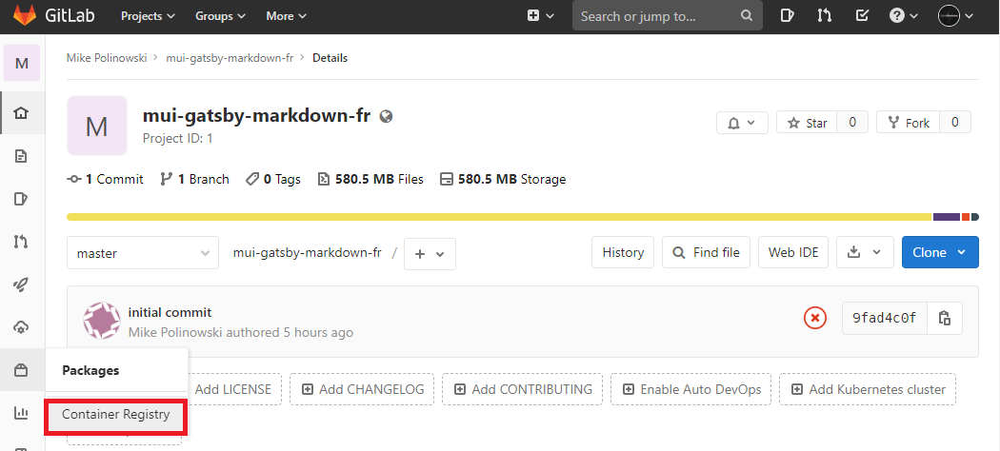

<!-- TOC -->

- [Install the Local Docker Registry](#install-the-local-docker-registry)
    - [Copy an image from Docker Hub to your Registry](#copy-an-image-from-docker-hub-to-your-registry)
    - [Podman and insecure Registries](#podman-and-insecure-registries)
    - [Pushing Images into your local Registry](#pushing-images-into-your-local-registry)
    - [Pulling Images from your local Registry](#pulling-images-from-your-local-registry)
- [Enable the Container Registry in Gitlab](#enable-the-container-registry-in-gitlab)

<!-- /TOC -->


## Install the Local Docker Registry

Use a command like the following to start the [registry container](https://docs.docker.com/registry/deploying/):


```bash
podman run -d -p 5000:5000 --restart=always --name registry registry:2

podman ps -a

CONTAINER ID  IMAGE                         STATUS             PORTS                   NAMES
1a14df139a2f  docker.io/library/registry:2  Up 28 seconds ago  0.0.0.0:5000->5000/tcp  registry
```


### Copy an image from Docker Hub to your Registry

Pull the ubuntu:16.04 image from Docker Hub:


```bash
podman pull hello-world:latest
```


Tag the image as `localhost:5000/my-world`. This creates an additional tag for the existing image. When the first part of the tag is a hostname and port, Docker interprets this as the location of a registry, when pushing.


```bash
podman tag hello-world:latest localhost:5000/my-world

podman images

REPOSITORY
docker.io/gitlab/gitlab-ce     latest            8065f4b39790   4 days ago     2.06 GB
docker.io/library/registry     2                 708bc6af7e5e   3 months ago   26.3 MB
localhost:5000/my-world        latest            bf756fb1ae65   4 months ago   20 kB
```


### Podman and insecure Registries

We can add our local and non-TLS protected Docker Registry through the system-wide registries configuration file. On CentOS 8, that file resides at `/etc/containers/registries.conf`:


```conf
# The only valid categories are: 'registries.search', 'registries.insecure', 
# and 'registries.block'.

[registries.search]
registries = ['docker.io', 'quay.io']

# If you need to access insecure registries, add the registry's fully-qualified name.
# An insecure registry is one that does not have a valid SSL certificate or only does HTTP.
[registries.insecure]
registries = ['localhost:5000']
```

Here you can see I have two registries defined under the search header and a single registry defined as an insecure registry - our local registry on port `5000`. The registries under the search header are registries that Podman will search when you try to find an image that is not fully-qualified.


### Pushing Images into your local Registry

Push the image to the local registry running at `localhost:5000`:


```bash
podman push localhost:5000/my-world

Getting image source signatures
Copying blob 9c27e219663c done
Copying config bf756fb1ae done
Writing manifest to image destination
Storing signatures
```


### Pulling Images from your local Registry

Remove the locally-cached `hello-world:latest` and `localhost:5000/my-world` images, so that you can test pulling the image from your registry. This does not remove the `localhost:5000/my-world` image from your registry.


```bash
podman rmi hello-world:latest
podman rmi localhost:5000/my-world

podman images
```


Pull the `localhost:5000/my-world` image from your local registry:


```bash
podman pull localhost:5000/my-world

podman run localhost:5000/my-world 
```


## Enable the Container Registry in Gitlab

After the installation is complete, you will have to configure the Registry’s settings in gitlab.yml in order to enable it.


```bash
nano /srv/gitlab/data/gitlab-rails/etc/gitlab.yml
```


Scroll down to the __Container Registry__ section and add the following information:


```yml
 ## Container Registry
  registry:
    enabled: true
    host: centos8.fritz.box
    port: 5005
    api_url: http://localhost:5000/
    key: /var/opt/gitlab/gitlab-rails/etc/gitlab-registry.key
    path: shared/registry
    issuer: omnibus-gitlab-issuer
```


Your `nano /srv/gitlab/config/gitlab.rb` should contain the Registry URL as well as the path to the existing TLS certificate and key used by GitLab:


```ruby
##########################################################################
## Container Registry settings
##! Docs: https://docs.gitlab.com/ee/administration/container_registry.html
###########################################################################

registry_external_url 'http://centos8.fritz.box:5005'
```


Your local registry is now available from inside your repository:



