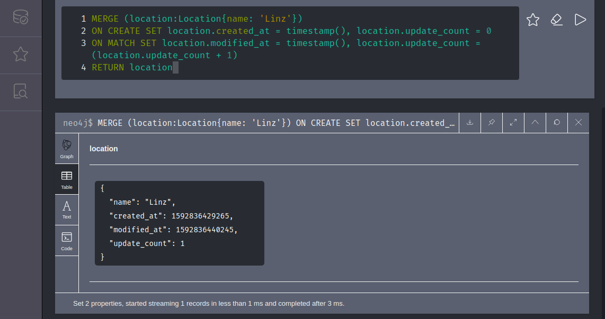
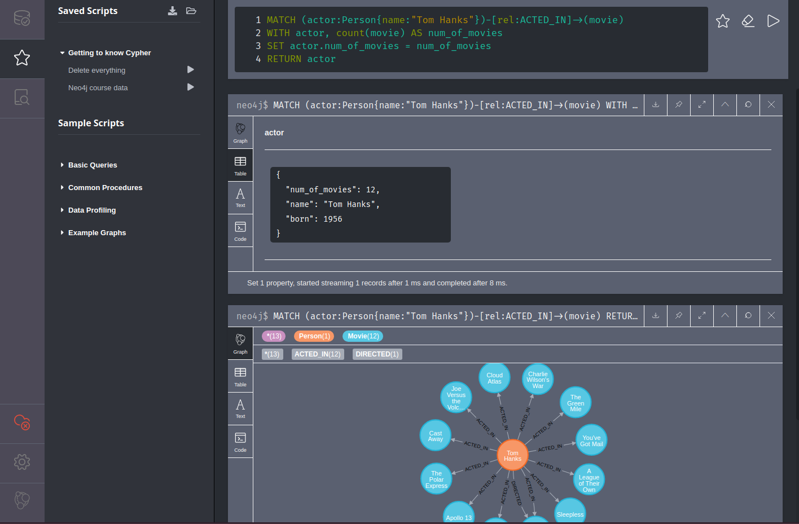
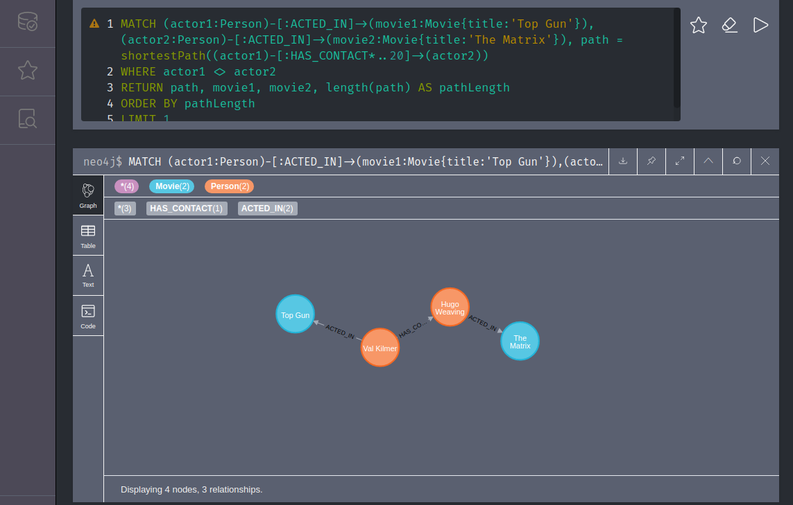

<!-- TOC -->

- [Running in Docker](#running-in-docker)
- [Cypher](#cypher)
    - [CREATE](#create)
    - [MATCH](#match)
    - [MERGE](#merge)
    - [WHERE, WITH and AND](#where-with-and-and)
    - [SET](#set)
    - [REMOVE](#remove)
    - [WITH](#with)
    - [DELETE](#delete)
    - [NULL](#null)
    - [Nth Degree Relationships](#nth-degree-relationships)
- [Importing Scripts](#importing-scripts)

<!-- /TOC -->


## Running in Docker

Create the folders Neo4j will need to persists it's data:


```bash
mkdir /opt/neo4j/data
mkdir /opt/neo4j/logs
mkdir /opt/neo4j/import
mkdir /opt/neo4j/plugins
```

`chown 101:101` all folders to make them available for your Docker user.


Pull and run the latest version of Neo4j from Docker Hub.


```bash
docker run \
    --name neo4j \
    -p7474:7474 -p7687:7687 \
    -d \
    -v /opt/neo4j/data:/data \
    -v /opt/neo4j/logs:/logs \
    -v /opt/neo4j/import:/var/lib/neo4j/import \
    -v /opt/neo4j/plugins:/plugins \
    --env NEO4J_AUTH=neo4j/password \
    neo4j:latest
```


By default, the Docker image exposes three ports for remote access:

* 7474 for HTTP
* 7473 for HTTPS
* 7687 for Bolt
    
    
Now head over to `localhost:7474` with your browser and login with `neo4j/password`.
  


## Cypher

### CREATE

Use the __Create__ command to create nodes with properties and relationships.

```bash
CREATE(p1: Person{name:'Susanne Colgate'}) -[r:UNIVERSITY_BERKELEY{attr:"Susanne followed Simon"}]-> (p2: Person{name: 'Simon Scabourough'}) RETURN p1,p2,r
```

Create two nodes of type __Person__ and the property __Name__ and set them into a __Relationship__, e.g. both persons went to the same university. The return command allows us to see a visualization of the result of our query.


### MATCH

Use the __Match__ command to find pattern among your nodes.


```bash
MATCH (p1: Person {name:'Simon Scabourough'}), (p2:Person {name: 'Susanne Colgate'})
CREATE (p1) -[r:APPLIED_PHYSICS{attr:"Susanne invited Simon"}]-> (p2)
RETURN p1,p2,r
```

Find two nodes of type __Person__ with specific __Name__ properties and add a new relationship between them - a shared course at the university.


```bash
MATCH (p1:Person {name: 'Simon Scabourough'})-[r:APPLIED_PHYSICS]->(p2)
RETURN p2
```

Show me who joined Simon in his AP1 course.


```bash
MATCH ()-[r:UNIVERSITY_BERKLY]->(p2)
RETURN p2
```

Show me everyone who was invited into Berkley.


### MERGE

Just like the match operator you get the nodes or relationships returned. But unlike match, if the node, property or relationship does not exist it will be created by the merge query:


```bash
MATCH (person:Person{name:'Josefine Strudelbäcker'})
RETURN person
```

Does not find anything - Merge creates the node for you:


```bash
MERGE (person:Person{name:'Josefine Strudelbäcker'})
MERGE (bäckerei:Work{name:'Zum Zipfelkratsch'})
MERGE (person)-[:Worked_IN]->(bäckerei)
RETURN person, bäckerei
```

__ON CREATE SET__

The Merge Operator will either create the node or update it if it already exists. Everything after On Create will only be executed if the node does not yet exists:


```bash
MERGE (location:Location{name: 'Linz'})
ON CREATE SET location.created_at = timestamp(), location.created_by = 'GPS100x5'
RETURN location
```


__ON MATCH SET__

If we want to update a property every time we get a match:


```bash
MERGE (location:Location{name: 'Linz'})
ON CREATE SET location.created_at = timestamp(), location.update_count = 0
ON MATCH SET location.modified_at = timestamp(), location.update_count = (location.update_count + 1)
RETURN location
```

How often die Keanu Reeves watch Top Gun? Increment a relationship property every time a query is run:


```bash
MATCH (actor:Person{name: 'Keanu Reeves'})
MATCH (movie:Movie{title: 'Top Gun'})
MERGE (actor)-[rel:VIEWED]->(movie)
ON CREATE SET rel.count = 1
ON MATCH SET rel.count = (rel.count + 1) 
RETURN actor, movie
```





### WHERE, WITH and AND

```bash
MATCH (a:Person),(b:Person)
WHERE a.name='Simon Scabourough' AND b.name='Susanne Colgate'
WITH a,b
CREATE (a) -[r:ANALYTICAL_CHEMISTRY]->(b)
RETURN a,b,r
```


### SET

Use the __Set__ command to change a property of a node.

```bash
MATCH (p:Person{name: 'Susanne Colgate'})
SET p.name= 'Susan Colgate'
RETURN p
```

__Set__ can also be used to create an property:


```bash
MATCH (p:Person {name: 'Susan Colgate'})
SET p.title = 'Freshman'
RETURN p
```

Or to set a relationship:


```bash
MATCH (director:Person{name:'Clint Eastwood'}),
(movies:Movie)<-[rel:DIRECTED]-(director)
SET rel.rating = 5
```

Or to set another label:


```bash
MATCH (director:Person{name:'Clint Eastwood'}),
(movies:Movie)<-[rel:DIRECTED]-(director)
SET director:Hero
```

Setting a relationship to a new type is not supported by Neo4j. But you can create a new relationship and copy over the old properties:


```bash
MATCH (actor1:Person{name:'Tom Hanks'})-[old_rel:HAS_CONTACT]->(actor2:Person{name:'Al Pacino'})
CREATE (actor1)-[new_rel:OLD_CONTACT]->(actor2)
SET new_rel=old_rel
DELETE old_rel
RETURN actor1, actor2
```


### REMOVE

Remove a relationship:


```bash
MATCH (director:Person{name:'Clint Eastwood'}),
(movies:Movie)<-[rel:DIRECTED]-(director)
REMOVE rel.rating
```

Remove a label:


```bash
MATCH (director:Person{name:'Clint Eastwood'}),
(movies:Movie)<-[rel:DIRECTED]-(director)
REMOVE director:Hero
```


### WITH

Set dynamic properties to nodes with the __WITH__ operator:


```bash
MATCH (actor:Person{name:"Tom Hanks"})-[rel:ACTED_IN]->(movie)
WITH actor, count(movie) AS num_of_movies
SET actor.num_of_movies = num_of_movies
RETURN actor
```





### DELETE

```bash
MATCH (n)
DELETE n
```

Only works if Nodes don't have any relations - otherwise those have to be selected and deleted as well.


__Delete All__:

```bash
MATCH (n)
OPTIONAL MATCH (n)-[r]-()
DELETE n,r
```

Select all nodes and relationships and delete the selection.


Or short - remove node and cut all relations that were attached to it:

```
MATCH (node)
DETACH DELETE node
```


Selective delete:


```bash
MATCH (actor:Person{name:'Tom Cruise'}),
(movies:Movie)<-[:ACTED_IN]-(actor)
DETACH DELETE movies
```


### NULL

Give me all person nodes that have a earnings property that is not undefined:

```bash
MATCH (person:Person)
WHERE person.earnings IS NOT NULL
RETURN person
```


### Nth Degree Relationships

Get all 1st degree contacts of actor Keanu Reeves:


```bash
MATCH (actor:Person{name:'Keanu Reeves'})-[:HAS_CONTACT]->(contact)
RETURN actor, contact
```


Get all 2nd degree contacts:


```bash
MATCH (actor:Person{name:'Keanu Reeves'})-[:HAS_CONTACT]->(contact)-[:HAS_CONTACT]->(contact2)
RETURN actor, contact2
```

Get the nth degree contacts by simply adding __*n__ to the relationship in question - e.g. get the 5th degree contacts:


```bash
MATCH (actor:Person{name:'Keanu Reeves'})-[rel:HAS_CONTACT*5]->(contact)
RETURN actor, rel, contact
LIMIT 1
```

Show all 0 - 2nd degree contacts:


```bash
MATCH (actor:Person{name:'Keanu Reeves'})-[rel:HAS_CONTACT*0..2]->(contact)
RETURN actor, rel, contact
LIMIT 5
```

__PATH__

How many contacts are between Keanu Reeves and Tom Cruise:


```bash
MATCH (neo:Person{name:'Keanu Reeves'})
MATCH (maverick:Person{name:'Tom Cruise'})
MATCH path=((neo)-[rel:HAS_CONTACT*]->(maverick))
RETURN length(path)
LIMIT 1
```

To find the shortest path limit the degree of contact until no path can be found anymore:


```bash
MATCH (neo:Person{name:'Keanu Reeves'})
MATCH (maverick:Person{name:'Tom Cruise'})
MATCH path=((neo)-[rel:HAS_CONTACT*..2]->(maverick))
RETURN length(path) AS path_length
LIMIT 1
```

The minimum path length is 2.


The easier way to find the path length is the __SHORTEST PATH__ function:


```bash
MATCH (neo:Person{name:'Keanu Reeves'})
MATCH (maverick:Person{name:'Tom Cruise'})
MATCH path=shortestPath((neo)-[rel:HAS_CONTACT*..20]->(maverick))
RETURN length(path) AS path_length
```


Since there might be several shortest paths we can use the __allShortestPath__ function to resolve all of them:


```bash
MATCH (neo:Person{name:'Keanu Reeves'})
MATCH (maverick:Person{name:'Tom Cruise'})
MATCH path=allShortestPaths((neo)-[rel:HAS_CONTACT*..20]->(maverick))
RETURN path, length(path) AS path_length
```


Get the shortest path between actors that acted in the movie The Matrix and actors from the movie Top Gun:


```bash
MATCH (actor1:Person)-[:ACTED_IN]->(movie1:Movie{title:'Top Gun'}),(actor2:Person)-[:ACTED_IN]->(movie2:Movie{title:'The Matrix'}), path = shortestPath((actor1)-[:HAS_CONTACT*..20]->(actor2))
RETURN path, movie1, movie2, length(path) AS pathLength
ORDER BY pathLength
LIMIT 2
```


To exclude path where an actor worked in both movies:


```bash
MATCH (actor1:Person)-[:ACTED_IN]->(movie1:Movie{title:'Top Gun'}),(actor2:Person)-[:ACTED_IN]->(movie2:Movie{title:'The Matrix'}), path = shortestPath((actor1)-[:HAS_CONTACT*..20]->(actor2))
WHERE actor1 <> actor2
RETURN path, movie1, movie2, length(path) AS pathLength
ORDER BY pathLength
LIMIT 1
```





## Importing Scripts

Just write down all your Cypher queries into a text file. Add a comment on top to name the script:

```bash
// Neo4j Sample Data
CREATE(p1: Person{name:'Susanne Colgate'}) -[r:UNIVERSITY_BERKELEY{attr:"Susanne followed Simon"}]-> (p2: Person{name: 'Simon Scabourough'})
MATCH (p1: Person {name:'Simon Scabourough'}), (p2:Person {name: 'Susanne Colgate'})
CREATE (p1) -[r:APPLIED_PHYSICS{attr:"Susanne invited Simon"}]-> (p2)
MATCH (p1:Person {name: 'Simon Scabourough'})-[r:APPLIED_PHYSICS]->(p2)
MATCH (a:Person),(b:Person)
WHERE a.name='Simon Scabourough' AND b.name='Susanne Colgate'
WITH a,b
CREATE (a) -[r:ANALYTICAL_CHEMISTRY]->(b)
MATCH (p:Person{name: 'Susanne Colgate'})
SET p.name= 'Susan Colgate'
MATCH (p:Person {name: 'Susan Colgate'})
SET p.title = 'Freshman'
```

And drag&drop them into the favorite section of the Neo4j web interface:


You can run all scripts at once by clicking on the play button next to your scripts name.


