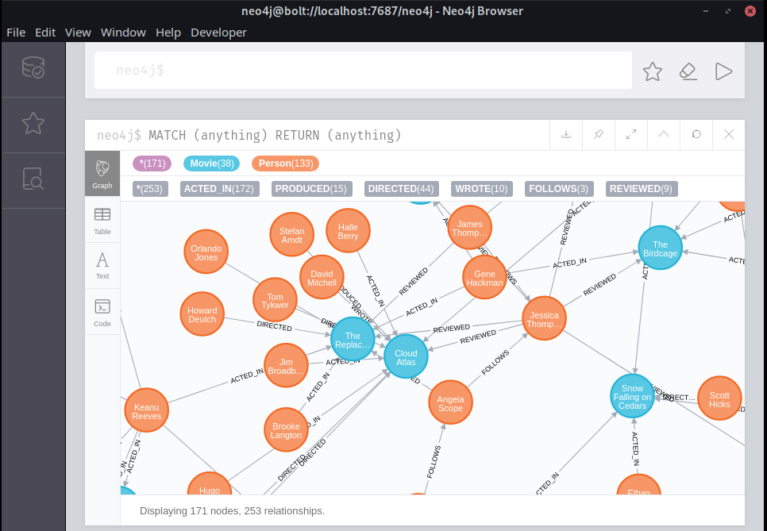
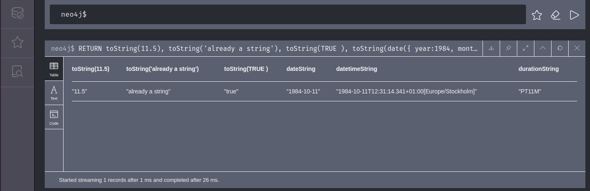

<!-- TOC -->

- [Cypher Queries](#cypher-queries)
    - [Nodes, Properties and Relationships](#nodes-properties-and-relationships)
    - [Filter](#filter)
    - [Comparison](#comparison)
    - [Transformation](#transformation)
    - [Aggregation](#aggregation)
    - [Other Functions](#other-functions)
    - [Mathematical Functions](#mathematical-functions)
- [Movie Database Data](#movie-database-data)

<!-- /TOC -->


The software comes with a set of movie data that we can use to work with. Go to __Projects__ and open the preinstalled __Primer Project__.


 Start the movie database and connect to your Neo4j backend with your username and password:


We can take a first look at our data by running the following query:


```bash
MATCH (anything) RETURN (anything)
```





## Cypher Queries

### Nodes, Properties and Relationships

Only return the first five nodes with the property __Person__:


```
MATCH (anyone:Person) RETURN (anyone) LIMIT 5
```


or property __Movie__:

```bash
MATCH (any:Movie)
RETURN (any)
LIMIT 5
```

Show the first 5 relations between nodes:


```bash
MATCH (node1)--(node2)
RETURN node1, node2, rel
LIMIT 5
```

Name the relationship so you can add it to the return and specify the direction of an relationship by adding an arrow:

```bash
MATCH (node1)-[rel]->(node2)
RETURN node1, node2, rel
LIMIT 5
```

Specify the kind of relationship you want to query for:

```bash
MATCH (node1)-[rel:DIRECTED]->(node2)
RETURN node1, node2, rel
LIMIT 5
```

We can further specify properties our nodes have to have to be returned by our query:

```bash
MATCH (producer:Person)-[rel:PRODUCED]->(movie:Movie)
RETURN producer, movie, rel
LIMIT 5
```

Using the __OR__ statement - return all nodes with property Person that either acted in or directed a movie:


```bash
MATCH (actors:Person)-[rel:ACTED_IN | DIRECTED]->(movie:Movie)
RETURN actors, movie, rel
LIMIT 5
```


Return a list of a movie titles inside our database:

```bash
MATCH (movie:Movie)
RETURN movie.title
```


Take the result of the query above and find the directors that directed those movies:

```bash
MATCH (movie:Movie)
MATCH (director:Person)-[:DIRECTED]->(movie)
RETURN director.name
```


Further specify it by only matching directors that also acted in their own movie:


```bash
MATCH (movie:Movie)
MATCH (director:Person)-[:DIRECTED]->(movie)
MATCH (director)-[:ACTED_IN]->(movie)
RETURN movie.title, director.name
```


Using an optional match:


```bash
MATCH (movie:Movie)
OPTIONAL MATCH (director:Person)-[:DIRECTED]->(movie)<-[:ACTED_IN]-(director)
RETURN movie, director
```


```bash
MATCH (p1:Person)-[:FOLLOWS]->(p2:Person)-[:REVIEWED]->(movie:Movie)
RETURN p1.name, p2.name
```


### Filter


Search for a specific node - e.g. specific actor:


```bash
MATCH (actor{name: 'Laurence Fishburne'})
RETURN actor
```


We can speed those queries up by adding the label that the node will have:


```bash
MATCH (movie:Movie{title: 'The Matrix'})
RETURN movie
```


In this case only nodes will be searched that have the correct label - in this case `Movie`.


If there are more than 1 node that has `Matrix` in it's title - which will give us the complete trilogy: 


```bash
MATCH (movie:Movie)
WHERE (movie.title CONTAINS 'Matrix')
RETURN movie
```

You can specify another property to specify the movie that you are looking for, e.g. the release date:


```bash
MATCH (movie:Movie{released:1999})
WHERE (movie.title CONTAINS 'Matrix')
RETURN movie
```

Another way is to use the __AND__ operator to add another property to your match:


```bash
MATCH (actor:Person)
WHERE actor.name = 'Laurence Fishburne' AND actor.born = 1961
RETURN actor
```


### Comparison

Using the __OR__ operator:


```bash
MATCH (movie:Movie)
WHERE movie.released = 1999 OR movie.released = 2000
RETURN movie
```

We can shorten this query:


```bash
MATCH (movie:Movie)
WHERE movie.released IN [1999, 2000]
RETURN movie
```


Search within a time window:


```bash
MATCH (actor:Person)
WHERE actor.born >= 1967 AND actor.born < 1976
RETURN actor
```


Or exclude a time window by using __NOT__:


```bash
MATCH (actor:Person)
WHERE NOT (actor.born >= 1900 AND actor.born < 1980)
RETURN actor
```


Find all persons that acted in but did not direct the movie with the title `Unforgiven`. You can check out the movie by running the following query:


```bash
MATCH (movie:Movie)
WHERE movie.title CONTAINS 'Unforgiven'
RETURN movie
```

When you click on the movie node and expand it's relationships you can see that there are 4 actors listed. One of which, Clint Eastwood, also directed the movie.


We can also query this information directly:


```bash
MATCH (person:Person)-->(movie:Movie)
WHERE movie.title = 'Unforgiven'
RETURN person
```

To exclude the director from our query we can use the __AND NOT__ operator:


```bash
MATCH (person:Person)-->(movie:Movie)
WHERE movie.title = 'Unforgiven' AND NOT (person)-[:DIRECTED]->(movie)
RETURN person
```

Using __Regular Expressions__ to find all movies that start with a `The` in their titles:


```bash
MATCH (movie:Movie)
WHERE movie.title =~ 'The.*'
RETURN movie.title
```

Or find all movies that have a title that contains a `The` anywhere:


```bash
MATCH (movie:Movie)
WHERE movie.title =~ '.*The.*'
RETURN movie.title
```


This will get the movie `A League of Their Own` as a result - if you only want to match the exact word `The` you have to add a SPACE behind it:


```bash
MATCH (movie:Movie)
WHERE movie.title =~ '.*The .*'
RETURN movie.title
```

To make the query case-insensitive use the following expression:


```bash
MATCH (movie:Movie)
WHERE movie.title =~ '(?i).*The .*'
RETURN movie.title
```

To exclude titles that start with `The` we can use `.+` at the start to match any character- but there has to be at least one in front of the search word:


```bash
MATCH (movie:Movie)
WHERE movie.title =~ '(?i).+The .*'
RETURN movie.title
```

This will only match titles that have the word __The__ or __the__ somewhere in the middle.


### Transformation

Return the persons that acted in the movie `Top Gun` and order the results by the age of the actors:


```bash
MATCH (actor:Person)-[:ACTED_IN]->(movie:Movie{title:'Top Gun'})
RETURN actor.name, actor.born
ORDER BY actor.born DESC
LIMIT 3
```


For __Pagination__ we can use the __SKIP__ and __LIMIT__ operator:


```bash
MATCH (actor:Person)-[:ACTED_IN]->(movie:Movie{title:'Top Gun'})
RETURN actor.name, actor.born
ORDER BY actor.born DESC
SKIP 3
LIMIT 3
```


We can also make our results more readable by using the __AS__ operator:


```bash
MATCH (actor:Person)-[:ACTED_IN]->(movie:Movie{title:'Top Gun'})
RETURN actor.name AS Name, actor.born AS Born
ORDER BY actor.born DESC
SKIP 3
LIMIT 3
```


### Aggregation


|Function|Description|
| --- | --- |
|[avg() - Numeric values](https://neo4j.com/docs/cypher-manual/current/functions/aggregating/#functions-avg)|Returns the average of a set of numeric values.|
|[avg() - Durations](https://neo4j.com/docs/cypher-manual/current/functions/aggregating/#functions-avg-duration)|Returns the average of a set of Durations.|
|[collect()](https://neo4j.com/docs/cypher-manual/current/functions/aggregating/#functions-collect)|Returns a list containing the values returned by an expression.|
|[count()](https://neo4j.com/docs/cypher-manual/current/functions/aggregating/#functions-count)|Returns the number of values or rows.|
|[max()](https://neo4j.com/docs/cypher-manual/current/functions/aggregating/#functions-max)|Returns the maximum value in a set of values.|
|[min()](https://neo4j.com/docs/cypher-manual/current/functions/aggregating/#functions-min)|Returns the minimum value in a set of values.|
|[percentileCont()](https://neo4j.com/docs/cypher-manual/current/functions/aggregating/#functions-percentilecont)|Returns the percentile of a value over a group using linear interpolation.|
|[percentileDisc()](https://neo4j.com/docs/cypher-manual/current/functions/aggregating/#functions-percentiledisc)|Returns the nearest value to the given percentile over a group using a rounding method.|
|[stDev()](https://neo4j.com/docs/cypher-manual/current/functions/aggregating/#functions-stdev)|Returns the standard deviation for the given value over a group for a sample of a population.|
|[stDevP()](https://neo4j.com/docs/cypher-manual/current/functions/aggregating/#functions-stdevp)|Returns the standard deviation for the given value over a group for an entire population.|
|[sum() - Numeric values](https://neo4j.com/docs/cypher-manual/current/functions/aggregating/#functions-sum)|Returns the sum of a set of numeric values.|
|[sum() - Durations](https://neo4j.com/docs/cypher-manual/current/functions/aggregating/#functions-sum-duration)|Returns the sum of a set of Durations.|


__COUNT__: Count the results instead of displaying them:

```bash
MATCH (actor:Person{name:'Tom Hanks'})-[:ACTED_IN]->(movie:Movie)
RETURN COUNT(movie) AS MovieCount
```


__SUM__: If you want to add up all results:

```bash
...

RETURN SUM(movie.cost) AS MovieCosts
```


__AVG__, __MIN__, __MAX__: Get the average, minimum and maximum cost of a movie in your results

```bash
...

RETURN AVG(movie.cost) AS AVGMovieCosts,  MIN(movie.cost) AS MinMovieCosts, MAX(movie.cost) AS MaxMovieCosts
```

```bash
MATCH (actor:Person)-[:ACTED_IN]->(movie:Movie)
RETURN MIN(actor.born), MAX(actor.born), toInteger(AVG(actor.born))
```


__DISTINCT__: When a query retrieves the same node multiple time, use the distinct operator to remove duplicates:


```bash
...

RETURN DISTINCT movie.title AS MovieTitle
```


### Other Functions

__String Functions__:

|Function|Description|
| --- | --- |
|[left()](https://neo4j.com/docs/cypher-manual/current/functions/string/#functions-left)|Returns a string containing the specified number of leftmost characters of the original string.|
|[lTrim()](https://neo4j.com/docs/cypher-manual/current/functions/string/#functions-ltrim)|Returns the original string with leading whitespace removed.|
|[replace()](https://neo4j.com/docs/cypher-manual/current/functions/string/#functions-replace)|Returns a string in which all occurrences of a specified string in the original string have been replaced by another (specified) string.|
|[reverse()](https://neo4j.com/docs/cypher-manual/current/functions/string/#functions-reverse)|Returns a string in which the order of all characters in the original string have been reversed.|
|[right()](https://neo4j.com/docs/cypher-manual/current/functions/string/#functions-right)|Returns a string containing the specified number of rightmost characters of the original string.|
|[rTrim()](https://neo4j.com/docs/cypher-manual/current/functions/string/#functions-rtrim)|Returns the original string with trailing whitespace removed.|
|[split()](https://neo4j.com/docs/cypher-manual/current/functions/string/#functions-split)|Returns a list of strings resulting from the splitting of the original string around matches of the given delimiter.|
|[substring()](https://neo4j.com/docs/cypher-manual/current/functions/string/#functions-substring)|Returns a substring of the original string, beginning with a 0-based index start and length.|
|[toLower()](https://neo4j.com/docs/cypher-manual/current/functions/string/#functions-tolower)|Returns the original string in lowercase.|
|[toString()](https://neo4j.com/docs/cypher-manual/current/functions/string/#functions-tostring)|Converts an integer, float, boolean or temporal type (i.e. Date, Time, LocalTime, DateTime, LocalDateTime or Duration) value to a string.|
|[toUpper()](https://neo4j.com/docs/cypher-manual/current/functions/string/#functions-toupper)|Returns the original string in uppercase.|
|[trim()](https://neo4j.com/docs/cypher-manual/current/functions/string/#functions-trim)|Returns the original string with leading and trailing whitespace removed.|


__toString()__ Turn returned values into strings:


```bash
RETURN toString(11.5), toString('already a string'), toString(TRUE ), toString(date({ year:1984, month:10, day:11 })) AS dateString, toString(datetime({ year:1984, month:10, day:11, hour:12, minute:31, second:14, millisecond: 341, timezone: 'Europe/Stockholm' })) AS datetimeString, toString(duration({ minutes: 12, seconds: -60 })) AS durationString
```




__trim()__ Strip SPACES from results:


```bash
RETURN trim("  hello  ")
```


__replace()__ Replace characters inside a string `replace(original, search, replace)`:


```bash
RETURN replace('hello', 'l', 'x')
```


__Temporal Functions__:

|Function|Description|
| --- | --- |
|[date()](https://neo4j.com/docs/cypher-manual/current/functions/temporal/date/#functions-date-current)|Returns the current  *Date* .|
|[date.transaction()](https://neo4j.com/docs/cypher-manual/current/functions/temporal/date/#functions-date-current-transaction)|Returns the current  *Date*  using the  `transaction`  clock.|
|[date.statement()](https://neo4j.com/docs/cypher-manual/current/functions/temporal/date/#functions-date-current-statement)|Returns the current  *Date*  using the  `statement`  clock.|
|[date.realtime()](https://neo4j.com/docs/cypher-manual/current/functions/temporal/date/#functions-date-current-realtime)|Returns the current  *Date*  using the  `realtime`  clock.|
|[date({year [, month, day]})](https://neo4j.com/docs/cypher-manual/current/functions/temporal/date/#functions-date-calendar)|Returns a calendar (Year-Month-Day)  *Date* .|
|[date({year [, week, dayOfWeek]})](https://neo4j.com/docs/cypher-manual/current/functions/temporal/date/#functions-date-week)|Returns a week (Year-Week-Day)  *Date* .|
|[date({year [, quarter, dayOfQuarter]})](https://neo4j.com/docs/cypher-manual/current/functions/temporal/date/#functions-date-quarter)|Returns a quarter (Year-Quarter-Day)  *Date* .|
|[date({year [, ordinalDay]})](https://neo4j.com/docs/cypher-manual/current/functions/temporal/date/#functions-date-ordinal)|Returns an ordinal (Year-Day)  *Date* .|
|[date(string)](https://neo4j.com/docs/cypher-manual/current/functions/temporal/date/#functions-date-create-string)|Returns a  *Date*  by parsing a string.|
|[date({map})](https://neo4j.com/docs/cypher-manual/current/functions/temporal/date/#functions-date-temporal)|Returns a  *Date*  from a map of another temporal value’s components.|
|[date.truncate()](https://neo4j.com/docs/cypher-manual/current/functions/temporal/date/#functions-date-truncate)|Returns a  *Date*  obtained by truncating a value at a specific component boundary. [Truncation summary](https://neo4j.com/docs/cypher-manual/current/functions/temporal/instant/#functions-temporal-truncate-overview).|
|[datetime()](https://neo4j.com/docs/cypher-manual/current/functions/temporal/datetime/#functions-datetime-current)|Returns the current  *DateTime* .|
|[datetime.transaction()](https://neo4j.com/docs/cypher-manual/current/functions/temporal/datetime/#functions-datetime-current-transaction)|Returns the current  *DateTime*  using the  `transaction`  clock.|
|[datetime.statement()](https://neo4j.com/docs/cypher-manual/current/functions/temporal/datetime/#functions-datetime-current-statement)|Returns the current  *DateTime*  using the  `statement`  clock.|
|[datetime.realtime()](https://neo4j.com/docs/cypher-manual/current/functions/temporal/datetime/#functions-datetime-current-realtime)|Returns the current  *DateTime*  using the  `realtime`  clock.|
|[datetime({year [, month, day, …​]})](https://neo4j.com/docs/cypher-manual/current/functions/temporal/datetime/#functions-datetime-calendar)|Returns a calendar (Year-Month-Day)  *DateTime* .|
|[datetime({year [, week, dayOfWeek, …​]})](https://neo4j.com/docs/cypher-manual/current/functions/temporal/datetime/#functions-datetime-week)|Returns a week (Year-Week-Day)  *DateTime* .|
|[datetime({year [, quarter, dayOfQuarter, …​]})](https://neo4j.com/docs/cypher-manual/current/functions/temporal/datetime/#functions-datetime-quarter)|Returns a quarter (Year-Quarter-Day)  *DateTime* .|
|[datetime({year [, ordinalDay, …​]})](https://neo4j.com/docs/cypher-manual/current/functions/temporal/datetime/#functions-datetime-ordinal)|Returns an ordinal (Year-Day)  *DateTime* .|
|[datetime(string)](https://neo4j.com/docs/cypher-manual/current/functions/temporal/datetime/#functions-datetime-create-string)|Returns a  *DateTime*  by parsing a string.|
|[datetime({map})](https://neo4j.com/docs/cypher-manual/current/functions/temporal/datetime/#functions-datetime-temporal)|Returns a  *DateTime*  from a map of another temporal value’s components.|
|[datetime({epochSeconds})](https://neo4j.com/docs/cypher-manual/current/functions/temporal/datetime/#functions-datetime-timestamp)|Returns a  *DateTime*  from a timestamp.|
|[datetime.truncate()](https://neo4j.com/docs/cypher-manual/current/functions/temporal/datetime/#functions-datetime-truncate)|Returns a  *DateTime*  obtained by truncating a value at a specific component boundary. [Truncation summary](https://neo4j.com/docs/cypher-manual/current/functions/temporal/instant/#functions-temporal-truncate-overview).|
|[localdatetime()](https://neo4j.com/docs/cypher-manual/current/functions/temporal/localdatetime/#functions-localdatetime-current)|Returns the current  *LocalDateTime* .|
|[localdatetime.transaction()](https://neo4j.com/docs/cypher-manual/current/functions/temporal/localdatetime/#functions-localdatetime-current-transaction)|Returns the current  *LocalDateTime*  using the  `transaction`  clock.|
|[localdatetime.statement()](https://neo4j.com/docs/cypher-manual/current/functions/temporal/localdatetime/#functions-localdatetime-current-statement)|Returns the current  *LocalDateTime*  using the  `statement`  clock.|
|[localdatetime.realtime()](https://neo4j.com/docs/cypher-manual/current/functions/temporal/localdatetime/#functions-localdatetime-current-realtime)|Returns the current  *LocalDateTime*  using the  `realtime`  clock.|
|[localdatetime({year [, month, day, …​]})](https://neo4j.com/docs/cypher-manual/current/functions/temporal/localdatetime/#functions-localdatetime-calendar)|Returns a calendar (Year-Month-Day)  *LocalDateTime* .|
|[localdatetime({year [, week, dayOfWeek, …​]})](https://neo4j.com/docs/cypher-manual/current/functions/temporal/localdatetime/#functions-localdatetime-week)|Returns a week (Year-Week-Day)  *LocalDateTime* .|
|[localdatetime({year [, quarter, dayOfQuarter, …​]})](https://neo4j.com/docs/cypher-manual/current/functions/temporal/localdatetime/#functions-localdatetime-quarter)|Returns a quarter (Year-Quarter-Day)  *DateTime* .|
|[localdatetime({year [, ordinalDay, …​]})](https://neo4j.com/docs/cypher-manual/current/functions/temporal/localdatetime/#functions-localdatetime-ordinal)|Returns an ordinal (Year-Day)  *LocalDateTime* .|
|[localdatetime(string)](https://neo4j.com/docs/cypher-manual/current/functions/temporal/localdatetime/#functions-localdatetime-create-string)|Returns a  *LocalDateTime*  by parsing a string.|
|[localdatetime({map})](https://neo4j.com/docs/cypher-manual/current/functions/temporal/localdatetime/#functions-localdatetime-temporal)|Returns a  *LocalDateTime*  from a map of another temporal value’s components.|
|[localdatetime.truncate()](https://neo4j.com/docs/cypher-manual/current/functions/temporal/localdatetime/#functions-localdatetime-truncate)|Returns a  *LocalDateTime*  obtained by truncating a value at a specific component boundary. [Truncation summary](https://neo4j.com/docs/cypher-manual/current/functions/temporal/instant/#functions-temporal-truncate-overview).|
|[localtime()](https://neo4j.com/docs/cypher-manual/current/functions/temporal/localtime/#functions-localtime-current)|Returns the current  *LocalTime* .|
|[localtime.transaction()](https://neo4j.com/docs/cypher-manual/current/functions/temporal/localtime/#functions-localtime-current-transaction)|Returns the current  *LocalTime*  using the  `transaction`  clock.|
|[localtime.statement()](https://neo4j.com/docs/cypher-manual/current/functions/temporal/localtime/#functions-localtime-current-statement)|Returns the current  *LocalTime*  using the  `statement`  clock.|
|[localtime.realtime()](https://neo4j.com/docs/cypher-manual/current/functions/temporal/localtime/#functions-localtime-current-realtime)|Returns the current  *LocalTime*  using the  `realtime`  clock.|
|[localtime({hour [, minute, second, …​]})](https://neo4j.com/docs/cypher-manual/current/functions/temporal/localtime/#functions-localtime-create)|Returns a  *LocalTime*  with the specified component values.|
|[localtime(string)](https://neo4j.com/docs/cypher-manual/current/functions/temporal/localtime/#functions-localtime-create-string)|Returns a  *LocalTime*  by parsing a string.|
|[localtime({time [, hour, …​]})](https://neo4j.com/docs/cypher-manual/current/functions/temporal/localtime/#functions-localtime-temporal)|Returns a  *LocalTime*  from a map of another temporal value’s components.|
|[localtime.truncate()](https://neo4j.com/docs/cypher-manual/current/functions/temporal/localtime/#functions-localtime-truncate)|Returns a  *LocalTime*  obtained by truncating a value at a specific component boundary. [Truncation summary](https://neo4j.com/docs/cypher-manual/current/functions/temporal/instant/#functions-temporal-truncate-overview).|
|[time()](https://neo4j.com/docs/cypher-manual/current/functions/temporal/time/#functions-time-current)|Returns the current  *Time* .|
|[time.transaction()](https://neo4j.com/docs/cypher-manual/current/functions/temporal/time/#functions-time-current-transaction)|Returns the current  *Time*  using the  `transaction`  clock.|
|[time.statement()](https://neo4j.com/docs/cypher-manual/current/functions/temporal/time/#functions-time-current-statement)|Returns the current  *Time*  using the  `statement`  clock.|
|[time.realtime()](https://neo4j.com/docs/cypher-manual/current/functions/temporal/time/#functions-time-current-realtime)|Returns the current  *Time*  using the  `realtime`  clock.|
|[time({hour [, minute, …​]})](https://neo4j.com/docs/cypher-manual/current/functions/temporal/time/#functions-time-create)|Returns a  *Time*  with the specified component values.|
|[time(string)](https://neo4j.com/docs/cypher-manual/current/functions/temporal/time/#functions-time-create-string)|Returns a  *Time*  by parsing a string.|
|[time({time [, hour, …​, timezone]})](https://neo4j.com/docs/cypher-manual/current/functions/temporal/time/#functions-time-temporal)|Returns a  *Time*  from a map of another temporal value’s components.|
|[time.truncate()](https://neo4j.com/docs/cypher-manual/current/functions/temporal/time/#functions-time-truncate)|Returns a  *Time*  obtained by truncating a value at a specific component boundary. [Truncation summary](https://neo4j.com/docs/cypher-manual/current/functions/temporal/instant/#functions-temporal-truncate-overview).|


__Temporal Functions (Duration)__


|Function|Description|
| --- | --- |
|[duration({map})](https://neo4j.com/docs/cypher-manual/current/functions/temporal/duration/#functions-duration-create-components)|Returns a  *Duration*  from a map of its components.|
|[duration(string)](https://neo4j.com/docs/cypher-manual/current/functions/temporal/duration/#functions-duration-create-string)|Returns a  *Duration*  by parsing a string.|
|[duration.between()](https://neo4j.com/docs/cypher-manual/current/functions/temporal/duration/#functions-duration-between)|Returns a  *Duration*  equal to the difference between two given instants.|
|[duration.inMonths()](https://neo4j.com/docs/cypher-manual/current/functions/temporal/duration/#functions-duration-inmonths)|Returns a  *Duration*  equal to the difference in whole months, quarters or years between two given instants.|
|[duration.inDays()](https://neo4j.com/docs/cypher-manual/current/functions/temporal/duration/#functions-duration-indays)|Returns a  *Duration*  equal to the difference in whole days or weeks between two given instants.|
|[duration.inSeconds()](https://neo4j.com/docs/cypher-manual/current/functions/temporal/duration/#functions-duration-inseconds)|Returns a  *Duration*  equal to the difference in seconds and fractions of seconds, or minutes or hours, between two given instants.|


__Spacial Functions__


|Function|Description|
| --- | --- |
|[distance()](https://neo4j.com/docs/cypher-manual/current/functions/spatial/#functions-distance)|Returns a floating point number representing the geodesic distance between any two points in the same CRS.|
|[point() - Cartesian 2D](https://neo4j.com/docs/cypher-manual/current/functions/spatial/#functions-point-cartesian-2d)|Returns a 2D point object, given two coordinate values in the Cartesian coordinate system.|
|[point() - Cartesian 3D](https://neo4j.com/docs/cypher-manual/current/functions/spatial/#functions-point-cartesian-3d)|Returns a 3D point object, given three coordinate values in the Cartesian coordinate system.|
|[point() - WGS 84 2D](https://neo4j.com/docs/cypher-manual/current/functions/spatial/#functions-point-wgs84-2d)|Returns a 2D point object, given two coordinate values in the WGS 84 geographic coordinate system.|
|[point() - WGS 84 3D](https://neo4j.com/docs/cypher-manual/current/functions/spatial/#functions-point-wgs84-3d)|Returns a 3D point object, given three coordinate values in the WGS 84 geographic coordinate system.|


__Scalar Functions__

|Function|Description|
| --- | --- |
|[coalesce()](https://neo4j.com/docs/cypher-manual/current/functions/scalar/#functions-coalesce)|Returns the first non- `null`  value in a list of expressions.|
|[endNode()](https://neo4j.com/docs/cypher-manual/current/functions/scalar/#functions-endnode)|Returns the end node of a relationship.|
|[head()](https://neo4j.com/docs/cypher-manual/current/functions/scalar/#functions-head)|Returns the first element in a list.|
|[id()](https://neo4j.com/docs/cypher-manual/current/functions/scalar/#functions-id)|Returns the id of a relationship or node.|
|[last()](https://neo4j.com/docs/cypher-manual/current/functions/scalar/#functions-last)|Returns the last element in a list.|
|[length()](https://neo4j.com/docs/cypher-manual/current/functions/scalar/#functions-length)|Returns the length of a path.|
|[properties()](https://neo4j.com/docs/cypher-manual/current/functions/scalar/#functions-properties)|Returns a map containing all the properties of a node or relationship.|
|[randomUUID()](https://neo4j.com/docs/cypher-manual/current/functions/scalar/#functions-randomuuid)|Returns a string value corresponding to a randomly-generated UUID.|
|[size()](https://neo4j.com/docs/cypher-manual/current/functions/scalar/#functions-size)|Returns the number of items in a list.|
|[size() applied to pattern expression](https://neo4j.com/docs/cypher-manual/current/functions/scalar/#functions-size-of-pattern-expression)|Returns the number of sub-graphs matching the pattern expression.|
|[size() applied to string](https://neo4j.com/docs/cypher-manual/current/functions/scalar/#functions-size-of-string)|Returns the number of Unicode characters in a string.|
|[startNode()](https://neo4j.com/docs/cypher-manual/current/functions/scalar/#functions-startnode)|Returns the start node of a relationship.|
|[timestamp()](https://neo4j.com/docs/cypher-manual/current/functions/scalar/#functions-timestamp)|Returns the difference, measured in milliseconds, between the current time and midnight, January 1, 1970 UTC.|
|[toBoolean()](https://neo4j.com/docs/cypher-manual/current/functions/scalar/#functions-toboolean)|Converts a string value to a boolean value.|
|[toFloat()](https://neo4j.com/docs/cypher-manual/current/functions/scalar/#functions-tofloat)|Converts an integer or string value to a floating point number.|
|[toInteger()](https://neo4j.com/docs/cypher-manual/current/functions/scalar/#functions-tointeger)|Converts a floating point or string value to an integer value.|
|[type()](https://neo4j.com/docs/cypher-manual/current/functions/scalar/#functions-type)|Returns the string representation of the relationship type.|


### Mathematical Functions


__Numeric__

|Function|Description|
| --- | --- |
|[abs()](https://neo4j.com/docs/cypher-manual/current/functions/mathematical-numeric/#functions-abs)|Returns the absolute value of a number.|
|[ceil()](https://neo4j.com/docs/cypher-manual/current/functions/mathematical-numeric/#functions-ceil)|Returns the smallest floating point number that is greater than or equal to a number and equal to a mathematical integer.|
|[floor()](https://neo4j.com/docs/cypher-manual/current/functions/mathematical-numeric/#functions-floor)|Returns the largest floating point number that is less than or equal to a number and equal to a mathematical integer.|
|[rand()](https://neo4j.com/docs/cypher-manual/current/functions/mathematical-numeric/#functions-rand)|Returns a random floating point number in the range from 0 (inclusive) to 1 (exclusive); i.e.  `[0,1)` .|
|[round()](https://neo4j.com/docs/cypher-manual/current/functions/mathematical-numeric/#functions-round)|Returns the value of a number rounded to the nearest integer.|
|[sign()](https://neo4j.com/docs/cypher-manual/current/functions/mathematical-numeric/#functions-sign)|Returns the signum of a number:  `0`  if the number is  `0` ,  `-1`  for any negative number, and  `1`  for any positive number.|


__Logarithmic__


|Function|Description|
| --- | --- |
|[e()](https://neo4j.com/docs/cypher-manual/current/functions/mathematical-logarithmic/#functions-e)|Returns the base of the natural logarithm,  `e` .|
|[exp()](https://neo4j.com/docs/cypher-manual/current/functions/mathematical-logarithmic/#functions-exp)|Returns  `e^n` , where  `e`  is the base of the natural logarithm, and  `n`  is the value of the argument expression.|
|[log()](https://neo4j.com/docs/cypher-manual/current/functions/mathematical-logarithmic/#functions-log)|Returns the natural logarithm of a number.|
|[log10()](https://neo4j.com/docs/cypher-manual/current/functions/mathematical-logarithmic/#functions-log10)|Returns the common logarithm (base 10) of a number.|
|[sqrt()](https://neo4j.com/docs/cypher-manual/current/functions/mathematical-logarithmic/#functions-sqrt)|Returns the square root of a number.|


__Trigonometric__


|Function|Description|
| --- | --- |
|[acos()](https://neo4j.com/docs/cypher-manual/current/functions/mathematical-trigonometric/#functions-acos)|Returns the arccosine of a number in radians.|
|[asin()](https://neo4j.com/docs/cypher-manual/current/functions/mathematical-trigonometric/#functions-asin)|Returns the arcsine of a number in radians.|
|[atan()](https://neo4j.com/docs/cypher-manual/current/functions/mathematical-trigonometric/#functions-atan)|Returns the arctangent of a number in radians.|
|[atan2()](https://neo4j.com/docs/cypher-manual/current/functions/mathematical-trigonometric/#functions-atan2)|Returns the arctangent2 of a set of coordinates in radians.|
|[cos()](https://neo4j.com/docs/cypher-manual/current/functions/mathematical-trigonometric/#functions-cos)|Returns the cosine of a number.|
|[cot()](https://neo4j.com/docs/cypher-manual/current/functions/mathematical-trigonometric/#functions-cot)|Returns the cotangent of a number.|
|[degrees()](https://neo4j.com/docs/cypher-manual/current/functions/mathematical-trigonometric/#functions-degrees)|Converts radians to degrees.|
|[haversin()](https://neo4j.com/docs/cypher-manual/current/functions/mathematical-trigonometric/#functions-haversin)|Returns half the versine of a number.|
|[pi()](https://neo4j.com/docs/cypher-manual/current/functions/mathematical-trigonometric/#functions-pi)|Returns the mathematical constant  *pi* .|
|[radians()](https://neo4j.com/docs/cypher-manual/current/functions/mathematical-trigonometric/#functions-radians)|Converts degrees to radians.|
|[sin()](https://neo4j.com/docs/cypher-manual/current/functions/mathematical-trigonometric/#functions-sin)|Returns the sine of a number.|
|[tan()](https://neo4j.com/docs/cypher-manual/current/functions/mathematical-trigonometric/#functions-tan)|Returns the tangent of a number.|


## Movie Database Data

The data that is written to our database is the following (see [Online Documentation](https://neo4j.com/developer/example-data) for details):


```bash
CREATE (TheMatrix:Movie {title:'The Matrix', released:1999, tagline:'Welcome to the Real World'})
CREATE (Keanu:Person {name:'Keanu Reeves', born:1964})
CREATE (Carrie:Person {name:'Carrie-Anne Moss', born:1967})
CREATE (Laurence:Person {name:'Laurence Fishburne', born:1961})
CREATE (Hugo:Person {name:'Hugo Weaving', born:1960})
CREATE (LillyW:Person {name:'Lilly Wachowski', born:1967})
CREATE (LanaW:Person {name:'Lana Wachowski', born:1965})
CREATE (JoelS:Person {name:'Joel Silver', born:1952})
CREATE
(Keanu)-[:ACTED_IN {roles:['Neo']}]->(TheMatrix),
(Carrie)-[:ACTED_IN {roles:['Trinity']}]->(TheMatrix),
(Laurence)-[:ACTED_IN {roles:['Morpheus']}]->(TheMatrix),
(Hugo)-[:ACTED_IN {roles:['Agent Smith']}]->(TheMatrix),
(LillyW)-[:DIRECTED]->(TheMatrix),
(LanaW)-[:DIRECTED]->(TheMatrix),
(JoelS)-[:PRODUCED]->(TheMatrix)

CREATE (Emil:Person {name:"Emil Eifrem", born:1978})
CREATE (Emil)-[:ACTED_IN {roles:["Emil"]}]->(TheMatrix)

CREATE (TheMatrixReloaded:Movie {title:'The Matrix Reloaded', released:2003, tagline:'Free your mind'})
CREATE
(Keanu)-[:ACTED_IN {roles:['Neo']}]->(TheMatrixReloaded),
(Carrie)-[:ACTED_IN {roles:['Trinity']}]->(TheMatrixReloaded),
(Laurence)-[:ACTED_IN {roles:['Morpheus']}]->(TheMatrixReloaded),
(Hugo)-[:ACTED_IN {roles:['Agent Smith']}]->(TheMatrixReloaded),
(LillyW)-[:DIRECTED]->(TheMatrixReloaded),
(LanaW)-[:DIRECTED]->(TheMatrixReloaded),
(JoelS)-[:PRODUCED]->(TheMatrixReloaded)

CREATE (TheMatrixRevolutions:Movie {title:'The Matrix Revolutions', released:2003, tagline:'Everything that has a beginning has an end'})
CREATE
(Keanu)-[:ACTED_IN {roles:['Neo']}]->(TheMatrixRevolutions),
(Carrie)-[:ACTED_IN {roles:['Trinity']}]->(TheMatrixRevolutions),
(Laurence)-[:ACTED_IN {roles:['Morpheus']}]->(TheMatrixRevolutions),
(Hugo)-[:ACTED_IN {roles:['Agent Smith']}]->(TheMatrixRevolutions),
(LillyW)-[:DIRECTED]->(TheMatrixRevolutions),
(LanaW)-[:DIRECTED]->(TheMatrixRevolutions),
(JoelS)-[:PRODUCED]->(TheMatrixRevolutions)

CREATE (TheDevilsAdvocate:Movie {title:"The Devil's Advocate", released:1997, tagline:'Evil has its winning ways'})
CREATE (Charlize:Person {name:'Charlize Theron', born:1975})
CREATE (Al:Person {name:'Al Pacino', born:1940})
CREATE (Taylor:Person {name:'Taylor Hackford', born:1944})
CREATE
(Keanu)-[:ACTED_IN {roles:['Kevin Lomax']}]->(TheDevilsAdvocate),
(Charlize)-[:ACTED_IN {roles:['Mary Ann Lomax']}]->(TheDevilsAdvocate),
(Al)-[:ACTED_IN {roles:['John Milton']}]->(TheDevilsAdvocate),
(Taylor)-[:DIRECTED]->(TheDevilsAdvocate)

CREATE (AFewGoodMen:Movie {title:"A Few Good Men", released:1992, tagline:"In the heart of the nation's capital, in a courthouse of the U.S. government, one man will stop at nothing to keep his honor, and one will stop at nothing to find the truth."})
CREATE (TomC:Person {name:'Tom Cruise', born:1962})
CREATE (JackN:Person {name:'Jack Nicholson', born:1937})
CREATE (DemiM:Person {name:'Demi Moore', born:1962})
CREATE (KevinB:Person {name:'Kevin Bacon', born:1958})
CREATE (KieferS:Person {name:'Kiefer Sutherland', born:1966})
CREATE (NoahW:Person {name:'Noah Wyle', born:1971})
CREATE (CubaG:Person {name:'Cuba Gooding Jr.', born:1968})
CREATE (KevinP:Person {name:'Kevin Pollak', born:1957})
CREATE (JTW:Person {name:'J.T. Walsh', born:1943})
CREATE (JamesM:Person {name:'James Marshall', born:1967})
CREATE (ChristopherG:Person {name:'Christopher Guest', born:1948})
CREATE (RobR:Person {name:'Rob Reiner', born:1947})
CREATE (AaronS:Person {name:'Aaron Sorkin', born:1961})
CREATE
(TomC)-[:ACTED_IN {roles:['Lt. Daniel Kaffee']}]->(AFewGoodMen),
(JackN)-[:ACTED_IN {roles:['Col. Nathan R. Jessup']}]->(AFewGoodMen),
(DemiM)-[:ACTED_IN {roles:['Lt. Cdr. JoAnne Galloway']}]->(AFewGoodMen),
(KevinB)-[:ACTED_IN {roles:['Capt. Jack Ross']}]->(AFewGoodMen),
(KieferS)-[:ACTED_IN {roles:['Lt. Jonathan Kendrick']}]->(AFewGoodMen),
(NoahW)-[:ACTED_IN {roles:['Cpl. Jeffrey Barnes']}]->(AFewGoodMen),
(CubaG)-[:ACTED_IN {roles:['Cpl. Carl Hammaker']}]->(AFewGoodMen),
(KevinP)-[:ACTED_IN {roles:['Lt. Sam Weinberg']}]->(AFewGoodMen),
(JTW)-[:ACTED_IN {roles:['Lt. Col. Matthew Andrew Markinson']}]->(AFewGoodMen),
(JamesM)-[:ACTED_IN {roles:['Pfc. Louden Downey']}]->(AFewGoodMen),
(ChristopherG)-[:ACTED_IN {roles:['Dr. Stone']}]->(AFewGoodMen),
(AaronS)-[:ACTED_IN {roles:['Man in Bar']}]->(AFewGoodMen),
(RobR)-[:DIRECTED]->(AFewGoodMen),
(AaronS)-[:WROTE]->(AFewGoodMen)

CREATE (TopGun:Movie {title:"Top Gun", released:1986, tagline:'I feel the need, the need for speed.'})
CREATE (KellyM:Person {name:'Kelly McGillis', born:1957})
CREATE (ValK:Person {name:'Val Kilmer', born:1959})
CREATE (AnthonyE:Person {name:'Anthony Edwards', born:1962})
CREATE (TomS:Person {name:'Tom Skerritt', born:1933})
CREATE (MegR:Person {name:'Meg Ryan', born:1961})
CREATE (TonyS:Person {name:'Tony Scott', born:1944})
CREATE (JimC:Person {name:'Jim Cash', born:1941})
CREATE
(TomC)-[:ACTED_IN {roles:['Maverick']}]->(TopGun),
(KellyM)-[:ACTED_IN {roles:['Charlie']}]->(TopGun),
(ValK)-[:ACTED_IN {roles:['Iceman']}]->(TopGun),
(AnthonyE)-[:ACTED_IN {roles:['Goose']}]->(TopGun),
(TomS)-[:ACTED_IN {roles:['Viper']}]->(TopGun),
(MegR)-[:ACTED_IN {roles:['Carole']}]->(TopGun),
(TonyS)-[:DIRECTED]->(TopGun),
(JimC)-[:WROTE]->(TopGun)

CREATE (JerryMaguire:Movie {title:'Jerry Maguire', released:2000, tagline:'The rest of his life begins now.'})
CREATE (ReneeZ:Person {name:'Renee Zellweger', born:1969})
CREATE (KellyP:Person {name:'Kelly Preston', born:1962})
CREATE (JerryO:Person {name:"Jerry O'Connell", born:1974})
CREATE (JayM:Person {name:'Jay Mohr', born:1970})
CREATE (BonnieH:Person {name:'Bonnie Hunt', born:1961})
CREATE (ReginaK:Person {name:'Regina King', born:1971})
CREATE (JonathanL:Person {name:'Jonathan Lipnicki', born:1996})
CREATE (CameronC:Person {name:'Cameron Crowe', born:1957})
CREATE
(TomC)-[:ACTED_IN {roles:['Jerry Maguire']}]->(JerryMaguire),
(CubaG)-[:ACTED_IN {roles:['Rod Tidwell']}]->(JerryMaguire),
(ReneeZ)-[:ACTED_IN {roles:['Dorothy Boyd']}]->(JerryMaguire),
(KellyP)-[:ACTED_IN {roles:['Avery Bishop']}]->(JerryMaguire),
(JerryO)-[:ACTED_IN {roles:['Frank Cushman']}]->(JerryMaguire),
(JayM)-[:ACTED_IN {roles:['Bob Sugar']}]->(JerryMaguire),
(BonnieH)-[:ACTED_IN {roles:['Laurel Boyd']}]->(JerryMaguire),
(ReginaK)-[:ACTED_IN {roles:['Marcee Tidwell']}]->(JerryMaguire),
(JonathanL)-[:ACTED_IN {roles:['Ray Boyd']}]->(JerryMaguire),
(CameronC)-[:DIRECTED]->(JerryMaguire),
(CameronC)-[:PRODUCED]->(JerryMaguire),
(CameronC)-[:WROTE]->(JerryMaguire)

CREATE (StandByMe:Movie {title:"Stand By Me", released:1986, tagline:"For some, it's the last real taste of innocence, and the first real taste of life. But for everyone, it's the time that memories are made of."})
CREATE (RiverP:Person {name:'River Phoenix', born:1970})
CREATE (CoreyF:Person {name:'Corey Feldman', born:1971})
CREATE (WilW:Person {name:'Wil Wheaton', born:1972})
CREATE (JohnC:Person {name:'John Cusack', born:1966})
CREATE (MarshallB:Person {name:'Marshall Bell', born:1942})
CREATE
(WilW)-[:ACTED_IN {roles:['Gordie Lachance']}]->(StandByMe),
(RiverP)-[:ACTED_IN {roles:['Chris Chambers']}]->(StandByMe),
(JerryO)-[:ACTED_IN {roles:['Vern Tessio']}]->(StandByMe),
(CoreyF)-[:ACTED_IN {roles:['Teddy Duchamp']}]->(StandByMe),
(JohnC)-[:ACTED_IN {roles:['Denny Lachance']}]->(StandByMe),
(KieferS)-[:ACTED_IN {roles:['Ace Merrill']}]->(StandByMe),
(MarshallB)-[:ACTED_IN {roles:['Mr. Lachance']}]->(StandByMe),
(RobR)-[:DIRECTED]->(StandByMe)

CREATE (AsGoodAsItGets:Movie {title:'As Good as It Gets', released:1997, tagline:'A comedy from the heart that goes for the throat.'})
CREATE (HelenH:Person {name:'Helen Hunt', born:1963})
CREATE (GregK:Person {name:'Greg Kinnear', born:1963})
CREATE (JamesB:Person {name:'James L. Brooks', born:1940})
CREATE
(JackN)-[:ACTED_IN {roles:['Melvin Udall']}]->(AsGoodAsItGets),
(HelenH)-[:ACTED_IN {roles:['Carol Connelly']}]->(AsGoodAsItGets),
(GregK)-[:ACTED_IN {roles:['Simon Bishop']}]->(AsGoodAsItGets),
(CubaG)-[:ACTED_IN {roles:['Frank Sachs']}]->(AsGoodAsItGets),
(JamesB)-[:DIRECTED]->(AsGoodAsItGets)

CREATE (WhatDreamsMayCome:Movie {title:'What Dreams May Come', released:1998, tagline:'After life there is more. The end is just the beginning.'})
CREATE (AnnabellaS:Person {name:'Annabella Sciorra', born:1960})
CREATE (MaxS:Person {name:'Max von Sydow', born:1929})
CREATE (WernerH:Person {name:'Werner Herzog', born:1942})
CREATE (Robin:Person {name:'Robin Williams', born:1951})
CREATE (VincentW:Person {name:'Vincent Ward', born:1956})
CREATE
(Robin)-[:ACTED_IN {roles:['Chris Nielsen']}]->(WhatDreamsMayCome),
(CubaG)-[:ACTED_IN {roles:['Albert Lewis']}]->(WhatDreamsMayCome),
(AnnabellaS)-[:ACTED_IN {roles:['Annie Collins-Nielsen']}]->(WhatDreamsMayCome),
(MaxS)-[:ACTED_IN {roles:['The Tracker']}]->(WhatDreamsMayCome),
(WernerH)-[:ACTED_IN {roles:['The Face']}]->(WhatDreamsMayCome),
(VincentW)-[:DIRECTED]->(WhatDreamsMayCome)

CREATE (SnowFallingonCedars:Movie {title:'Snow Falling on Cedars', released:1999, tagline:'First loves last. Forever.'})
CREATE (EthanH:Person {name:'Ethan Hawke', born:1970})
CREATE (RickY:Person {name:'Rick Yune', born:1971})
CREATE (JamesC:Person {name:'James Cromwell', born:1940})
CREATE (ScottH:Person {name:'Scott Hicks', born:1953})
CREATE
(EthanH)-[:ACTED_IN {roles:['Ishmael Chambers']}]->(SnowFallingonCedars),
(RickY)-[:ACTED_IN {roles:['Kazuo Miyamoto']}]->(SnowFallingonCedars),
(MaxS)-[:ACTED_IN {roles:['Nels Gudmundsson']}]->(SnowFallingonCedars),
(JamesC)-[:ACTED_IN {roles:['Judge Fielding']}]->(SnowFallingonCedars),
(ScottH)-[:DIRECTED]->(SnowFallingonCedars)

CREATE (YouveGotMail:Movie {title:"You've Got Mail", released:1998, tagline:'At odds in life... in love on-line.'})
CREATE (ParkerP:Person {name:'Parker Posey', born:1968})
CREATE (DaveC:Person {name:'Dave Chappelle', born:1973})
CREATE (SteveZ:Person {name:'Steve Zahn', born:1967})
CREATE (TomH:Person {name:'Tom Hanks', born:1956})
CREATE (NoraE:Person {name:'Nora Ephron', born:1941})
CREATE
(TomH)-[:ACTED_IN {roles:['Joe Fox']}]->(YouveGotMail),
(MegR)-[:ACTED_IN {roles:['Kathleen Kelly']}]->(YouveGotMail),
(GregK)-[:ACTED_IN {roles:['Frank Navasky']}]->(YouveGotMail),
(ParkerP)-[:ACTED_IN {roles:['Patricia Eden']}]->(YouveGotMail),
(DaveC)-[:ACTED_IN {roles:['Kevin Jackson']}]->(YouveGotMail),
(SteveZ)-[:ACTED_IN {roles:['George Pappas']}]->(YouveGotMail),
(NoraE)-[:DIRECTED]->(YouveGotMail)

CREATE (SleeplessInSeattle:Movie {title:'Sleepless in Seattle', released:1993, tagline:'What if someone you never met, someone you never saw, someone you never knew was the only someone for you?'})
CREATE (RitaW:Person {name:'Rita Wilson', born:1956})
CREATE (BillPull:Person {name:'Bill Pullman', born:1953})
CREATE (VictorG:Person {name:'Victor Garber', born:1949})
CREATE (RosieO:Person {name:"Rosie O'Donnell", born:1962})
CREATE
(TomH)-[:ACTED_IN {roles:['Sam Baldwin']}]->(SleeplessInSeattle),
(MegR)-[:ACTED_IN {roles:['Annie Reed']}]->(SleeplessInSeattle),
(RitaW)-[:ACTED_IN {roles:['Suzy']}]->(SleeplessInSeattle),
(BillPull)-[:ACTED_IN {roles:['Walter']}]->(SleeplessInSeattle),
(VictorG)-[:ACTED_IN {roles:['Greg']}]->(SleeplessInSeattle),
(RosieO)-[:ACTED_IN {roles:['Becky']}]->(SleeplessInSeattle),
(NoraE)-[:DIRECTED]->(SleeplessInSeattle)

CREATE (JoeVersustheVolcano:Movie {title:'Joe Versus the Volcano', released:1990, tagline:'A story of love, lava and burning desire.'})
CREATE (JohnS:Person {name:'John Patrick Stanley', born:1950})
CREATE (Nathan:Person {name:'Nathan Lane', born:1956})
CREATE
(TomH)-[:ACTED_IN {roles:['Joe Banks']}]->(JoeVersustheVolcano),
(MegR)-[:ACTED_IN {roles:['DeDe', 'Angelica Graynamore', 'Patricia Graynamore']}]->(JoeVersustheVolcano),
(Nathan)-[:ACTED_IN {roles:['Baw']}]->(JoeVersustheVolcano),
(JohnS)-[:DIRECTED]->(JoeVersustheVolcano)

CREATE (WhenHarryMetSally:Movie {title:'When Harry Met Sally', released:1998, tagline:'Can two friends sleep together and still love each other in the morning?'})
CREATE (BillyC:Person {name:'Billy Crystal', born:1948})
CREATE (CarrieF:Person {name:'Carrie Fisher', born:1956})
CREATE (BrunoK:Person {name:'Bruno Kirby', born:1949})
CREATE
(BillyC)-[:ACTED_IN {roles:['Harry Burns']}]->(WhenHarryMetSally),
(MegR)-[:ACTED_IN {roles:['Sally Albright']}]->(WhenHarryMetSally),
(CarrieF)-[:ACTED_IN {roles:['Marie']}]->(WhenHarryMetSally),
(BrunoK)-[:ACTED_IN {roles:['Jess']}]->(WhenHarryMetSally),
(RobR)-[:DIRECTED]->(WhenHarryMetSally),
(RobR)-[:PRODUCED]->(WhenHarryMetSally),
(NoraE)-[:PRODUCED]->(WhenHarryMetSally),
(NoraE)-[:WROTE]->(WhenHarryMetSally)

CREATE (ThatThingYouDo:Movie {title:'That Thing You Do', released:1996, tagline:'In every life there comes a time when that thing you dream becomes that thing you do'})
CREATE (LivT:Person {name:'Liv Tyler', born:1977})
CREATE
(TomH)-[:ACTED_IN {roles:['Mr. White']}]->(ThatThingYouDo),
(LivT)-[:ACTED_IN {roles:['Faye Dolan']}]->(ThatThingYouDo),
(Charlize)-[:ACTED_IN {roles:['Tina']}]->(ThatThingYouDo),
(TomH)-[:DIRECTED]->(ThatThingYouDo)

CREATE (TheReplacements:Movie {title:'The Replacements', released:2000, tagline:'Pain heals, Chicks dig scars... Glory lasts forever'})
CREATE (Brooke:Person {name:'Brooke Langton', born:1970})
CREATE (Gene:Person {name:'Gene Hackman', born:1930})
CREATE (Orlando:Person {name:'Orlando Jones', born:1968})
CREATE (Howard:Person {name:'Howard Deutch', born:1950})
CREATE
(Keanu)-[:ACTED_IN {roles:['Shane Falco']}]->(TheReplacements),
(Brooke)-[:ACTED_IN {roles:['Annabelle Farrell']}]->(TheReplacements),
(Gene)-[:ACTED_IN {roles:['Jimmy McGinty']}]->(TheReplacements),
(Orlando)-[:ACTED_IN {roles:['Clifford Franklin']}]->(TheReplacements),
(Howard)-[:DIRECTED]->(TheReplacements)

CREATE (RescueDawn:Movie {title:'RescueDawn', released:2006, tagline:"Based on the extraordinary true story of one man's fight for freedom"})
CREATE (ChristianB:Person {name:'Christian Bale', born:1974})
CREATE (ZachG:Person {name:'Zach Grenier', born:1954})
CREATE
(MarshallB)-[:ACTED_IN {roles:['Admiral']}]->(RescueDawn),
(ChristianB)-[:ACTED_IN {roles:['Dieter Dengler']}]->(RescueDawn),
(ZachG)-[:ACTED_IN {roles:['Squad Leader']}]->(RescueDawn),
(SteveZ)-[:ACTED_IN {roles:['Duane']}]->(RescueDawn),
(WernerH)-[:DIRECTED]->(RescueDawn)

CREATE (TheBirdcage:Movie {title:'The Birdcage', released:1996, tagline:'Come as you are'})
CREATE (MikeN:Person {name:'Mike Nichols', born:1931})
CREATE
(Robin)-[:ACTED_IN {roles:['Armand Goldman']}]->(TheBirdcage),
(Nathan)-[:ACTED_IN {roles:['Albert Goldman']}]->(TheBirdcage),
(Gene)-[:ACTED_IN {roles:['Sen. Kevin Keeley']}]->(TheBirdcage),
(MikeN)-[:DIRECTED]->(TheBirdcage)

CREATE (Unforgiven:Movie {title:'Unforgiven', released:1992, tagline:"It's a hell of a thing, killing a man"})
CREATE (RichardH:Person {name:'Richard Harris', born:1930})
CREATE (ClintE:Person {name:'Clint Eastwood', born:1930})
CREATE
(RichardH)-[:ACTED_IN {roles:['English Bob']}]->(Unforgiven),
(ClintE)-[:ACTED_IN {roles:['Bill Munny']}]->(Unforgiven),
(Gene)-[:ACTED_IN {roles:['Little Bill Daggett']}]->(Unforgiven),
(ClintE)-[:DIRECTED]->(Unforgiven)

CREATE (JohnnyMnemonic:Movie {title:'Johnny Mnemonic', released:1995, tagline:'The hottest data on earth. In the coolest head in town'})
CREATE (Takeshi:Person {name:'Takeshi Kitano', born:1947})
CREATE (Dina:Person {name:'Dina Meyer', born:1968})
CREATE (IceT:Person {name:'Ice-T', born:1958})
CREATE (RobertL:Person {name:'Robert Longo', born:1953})
CREATE
(Keanu)-[:ACTED_IN {roles:['Johnny Mnemonic']}]->(JohnnyMnemonic),
(Takeshi)-[:ACTED_IN {roles:['Takahashi']}]->(JohnnyMnemonic),
(Dina)-[:ACTED_IN {roles:['Jane']}]->(JohnnyMnemonic),
(IceT)-[:ACTED_IN {roles:['J-Bone']}]->(JohnnyMnemonic),
(RobertL)-[:DIRECTED]->(JohnnyMnemonic)

CREATE (CloudAtlas:Movie {title:'Cloud Atlas', released:2012, tagline:'Everything is connected'})
CREATE (HalleB:Person {name:'Halle Berry', born:1966})
CREATE (JimB:Person {name:'Jim Broadbent', born:1949})
CREATE (TomT:Person {name:'Tom Tykwer', born:1965})
CREATE (DavidMitchell:Person {name:'David Mitchell', born:1969})
CREATE (StefanArndt:Person {name:'Stefan Arndt', born:1961})
CREATE
(TomH)-[:ACTED_IN {roles:['Zachry', 'Dr. Henry Goose', 'Isaac Sachs', 'Dermot Hoggins']}]->(CloudAtlas),
(Hugo)-[:ACTED_IN {roles:['Bill Smoke', 'Haskell Moore', 'Tadeusz Kesselring', 'Nurse Noakes', 'Boardman Mephi', 'Old Georgie']}]->(CloudAtlas),
(HalleB)-[:ACTED_IN {roles:['Luisa Rey', 'Jocasta Ayrs', 'Ovid', 'Meronym']}]->(CloudAtlas),
(JimB)-[:ACTED_IN {roles:['Vyvyan Ayrs', 'Captain Molyneux', 'Timothy Cavendish']}]->(CloudAtlas),
(TomT)-[:DIRECTED]->(CloudAtlas),
(LillyW)-[:DIRECTED]->(CloudAtlas),
(LanaW)-[:DIRECTED]->(CloudAtlas),
(DavidMitchell)-[:WROTE]->(CloudAtlas),
(StefanArndt)-[:PRODUCED]->(CloudAtlas)

CREATE (TheDaVinciCode:Movie {title:'The Da Vinci Code', released:2006, tagline:'Break The Codes'})
CREATE (IanM:Person {name:'Ian McKellen', born:1939})
CREATE (AudreyT:Person {name:'Audrey Tautou', born:1976})
CREATE (PaulB:Person {name:'Paul Bettany', born:1971})
CREATE (RonH:Person {name:'Ron Howard', born:1954})
CREATE
(TomH)-[:ACTED_IN {roles:['Dr. Robert Langdon']}]->(TheDaVinciCode),
(IanM)-[:ACTED_IN {roles:['Sir Leight Teabing']}]->(TheDaVinciCode),
(AudreyT)-[:ACTED_IN {roles:['Sophie Neveu']}]->(TheDaVinciCode),
(PaulB)-[:ACTED_IN {roles:['Silas']}]->(TheDaVinciCode),
(RonH)-[:DIRECTED]->(TheDaVinciCode)

CREATE (VforVendetta:Movie {title:'V for Vendetta', released:2006, tagline:'Freedom! Forever!'})
CREATE (NatalieP:Person {name:'Natalie Portman', born:1981})
CREATE (StephenR:Person {name:'Stephen Rea', born:1946})
CREATE (JohnH:Person {name:'John Hurt', born:1940})
CREATE (BenM:Person {name: 'Ben Miles', born:1967})
CREATE
(Hugo)-[:ACTED_IN {roles:['V']}]->(VforVendetta),
(NatalieP)-[:ACTED_IN {roles:['Evey Hammond']}]->(VforVendetta),
(StephenR)-[:ACTED_IN {roles:['Eric Finch']}]->(VforVendetta),
(JohnH)-[:ACTED_IN {roles:['High Chancellor Adam Sutler']}]->(VforVendetta),
(BenM)-[:ACTED_IN {roles:['Dascomb']}]->(VforVendetta),
(JamesM)-[:DIRECTED]->(VforVendetta),
(LillyW)-[:PRODUCED]->(VforVendetta),
(LanaW)-[:PRODUCED]->(VforVendetta),
(JoelS)-[:PRODUCED]->(VforVendetta),
(LillyW)-[:WROTE]->(VforVendetta),
(LanaW)-[:WROTE]->(VforVendetta)

CREATE (SpeedRacer:Movie {title:'Speed Racer', released:2008, tagline:'Speed has no limits'})
CREATE (EmileH:Person {name:'Emile Hirsch', born:1985})
CREATE (JohnG:Person {name:'John Goodman', born:1960})
CREATE (SusanS:Person {name:'Susan Sarandon', born:1946})
CREATE (MatthewF:Person {name:'Matthew Fox', born:1966})
CREATE (ChristinaR:Person {name:'Christina Ricci', born:1980})
CREATE (Rain:Person {name:'Rain', born:1982})
CREATE
(EmileH)-[:ACTED_IN {roles:['Speed Racer']}]->(SpeedRacer),
(JohnG)-[:ACTED_IN {roles:['Pops']}]->(SpeedRacer),
(SusanS)-[:ACTED_IN {roles:['Mom']}]->(SpeedRacer),
(MatthewF)-[:ACTED_IN {roles:['Racer X']}]->(SpeedRacer),
(ChristinaR)-[:ACTED_IN {roles:['Trixie']}]->(SpeedRacer),
(Rain)-[:ACTED_IN {roles:['Taejo Togokahn']}]->(SpeedRacer),
(BenM)-[:ACTED_IN {roles:['Cass Jones']}]->(SpeedRacer),
(LillyW)-[:DIRECTED]->(SpeedRacer),
(LanaW)-[:DIRECTED]->(SpeedRacer),
(LillyW)-[:WROTE]->(SpeedRacer),
(LanaW)-[:WROTE]->(SpeedRacer),
(JoelS)-[:PRODUCED]->(SpeedRacer)

CREATE (NinjaAssassin:Movie {title:'Ninja Assassin', released:2009, tagline:'Prepare to enter a secret world of assassins'})
CREATE (NaomieH:Person {name:'Naomie Harris'})
CREATE
(Rain)-[:ACTED_IN {roles:['Raizo']}]->(NinjaAssassin),
(NaomieH)-[:ACTED_IN {roles:['Mika Coretti']}]->(NinjaAssassin),
(RickY)-[:ACTED_IN {roles:['Takeshi']}]->(NinjaAssassin),
(BenM)-[:ACTED_IN {roles:['Ryan Maslow']}]->(NinjaAssassin),
(JamesM)-[:DIRECTED]->(NinjaAssassin),
(LillyW)-[:PRODUCED]->(NinjaAssassin),
(LanaW)-[:PRODUCED]->(NinjaAssassin),
(JoelS)-[:PRODUCED]->(NinjaAssassin)

CREATE (TheGreenMile:Movie {title:'The Green Mile', released:1999, tagline:"Walk a mile you'll never forget."})
CREATE (MichaelD:Person {name:'Michael Clarke Duncan', born:1957})
CREATE (DavidM:Person {name:'David Morse', born:1953})
CREATE (SamR:Person {name:'Sam Rockwell', born:1968})
CREATE (GaryS:Person {name:'Gary Sinise', born:1955})
CREATE (PatriciaC:Person {name:'Patricia Clarkson', born:1959})
CREATE (FrankD:Person {name:'Frank Darabont', born:1959})
CREATE
(TomH)-[:ACTED_IN {roles:['Paul Edgecomb']}]->(TheGreenMile),
(MichaelD)-[:ACTED_IN {roles:['John Coffey']}]->(TheGreenMile),
(DavidM)-[:ACTED_IN {roles:['Brutus "Brutal" Howell']}]->(TheGreenMile),
(BonnieH)-[:ACTED_IN {roles:['Jan Edgecomb']}]->(TheGreenMile),
(JamesC)-[:ACTED_IN {roles:['Warden Hal Moores']}]->(TheGreenMile),
(SamR)-[:ACTED_IN {roles:['"Wild Bill" Wharton']}]->(TheGreenMile),
(GaryS)-[:ACTED_IN {roles:['Burt Hammersmith']}]->(TheGreenMile),
(PatriciaC)-[:ACTED_IN {roles:['Melinda Moores']}]->(TheGreenMile),
(FrankD)-[:DIRECTED]->(TheGreenMile)

CREATE (FrostNixon:Movie {title:'Frost/Nixon', released:2008, tagline:'400 million people were waiting for the truth.'})
CREATE (FrankL:Person {name:'Frank Langella', born:1938})
CREATE (MichaelS:Person {name:'Michael Sheen', born:1969})
CREATE (OliverP:Person {name:'Oliver Platt', born:1960})
CREATE
(FrankL)-[:ACTED_IN {roles:['Richard Nixon']}]->(FrostNixon),
(MichaelS)-[:ACTED_IN {roles:['David Frost']}]->(FrostNixon),
(KevinB)-[:ACTED_IN {roles:['Jack Brennan']}]->(FrostNixon),
(OliverP)-[:ACTED_IN {roles:['Bob Zelnick']}]->(FrostNixon),
(SamR)-[:ACTED_IN {roles:['James Reston, Jr.']}]->(FrostNixon),
(RonH)-[:DIRECTED]->(FrostNixon)

CREATE (Hoffa:Movie {title:'Hoffa', released:1992, tagline:"He didn't want law. He wanted justice."})
CREATE (DannyD:Person {name:'Danny DeVito', born:1944})
CREATE (JohnR:Person {name:'John C. Reilly', born:1965})
CREATE
(JackN)-[:ACTED_IN {roles:['Hoffa']}]->(Hoffa),
(DannyD)-[:ACTED_IN {roles:['Robert "Bobby" Ciaro']}]->(Hoffa),
(JTW)-[:ACTED_IN {roles:['Frank Fitzsimmons']}]->(Hoffa),
(JohnR)-[:ACTED_IN {roles:['Peter "Pete" Connelly']}]->(Hoffa),
(DannyD)-[:DIRECTED]->(Hoffa)

CREATE (Apollo13:Movie {title:'Apollo 13', released:1995, tagline:'Houston, we have a problem.'})
CREATE (EdH:Person {name:'Ed Harris', born:1950})
CREATE (BillPax:Person {name:'Bill Paxton', born:1955})
CREATE
(TomH)-[:ACTED_IN {roles:['Jim Lovell']}]->(Apollo13),
(KevinB)-[:ACTED_IN {roles:['Jack Swigert']}]->(Apollo13),
(EdH)-[:ACTED_IN {roles:['Gene Kranz']}]->(Apollo13),
(BillPax)-[:ACTED_IN {roles:['Fred Haise']}]->(Apollo13),
(GaryS)-[:ACTED_IN {roles:['Ken Mattingly']}]->(Apollo13),
(RonH)-[:DIRECTED]->(Apollo13)

CREATE (Twister:Movie {title:'Twister', released:1996, tagline:"Don't Breathe. Don't Look Back."})
CREATE (PhilipH:Person {name:'Philip Seymour Hoffman', born:1967})
CREATE (JanB:Person {name:'Jan de Bont', born:1943})
CREATE
(BillPax)-[:ACTED_IN {roles:['Bill Harding']}]->(Twister),
(HelenH)-[:ACTED_IN {roles:['Dr. Jo Harding']}]->(Twister),
(ZachG)-[:ACTED_IN {roles:['Eddie']}]->(Twister),
(PhilipH)-[:ACTED_IN {roles:['Dustin "Dusty" Davis']}]->(Twister),
(JanB)-[:DIRECTED]->(Twister)

CREATE (CastAway:Movie {title:'Cast Away', released:2000, tagline:'At the edge of the world, his journey begins.'})
CREATE (RobertZ:Person {name:'Robert Zemeckis', born:1951})
CREATE
(TomH)-[:ACTED_IN {roles:['Chuck Noland']}]->(CastAway),
(HelenH)-[:ACTED_IN {roles:['Kelly Frears']}]->(CastAway),
(RobertZ)-[:DIRECTED]->(CastAway)

CREATE (OneFlewOvertheCuckoosNest:Movie {title:"One Flew Over the Cuckoo's Nest", released:1975, tagline:"If he's crazy, what does that make you?"})
CREATE (MilosF:Person {name:'Milos Forman', born:1932})
CREATE
(JackN)-[:ACTED_IN {roles:['Randle McMurphy']}]->(OneFlewOvertheCuckoosNest),
(DannyD)-[:ACTED_IN {roles:['Martini']}]->(OneFlewOvertheCuckoosNest),
(MilosF)-[:DIRECTED]->(OneFlewOvertheCuckoosNest)

CREATE (SomethingsGottaGive:Movie {title:"Something's Gotta Give", released:2003})
CREATE (DianeK:Person {name:'Diane Keaton', born:1946})
CREATE (NancyM:Person {name:'Nancy Meyers', born:1949})
CREATE
(JackN)-[:ACTED_IN {roles:['Harry Sanborn']}]->(SomethingsGottaGive),
(DianeK)-[:ACTED_IN {roles:['Erica Barry']}]->(SomethingsGottaGive),
(Keanu)-[:ACTED_IN {roles:['Julian Mercer']}]->(SomethingsGottaGive),
(NancyM)-[:DIRECTED]->(SomethingsGottaGive),
(NancyM)-[:PRODUCED]->(SomethingsGottaGive),
(NancyM)-[:WROTE]->(SomethingsGottaGive)

CREATE (BicentennialMan:Movie {title:'Bicentennial Man', released:1999, tagline:"One robot's 200 year journey to become an ordinary man."})
CREATE (ChrisC:Person {name:'Chris Columbus', born:1958})
CREATE
(Robin)-[:ACTED_IN {roles:['Andrew Marin']}]->(BicentennialMan),
(OliverP)-[:ACTED_IN {roles:['Rupert Burns']}]->(BicentennialMan),
(ChrisC)-[:DIRECTED]->(BicentennialMan)

CREATE (CharlieWilsonsWar:Movie {title:"Charlie Wilson's War", released:2007, tagline:"A stiff drink. A little mascara. A lot of nerve. Who said they couldn't bring down the Soviet empire."})
CREATE (JuliaR:Person {name:'Julia Roberts', born:1967})
CREATE
(TomH)-[:ACTED_IN {roles:['Rep. Charlie Wilson']}]->(CharlieWilsonsWar),
(JuliaR)-[:ACTED_IN {roles:['Joanne Herring']}]->(CharlieWilsonsWar),
(PhilipH)-[:ACTED_IN {roles:['Gust Avrakotos']}]->(CharlieWilsonsWar),
(MikeN)-[:DIRECTED]->(CharlieWilsonsWar)

CREATE (ThePolarExpress:Movie {title:'The Polar Express', released:2004, tagline:'This Holiday Season… Believe'})
CREATE
(TomH)-[:ACTED_IN {roles:['Hero Boy', 'Father', 'Conductor', 'Hobo', 'Scrooge', 'Santa Claus']}]->(ThePolarExpress),
(RobertZ)-[:DIRECTED]->(ThePolarExpress)

CREATE (ALeagueofTheirOwn:Movie {title:'A League of Their Own', released:1992, tagline:'Once in a lifetime you get a chance to do something different.'})
CREATE (Madonna:Person {name:'Madonna', born:1954})
CREATE (GeenaD:Person {name:'Geena Davis', born:1956})
CREATE (LoriP:Person {name:'Lori Petty', born:1963})
CREATE (PennyM:Person {name:'Penny Marshall', born:1943})
CREATE
(TomH)-[:ACTED_IN {roles:['Jimmy Dugan']}]->(ALeagueofTheirOwn),
(GeenaD)-[:ACTED_IN {roles:['Dottie Hinson']}]->(ALeagueofTheirOwn),
(LoriP)-[:ACTED_IN {roles:['Kit Keller']}]->(ALeagueofTheirOwn),
(RosieO)-[:ACTED_IN {roles:['Doris Murphy']}]->(ALeagueofTheirOwn),
(Madonna)-[:ACTED_IN {roles:['"All the Way" Mae Mordabito']}]->(ALeagueofTheirOwn),
(BillPax)-[:ACTED_IN {roles:['Bob Hinson']}]->(ALeagueofTheirOwn),
(PennyM)-[:DIRECTED]->(ALeagueofTheirOwn)

CREATE (PaulBlythe:Person {name:'Paul Blythe'})
CREATE (AngelaScope:Person {name:'Angela Scope'})
CREATE (JessicaThompson:Person {name:'Jessica Thompson'})
CREATE (JamesThompson:Person {name:'James Thompson'})

CREATE
(JamesThompson)-[:FOLLOWS]->(JessicaThompson),
(AngelaScope)-[:FOLLOWS]->(JessicaThompson),
(PaulBlythe)-[:FOLLOWS]->(AngelaScope)

CREATE
(JessicaThompson)-[:REVIEWED {summary:'An amazing journey', rating:95}]->(CloudAtlas),
(JessicaThompson)-[:REVIEWED {summary:'Silly, but fun', rating:65}]->(TheReplacements),
(JamesThompson)-[:REVIEWED {summary:'The coolest football movie ever', rating:100}]->(TheReplacements),
(AngelaScope)-[:REVIEWED {summary:'Pretty funny at times', rating:62}]->(TheReplacements),
(JessicaThompson)-[:REVIEWED {summary:'Dark, but compelling', rating:85}]->(Unforgiven),
(JessicaThompson)-[:REVIEWED {summary:"Slapstick redeemed only by the Robin Williams and Gene Hackman's stellar performances", rating:45}]->(TheBirdcage),
(JessicaThompson)-[:REVIEWED {summary:'A solid romp', rating:68}]->(TheDaVinciCode),
(JamesThompson)-[:REVIEWED {summary:'Fun, but a little far fetched', rating:65}]->(TheDaVinciCode),
(JessicaThompson)-[:REVIEWED {summary:'You had me at Jerry', rating:92}]->(JerryMaguire)

WITH TomH as a
MATCH (a)-[:ACTED_IN]->(m)<-[:DIRECTED]-(d) RETURN a,m,d LIMIT 10;
```


