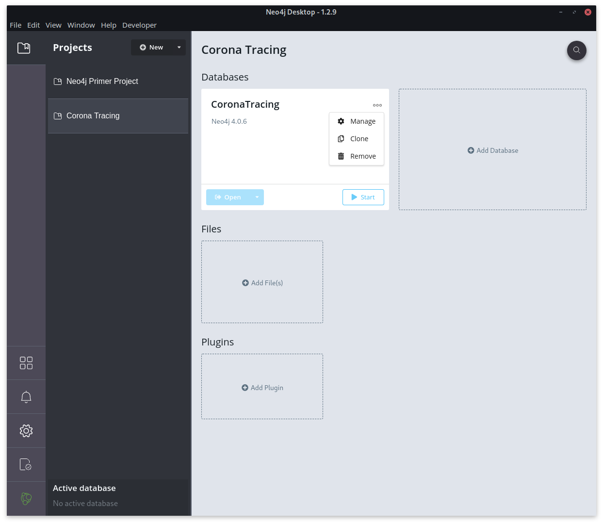
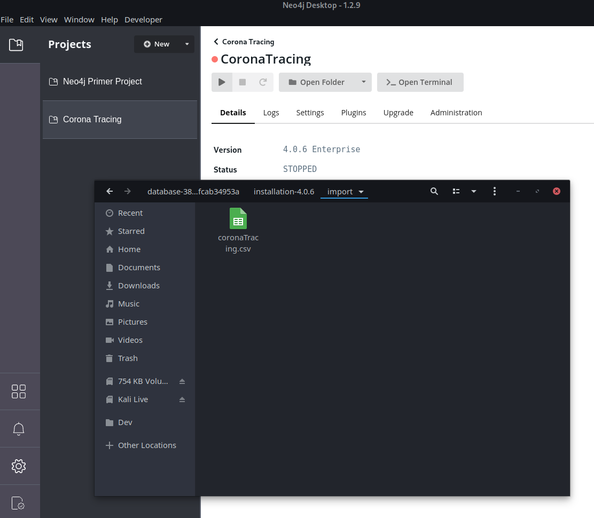
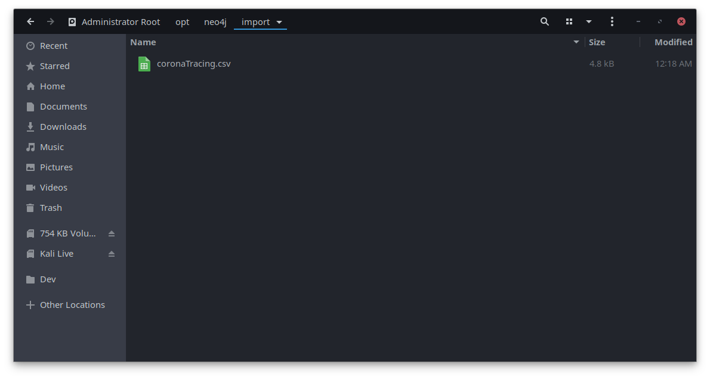
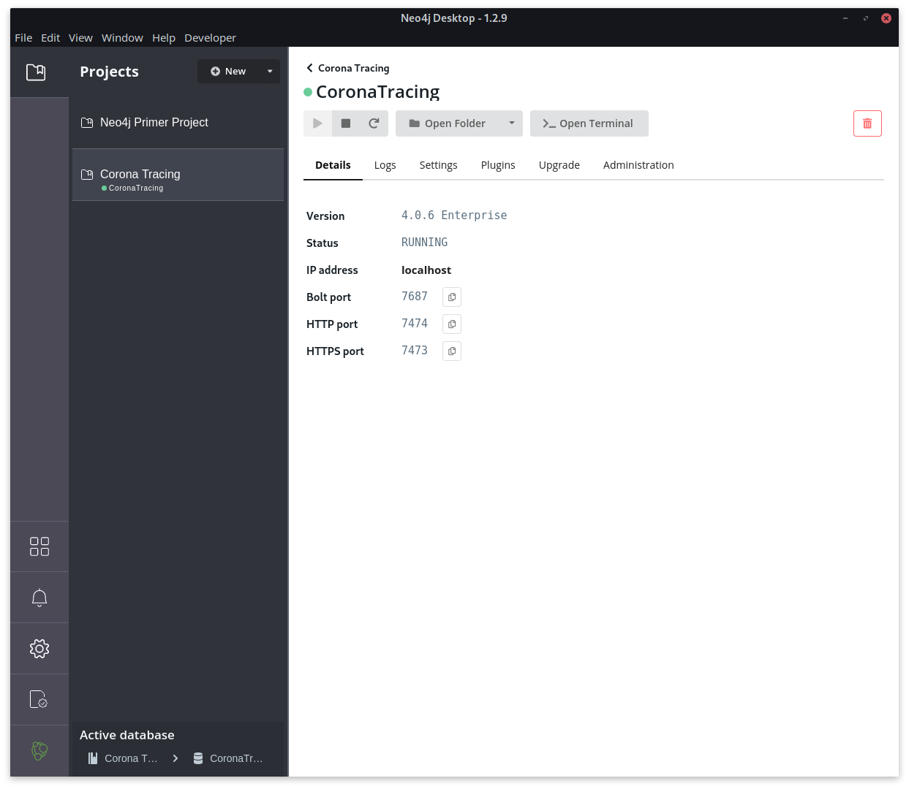
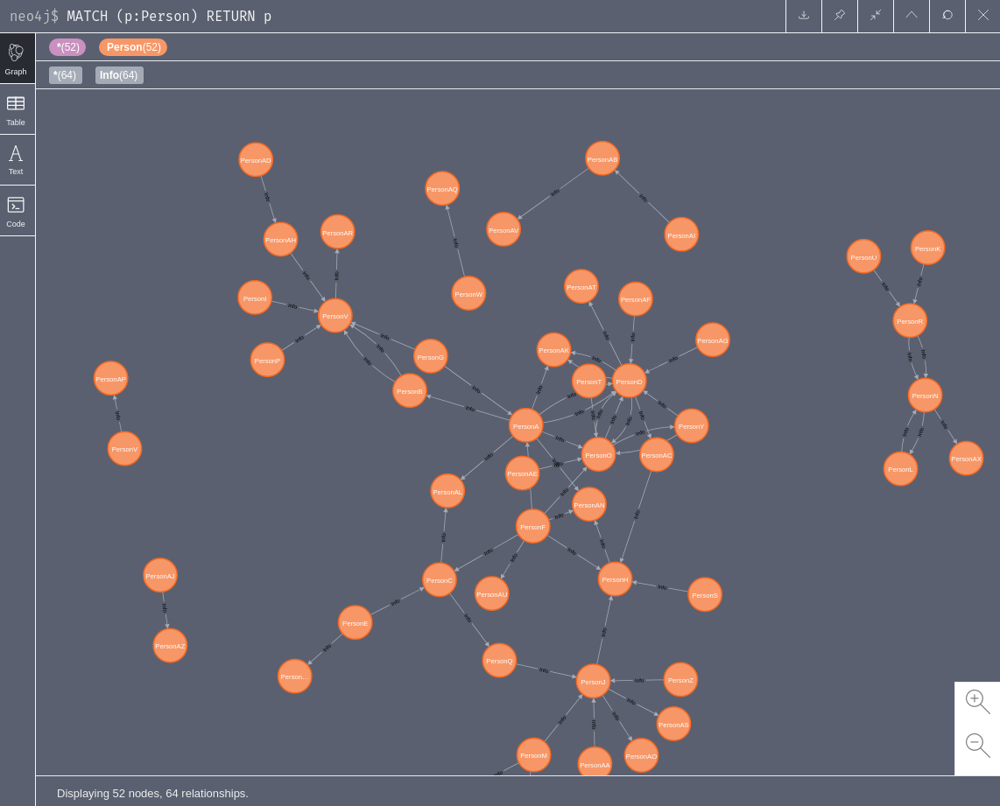

<!-- TOC -->

- [Installing Neo4j Desktop](#installing-neo4j-desktop)
    - [Creating your Database](#creating-your-database)
    - [Importing Data](#importing-data)
- [Working with your Data](#working-with-your-data)

<!-- /TOC -->


## Installing Neo4j Desktop

Download the latest version of the [Neo4j Desktop](https://neo4j.com/download-thanks-desktop/) AppImage and make it executable:


```bash
chmod a+x neo4j-desktop-offline-1.2.9-x86_64.AppImage
```

Then run it from your Terminal `./neo4j-desktop-offline-1.2.9-x86_64.AppImage`.

### Creating your Database

1. Click on __New Project__, create the database and click on __Manage__ to set it up.





2. Click on __Open Folder__, enter the __import__ directory.

3. Copy your [Corona Tracing Data](https://gist.github.com/mpolinowski/a4e4844b2fd52394c7161e8a1a5f1937) as `.csv` file into the directory.





__Alternative__: If you are [running Neo4j inside a Docker Container](https://mpolinowski.github.io/getting-to-know-neo-4-j) copy this file to `/opt/neo4j/import` and use the web client to run the import.





4. Now start the database and open the __Neo4j Explorer__.





### Importing Data

Run the following Cypher query to add your data to your database:

```bash
LOAD CSV WITH HEADERS FROM "file:///coronaTracing.csv" AS line
WITH line
MERGE (Infected:Person{name:line.Infected, Addr:line.InfectedAddress})
MERGE (Contact:Person{name:line.Contact, Addr:line.ContactAddress})
MERGE (Infected)-[info:Info{
`Contact Info`:line.ContactInfo, 
`Relationship`:line.`Relationship`, 
Location: CASE WHEN line.Geography IS NOT NULL THEN line.Geography ELSE '' END
}]->(Contact)
```





## Working with your Data

1. How many potential infections (query for relationship `Info` = event with the potential of an infection) ?


```bash
MATCH (person:Person)-[rel:Info]->(:Person)
RETURN COUNT (rel)
```

2. How many persons have been traced from `Cordon M` ?


```bash
MATCH (person:Person)
WHERE person.Addr = 'CordonM'
RETURN person
```


3. How many infected persons has `Person A` been in contact with ?

```bash
MATCH (carrier)-[r:Info]->(person:Person{name:'PersonA'})
RETURN carrier, person, r
```

4. How many were potentially infected by `Person J` ?

```bash
MATCH (carrier:Person{name:'PersonJ'})-[r:Info]->(person:Person)
RETURN COUNT (person) AS Infected
```

4.1. Omit potential double-count:


```bash
MATCH (carrier:Person{name:'PersonJ'})-[r:Info]->(person:Person)
RETURN COUNT (DISTINCT person) AS Infected
```


5. Select all and order by number of potential infection event - find __Super Spreader__:


```bash
MATCH (carrier:Person)-[rel:Info]->(person:Person)
RETURN carrier, COUNT(carrier) AS Infected
ORDER BY Infected DESC
LIMIT 10
```

_Switch results from `Graph` to `Table` to see the persons who are most likely to be super spreader_


6. Select list of persons with highest number of potential infections:


```bash
MATCH (n)-[r:Info]->(m)
WITH n, COUNT((n)-[]->()) as num
ORDER BY num DESC
LIMIT 10
MATCH (n)-[i]->(b)
RETURN n,i,b
```


7. Show the person that exposed the most:


```bash
MATCH (carrier:Person)-[rel:Info]->(person:Person)
RETURN person, COUNT(*) AS Infections
ORDER BY Infections DESC
LIMIT 1
```


8. What carriers had contact with the person who was exposed the most ?


```bash
MATCH (carrier:Person)-[rel:Info]->(person:Person)
WITH person, COUNT(*) AS Infections
ORDER BY Infections DESC
LIMIT 1
MATCH (person:Person)<-[r]-(p)
RETURN person, r, p
```

9. Who in `Cordon A` did not infect anyone ?

```bash
MATCH (a)
WHERE NOT(a:Person)-[:Info]->()
AND a.Addr = "CordonA"
RETURN a
```


10. Select carrier that infected the most of their own cordon:


```bash
MATCH (carrier:Person)-[r]->(person:Person)
WHERE carrier.Addr = person.Addr
WITH carrier, COUNT(*) AS Infections
ORDER BY Infections DESC
LIMIT 2
MATCH (p:Person)<-[r]-(carrier)
RETURN p,r,carrier
```


11. Show the path of the infection between `Person K` and `Person L`


```bash
MATCH path=(p1:Person{name:'PersonK'})-[*]->(p2:Person{name:'PersonL'})
RETURN path
```