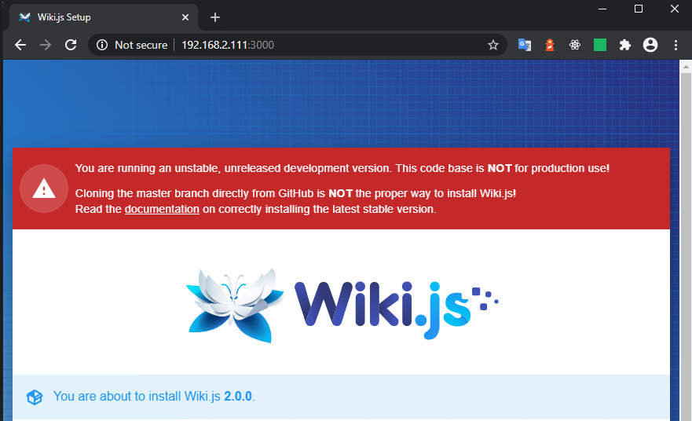

<!-- TOC -->

- [Preparations](#preparations)
    - [Dockerfile](#dockerfile)
    - [config.yml](#configyml)
    - [docker-compose.yml](#docker-composeyml)
- [Spinning up Docker](#spinning-up-docker)
    - [Running the App](#running-the-app)
    - [Stopping the App](#stopping-the-app)
- [Building production assets](#building-production-assets)

<!-- /TOC -->

## Preparations

Based on the official [WikiJS Docker Sample](https://github.com/Requarks/wiki/tree/dev/dev/containers).


Start by cloning the [WikiJS Repository](https://codeload.github.com/Requarks/wiki/zip/dev) into a folder called `wiki-source`. Continue by creating the following 3 files next to this folder:


### Dockerfile

```dockerfile
FROM node:12
LABEL maintainer "mpolinowski@gmail.com"

RUN apt-get update && \
    apt-get install -y bash curl git python make g++ nano openssh-server gnupg && \
    mkdir -p /wiki

WORKDIR /wiki

ENV dockerdev 1
ENV DEVDB postgres

EXPOSE 3000

CMD ["tail", "-f", "/dev/null"]
```
---

### config.yml

```yml
port: 3000
bindIP: 0.0.0.0
db:
  type: postgres
  host: db
  port: 5432
  user: wikijs
  pass: wikijsrocks
  db: wiki
logLevel: info
```
---

### docker-compose.yml

```yml
version: "3"
services:
  db:
    container_name: wiki-db
    image: postgres:9-alpine
    environment:
      POSTGRES_DB: wiki
      POSTGRES_PASSWORD: wikijsrocks
      POSTGRES_USER: wikijs
    logging:
      driver: "none"
    volumes:
      - db-data:/var/lib/postgresql/data
    ports:
      - "15432:5432"

  adminer:
    container_name: wiki-adminer
    image: adminer:latest
    logging:
      driver: "none"
    ports:
      - "3001:8080"

  wiki:
    container_name: wiki-app
    build:
      context: ./wiki-source
      dockerfile: ../Dockerfile
    depends_on:
      - db
    ports:
      - "3000:3000"
    volumes:
      - ./wiki-source:/wiki
      - /wiki/node_modules
      - /wiki/.git


volumes:
  db-data:
```
---


## Spinning up Docker

Run the build command to pull / build your images:


```bash
sudo docker-compose build
```


### Running the App

Run the following commands:


```bash
docker-compose -f docker-compose.yml up -d
docker exec wiki-app npm install   # only necessary the first time
docker exec wiki-app npm run dev
```

This will start Wiki.js in dev mode. Client assets are compiled first (using Webpack), then the server will start automatically. Wait for this process to complete before loading the app!


See [how to build for production](#building-production-assets) below.





Browse to the site, using the configuration you defined in config.yml. For example, if using port 3000 on your local machine, you would browse to `http://localhost:3000/`.

The first time you load the wiki, you'll get greeted with the setup wizard. Complete all the steps to finish the installation.


### Stopping the App

Run the following to shut down the app


```bash
docker-compose -f docker-compose.yml stop
```

To completely remove the containers run:


```bash
docker-compose -f docker-compose.yml down
```


To wipe the database as well, use:


```bash
docker-compose -f docker-compose.yml down --volumes
```


## Building production assets


Once you're ready to deploy your changes, you need to build the client assets into a production optimized bundle:


```bash
docker exec wiki-app npm run build
docker exec wiki-app npm run start
```
